# Module 1 - Lab 1 - Exercise 1 - Set up your Microsoft 365 tenant 

In the following lab exercises you will take on the role of Holly Dickson, Adatum Corporation’s Security Administrator. Adatum runs their legacy applications (such as Microsoft Exchange) in an on-premises deployment. However, they recently subscribed to Microsoft 365, thereby creating a hybrid deployment in which they must synchronize their on-premises and cloud deployments. 

You have been tasked with deploying Microsoft 365 in Adatum’s hybrid deployment using a virtualized lab environment. In this lab, you will set up a Microsoft 365 trial tenant, add a custom on-premises accepted domain, install Azure Active Directory, and add several users and groups that will be used throughout the remainder to the labs in this course. 

In this lab, the trial tenant has already been selected and a default tenant admin account has already been created. In your role as Holly Dickson, Adatum’s Security Administrator, you will be responsible for the remainder of the initial setup. You will log into the Domain Controller VM using the ADATUM\Azureuser Administrator account, and when you access Microsoft 365 for the first time, you will initially log in using the tenant email account that has been assigned to your Microsoft 365 tenant. Once you create your Microsoft 365 account for Holly, you will log into Microsoft 365 as Holly from that point forward.

### Task 1 - Obtain Your Office 365 Credentials

Once you launch the lab, a free trial tenant will be made available to you to access Azure in the Microsoft Virtual Lab environment. This tenant will be automatically assigned a unique username and password. You must retrieve this username and password so that you can sign into Azure and Microsoft 365 within the Microsoft Virtual Lab environment. You will also be assigned a unique network IP address and UPN name for your O365 blob. You will also use this UPN name in various tasks throughout the labs for this course.

1. Because this course can be offered by learning partners using any one of several authorized lab hosting providers, the actual steps involved to retrieve the UPN name, network IP address, and tenant ID associated with your tenant may vary by lab hosting provider. Therefore, your instructor will provide you with the necessary instructions on how to retrieve this information for your course. The information that you should note for later use includes:

	- **Tenant suffix ID.** This ID is for the onmicrosoft.com accounts that you will use to sign into Microsoft 365 throughout the labs. This is in the format of **{username}@M365xZZZZZZ.onmicrosoft.com**, where ZZZZZZ is your unique tenant suffix ID provided by your lab hosting provider. Record this ZZZZZZ value for later use. When any of the lab steps direct you to sign into the Office 365 or Microsoft 365 portals, you must enter the ZZZZZZ value that you obtained here.
	- **Tenant password.** This is the password for the admin account provided by your lab hosting provider.
	- **UPN name (in the format XXYYZZa) and the network IP address.** Write down the **IP Address** value (this is the IP Address of your parent domain; for example, 64.64.206.13), as well as your **UPN name** (for example, AVEAH2a).

### Task 2- Set up the Organization Profile

In your role as Holly Dickson, Adatum’s Security Administrator, you have been tasked with setting up the company’s profile for its Microsoft 365 trial tenant. In this task, you will configure the required options for Adatum’s tenant. Since Holly has yet to create a personal Microsoft 365 user account (you will do this in Task 3), Holly will initially sign into Microsoft 365 as the default Microsoft 365 ODL_USER_ID Administrator account using the Tenant email address and password that was provided in the Environment tab.

1. You should be logged into Domain Controller VM(LON-DC1-ID) as ADATUM\Azureuser Administrator with the password as provided in the **Environment** tab.

1. If you receive a **Networks** warning message asking if you want this PC to be discoverable by other PCs and devices on this network, select **No.**

1. select the **Microsoft Edge** icon. Maximize your browser window when it opens.

	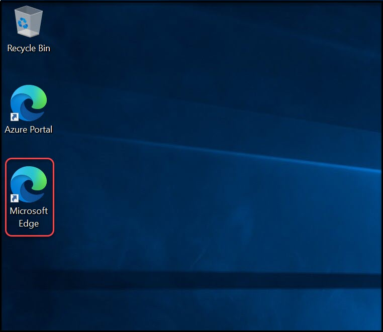

1. In your browser go to the **Microsoft Office Home** page by entering the following URL in the address bar: `https://portal.office.com/` 

1. In the **Sign in** dialog box, copy and paste in the **username** account provided in the **Environment** tab and then select **Next**.

1. In the **Enter password** dialog box, copy and paste in the **Password** provided in the **Environment** tab and then select **Sign in**.

1. On the **Stay signed in?** dialog box, select the **Don’t show this again** checkbox and then select **Yes.**

1. If a **Get your work done with Office 365** type window appears, then close it now. 

	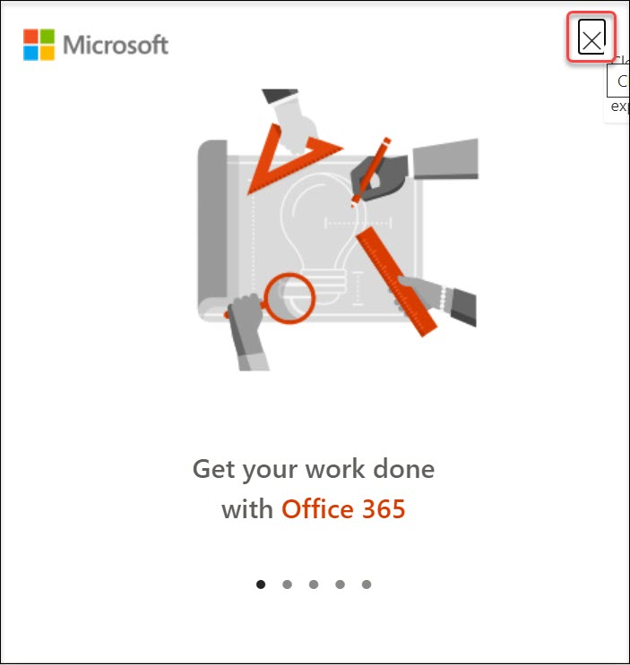

1. If a **Set your time zone** window appears, select **set the time zone for your calendar**. In the **Outlook** window that opens, under **Time zone,** select your time zone and select **Save**, then close your browser window and re-open the **Microsoft Office Home** page by entering the following URL in the address bar: `https://portal.office.com/`.

1. If a **Good morning/afternoon/evening MOD Administrator** window appears, select **Get started**.

1. In the **Microsoft Office Home** page, select the **Admin** icon in the column of app icons on the left. This opens the **Microsoft 365 admin center.**

	

1. In the left navigation pane, select the **Show All** ellipsis … icon to display all the navigation menu options.

	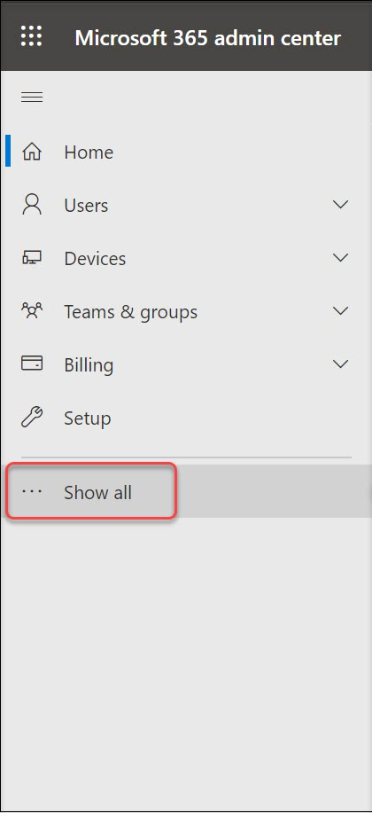	

1. In the left navigation pane, select **Settings** and then select **Org Settings**  then select **Organization profile** tab.

	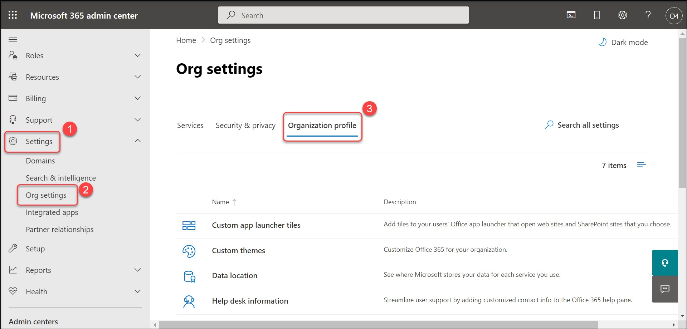

1. In the **Organization Profile** tab select **Organizational information**, it displays Azure HOL as the organization name, change this information.   

1. In the **Organization information** window, enter the following information:

	- Name: `Adatum Corporation`

	- Address: `555 Main Street`

	- City: `Redmond`

	- State: **Washington**

	- Postal Code: `98052`

	- Phone: No change

	- Technical contact: No change

	- Preferred language: **select your preferred language**

	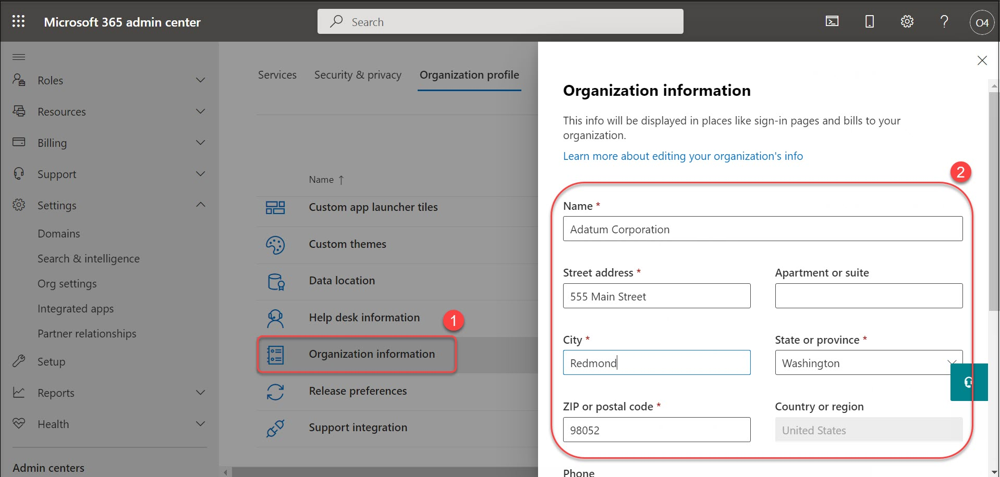

1. Select **Save**.

1. Close the **Organization information** window.

1. In the **Organization Profile** tab select **Release preferences**. If **Release Preferences** doesn't display under settings by default, use 'Search all settings' at top right corner to search for 'Release preferences'

	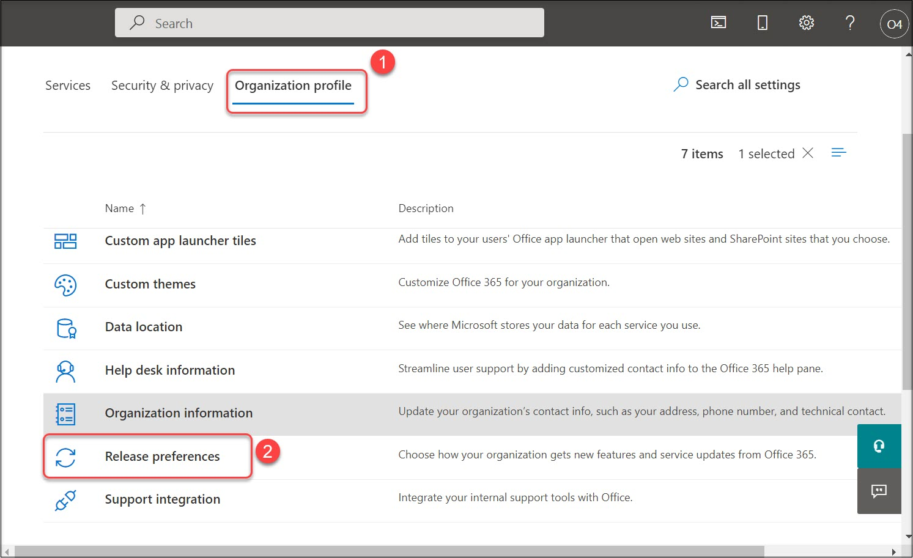

1. In the **Release preferences** window, select **Targeted release for selected users** and then select **Save**.  

    **Note:** One of the benefits of Office 365 is the ability to have the latest features and updates applied to your environment automatically, which can reduce maintenance costs and overhead for an organization. By setting up your Release preferences, you can control how and when your Office 365 tenant receives these updates.

	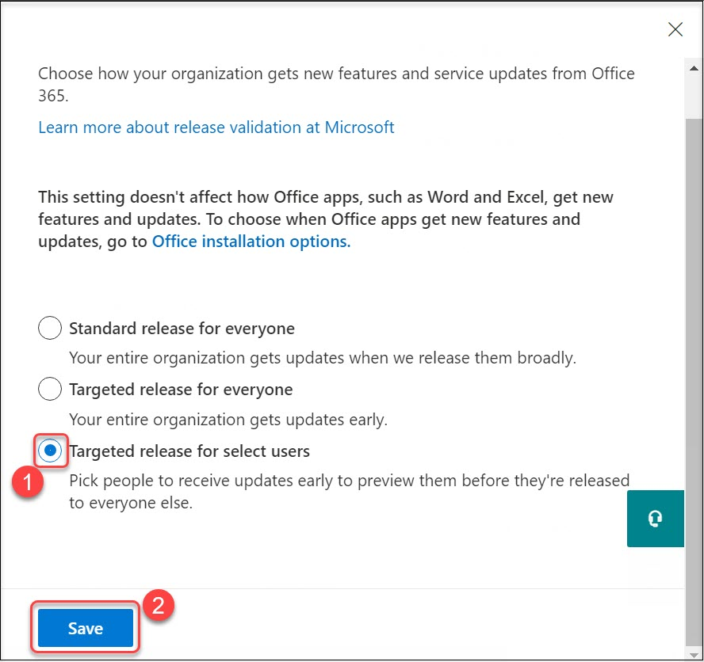

1. If the **Are you sure you want to change to Targeted release for select people** window appears, select **Yes.**.   

    **Note:** This option enables you to create a control group of users who will preview updates so that you can prepare the updates for your entire organization. The **Targeted release for everyone** option is more commonly used in development environments, where you can get updates early for your entire organization. In non-development environments, such as Adatum, targeted release to select people is the more typical preference as it enables an organization to control when it wants to make updates available to everyone once they’ve been reviewed by the control group.

1. In the **Release preferences** window, select **Select users**.

	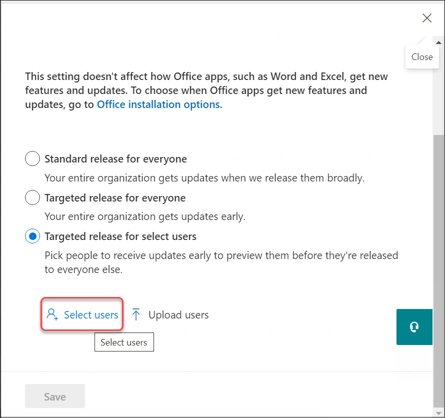

1. In the **Choose users for targeted release** window, in the list of users, select the **ODL_USER_ID** and then select **Save**.

	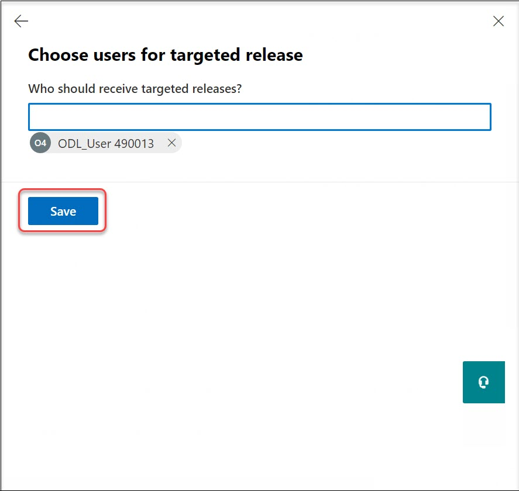

1. Close the **Release preferences** window, this returns you to the **Organization Profile** tab.

1. Select **Custom themes**.

	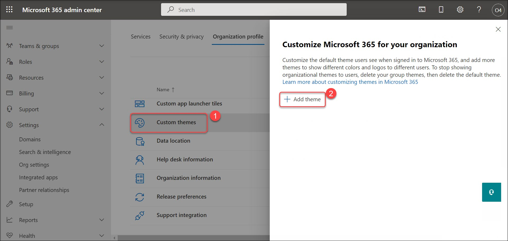

1. In the **Customize themes** window, you can add the logo of your company and set the background image as the default for all your users. Along with these options you can change the colors for your navigation pane, text color, icon color, and accent color. Go ahead and explore some different options for your tenant. Make any changes that you wish.  

    **Note:** Some colors patterns aesthetically distract users. Avoid using high contrasting colors together, such as neon colors and high-resolution colors like white and bright pink.

1. Once you’re done exploring and making any further changes, select **Save** and then **Close**.

1. Remain logged into the domain controller VM and in Microsoft EDGE, leave your Microsoft 365 admin center tab and all tabs open for the remaining tasks. 
 

### Task 3 - Create Microsoft 365 User Accounts 

Holly Dickson is Adatum’s Security Administrator. Since she doesn’t have a personal Microsoft 365 user account set up for herself, Holly initially signed into Microsoft 365 as the default Microsoft 365 ODL_USER Administrator account. In this task, she will create a Microsoft 365 user account for herself, and she will assign her user account the Microsoft 365 Global Administrator role, which gives her the ability to perform all administrative functions within Microsoft 365.

You will then create several additional user accounts in the Microsoft 365 admin center, each of which you will later add to new security groups that you’ll also create. While Security Admins typically do not add user accounts, this is a one-time task that you need to perform to prepare Adatum’s test environment for future lab exercises in this course.

**Important:** As a best practice in your real-world deployments, you should always write down the first global admin account’s credentials (in this lab, the MOD Administrator) and store it away for security reasons. This account is a non-personalized identity that owns the highest privileges possible in a tenant. It is **not** MFA activated (because it is not personalized) and the password for this account is typically shared among several users. Therefore, this first global admin is a perfect target for attacks, so it is recommended to create personalized service admins and keep as few global admins as possible. For those global admins that you do create, they should each be mapped to a single identity, and they should each have MFA enforced.

1. On the **LON-DC1** VM, the **Microsoft 365 admin center** should still be open in Edge from the prior task. In the **Microsoft 365 admin center**, in the left navigation pane, select **Users** and then select **Active users**. 

	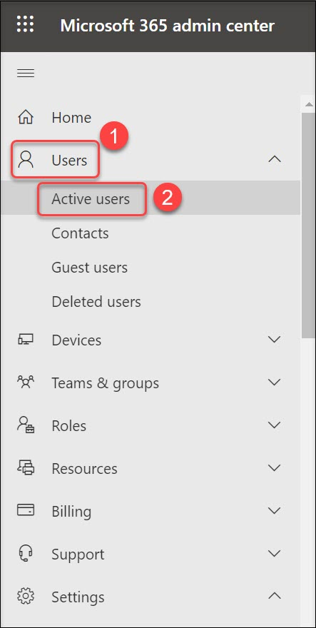

1. In the **Active users** list, you will see the  the default **ODL_USER_ID Administrator** account as well as some other user accounts. Since you’re taking on the role of Holly Dickson in this lab scenario, you will create a user account for yourself, and you will assign yourself the Microsoft 365 role of Global Administrator. 

1. In the **Active Users** window, select **Add a user**. 

	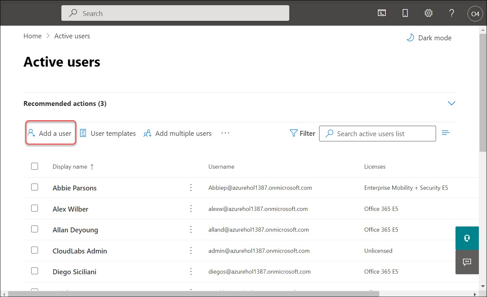

1. In the **Set up the basics** window, enter the following information:

	- First name: `Holly`

	- Last name: `Dickson` 

	- Display name: When you tab into this field, **Holly Dickson** will appear.

	- Username: When you tab into this field, **Holly** may appear; if not enter this as the username
	
		**IMPORTANT:** To the right of the **Username** field is the domain field. It may be prefilled with the custom **XXYYZZa.CustomDomain.us** on-premises domain; however, you must select the drop-down arrow and select the **xZZZZZZ.onmicrosoft.com** cloud domain instead (where ZZZZZZ is your tenant ID provided by your lab hosting provider).
	
		After configuring this field, Holly’s username should appear as:

		**Holly@xZZZZZZ.onmicrosoft.com**  
	
	- Password settings: Uncheck the **Automatically create a password** option

	- Password: `Pa55w.rd`

	- Uncheck the **Require this user to change their password when they first sign in** checkbox. 

1. Select **Next**.

	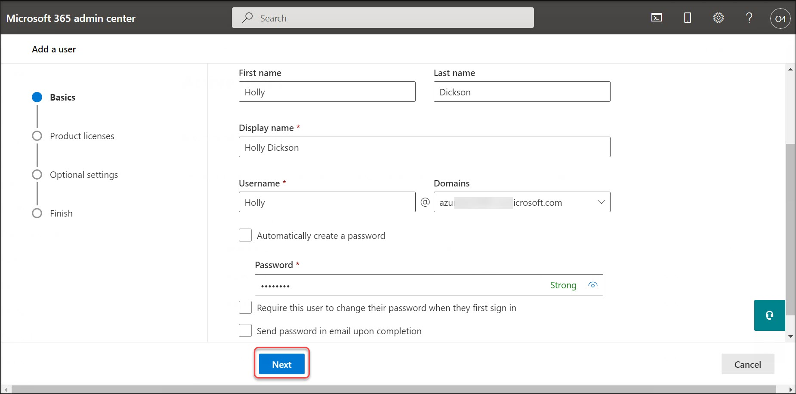

1. In the **Assign product licenses** window, enter the following information:

	- Select location: **United States**

	- Licenses: Under **Assign user a product license**, select **Microsoft 365 E5** and **Enterprise Mobility + Security E5**. 

1. Select **Next**.

	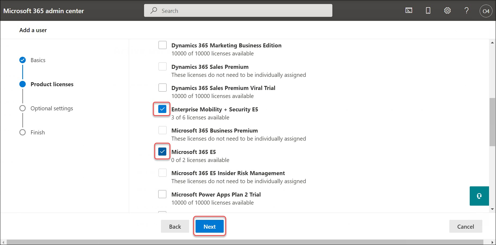

1. In the **Optional settings** window, in the Roles section select **Admin center access** By doing so, all the Microsoft 365 administrator roles are now enabled and available to be assigned.

1. Select **Global Administrator** and then select **Next**.

	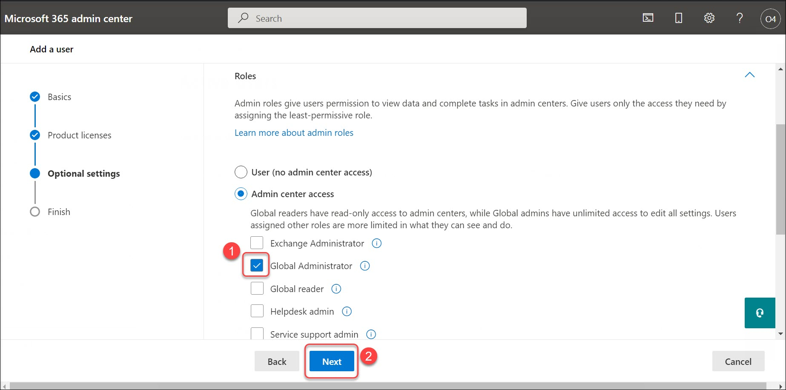

1. On the **Review and finish** window, review your selections. If anything needs to be changed, select the appropriate **Edit** link and make the necessary changes. Otherwise, if everything is correct, select **Finish adding**. 

1. On the **Holly Dickson has been added to active users** page, select **Close.** 

	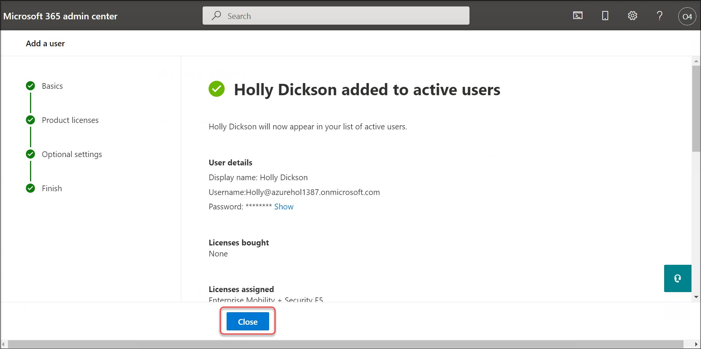

1. Remain logged into the domain controller VM with the Microsoft 365 admin center open in your browser for the next task.

### Task 4 – Prepare for Microsoft Azure Active Directory 

Azure Active Directory is needed to perform several configuration steps when installing Microsoft 365. These steps are performed using Windows PowerShell. However, before you can use PowerShell to access Azure AD, you must first install the Windows PowerShell modules that enable you to access Azure AD through PowerShell. In this task, you will prepare for using Azure AD by installing those PowerShell modules.

1. Open **Windows PowerShell** by performing the following steps:

	- Select the magnifying glass (Search Windows) icon on the taskbar at the bottom of the screen and type **powershell** in the Search box that appears. 

	- In the menu that appears, right-click on **Windows PowerShell** and select **Run as administrator** in the drop-down menu. 

	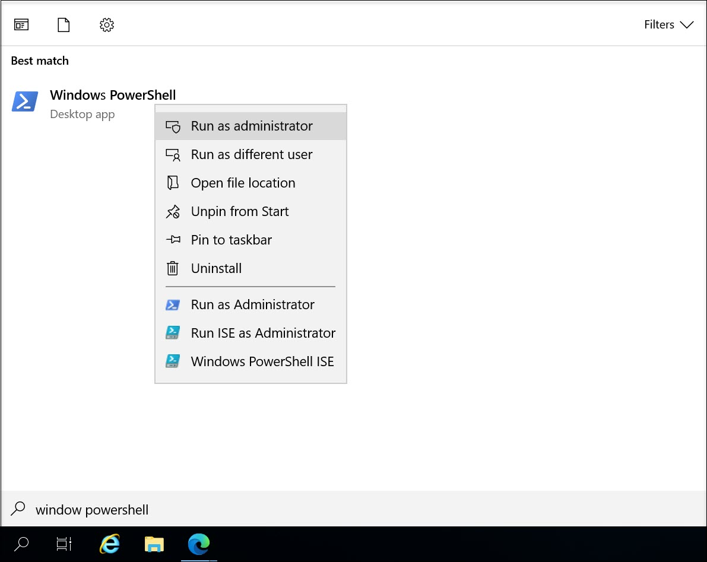

1. In **Windows PowerShell**, type the following command and then press Enter:

	`Install-Module MSOnline` 

1. If you are prompted to install the **NuGet provider**, enter **Y** to select **[Y] Yes**. Press Enter key. 

	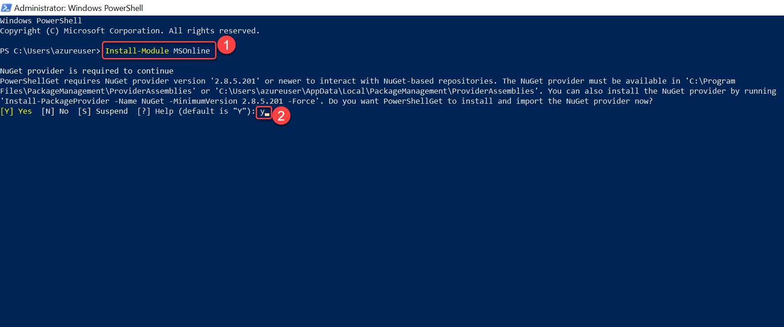

1. If you are prompted to install the module from **PSGallery,** enter **A** to select **[A] Yes to All**.  Press Enter key.

	

1. Once the installation is complete, the screen will return to the Windows PowerShell command prompt.

1. You must then run the following command to install the Azure AD PowerShell module that you just retrieved in the earlier step:

	`Install-Module AzureADPreview`   
	
1. If you are prompted to confirm that you want to execute this command, enter **A** to select **[A] Yes to All**.

	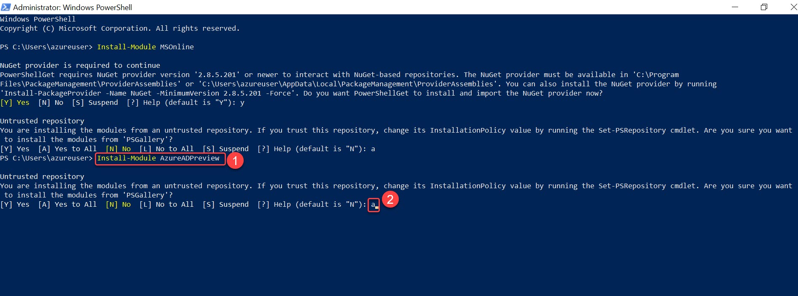

1. You have now installed the Windows PowerShell modules required to access Azure AD.

1. Remain logged into the domain controller VM and keep the Windows PowerShell window open.

### Task 5 - Enable IRM for SharePoint Online 

In this task, you will turn on Information Rights Management (IRM) for SharePoint Online. 

**Note:** While you will validate IRM in Exchange and SharePoint in a later lab, you must enable IRM for SharePoint Online now because it can take up to 60 minutes or more for IRM to show up in SharePoint Online. By the time you get to the validation exercise in the later lab, IRM should have finished its internal configuration so you won’t have to wait for it to be present in SharePoint Online.

1. You should still be logged into your domain controller VM as the **LON-DC1\Azureuser admin** account with password: **Pa55w.rd**, and you should still be logged into Microsoft 365 (portal.office.com) as **MOD Administrator**. 

1. In the **Microsoft 365 admin center**, scroll down through left navigation pane and under **Admin centers,** select **SharePoint**. This will open the SharePoint admin center.

	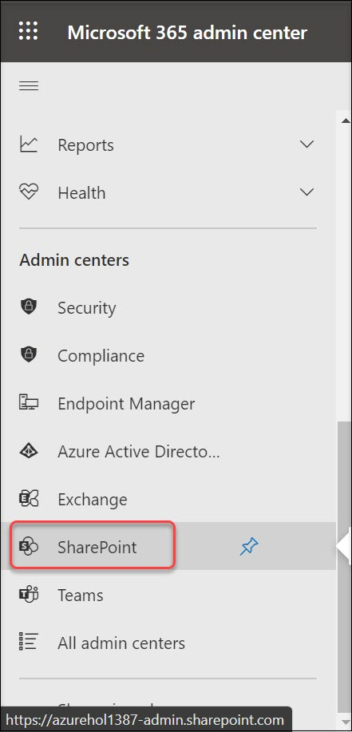

1. If a **One place for SharePoint administration** pop-up window appears, select **Got it** to close the window.

1. In the **SharePoint admin center**, in the left navigation pane, select **Settings**. 

	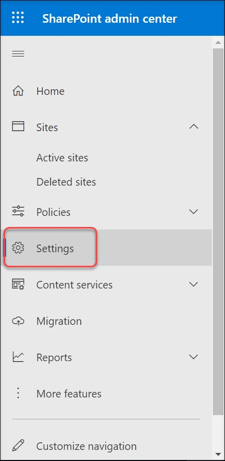

1. At the bottom of the page is a sentence that says **“Can’t find the setting you’re looking for? Go to the classic settings page.”** In this sentence, select the hyperlinked text: **classic settings page**.

	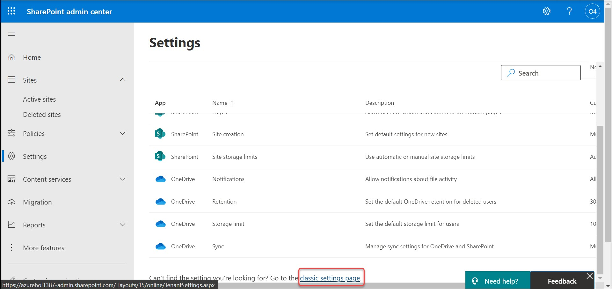

1. On the **Settings** page, scroll down to the **Information Rights Management (IRM)** section, select the **Use the IRM service specified in your configuration**, select the **Refresh IRM Settings** button, and then scroll down to the bottom of the page and select **OK**. 

	

	

1. Do NOT close the SharePoint admin center tab in your Edge browser. Leave your browser open for the next task.

### Task 6 – Turn on Audit Logging to enable Alert Policies

In a later lab, you will create Alert Policies using the Security and Compliance Center. However, before you can implement alerts, an admin must first turn on Audit Logging for the organization. Since it can take some hours for audit logging to be fully enabled once you turn it on in the Security and Compliance Center, you will turn it on in this lab so that it is fully enabled by the time you get to that lab.

1. You should still be logged into your domain controller 1 VM as the **LON-DC1\Azureuser admin** account, and you should be logged into Microsoft 365 as **ODL_USER_ID Administrator**.

1. In your browser, enter the following URL in the address bar: `https://protection.office.com`.

1. In the **Office 365 Security &amp; Compliance center**, in the left navigation pane, select **Search**, and then under it, select **Audit log search**.

	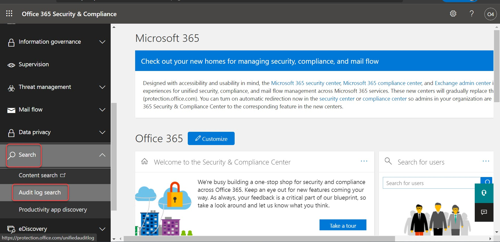

1. In the **Audit log search** window, at the top right of the page, select **Turn on auditing,** and then confirm the **Your organization settings need to be updated. Do you want to continue?** question by selecting **Yes**. 

	**Note**: 'Audit Log' will be turned on by defualt for MS 365 and Office 365 Enterprise organizations. If there is no prompt to 'Turn On' audit log on that page, that means 'Audit Log' has been turned on by default.

1. Leave the Client 1 VM and the Security and Compliance Center open.

# End of Lab 
