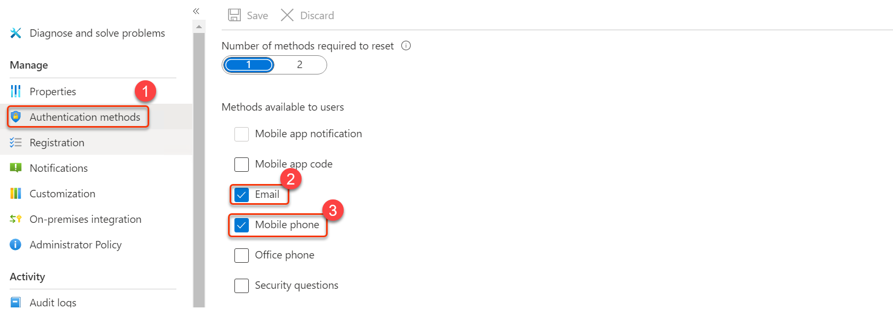
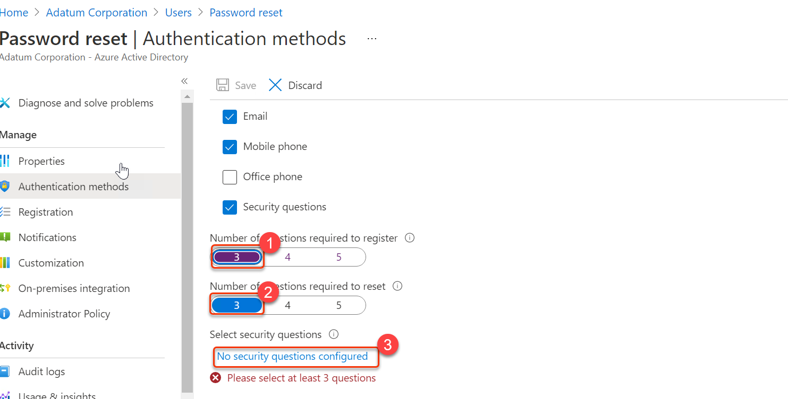
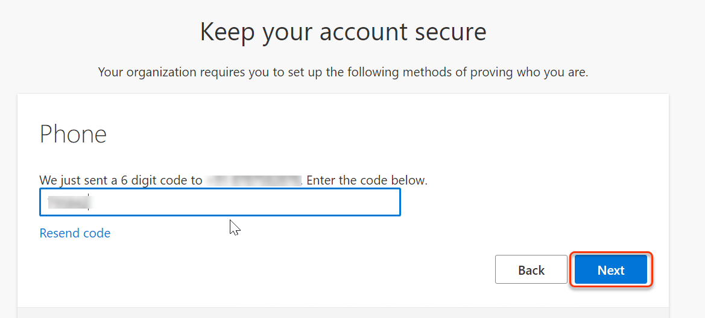
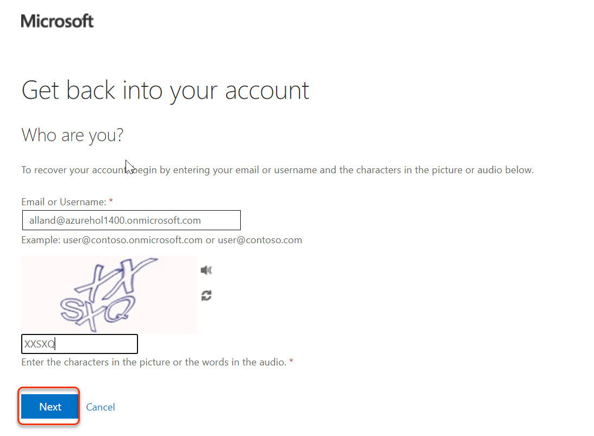
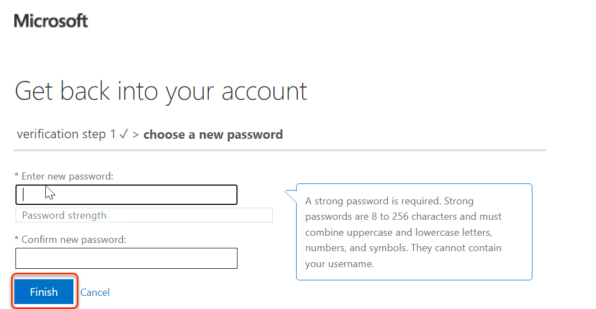

# Module 1 - Lab 2 - Exercise 1 - Configure Self-service password reset (SSPR) for user accounts in Azure AD

### Scenario

The Help Desk has indicated that a large number of support tickets are related to password resets. You have been asked to setup a way for users to reset their password on their own. 

#### Task 1: Enable self-service password reset

1.  Switch to **LON-CL1** and sign in as **Adatum\Azureuser Administrator** with the password as povided in the Environment tab.

1.  Open **Microsoft Edge**, open Azure by going to `https:/portal.azure.com/`.  Login as Holly Dickson from the previous lab. Navigate to **Azure Active Directory**
        
1.  In the navigation pane under **Manage** select **Users**, then select **Password reset**.

1.  In the **Password reset | Properties** window, select **All** to enable self-service password reset to **All** users. Select **Save**.

    

1.  On the **Password reset | Manage** blade, select **Authentication methods**.

1.  For the methods available to users, ensure that **Mobile Phone** and
    **Email** are selected, and then select **Security Questions**.
    
    

1.  For the **Number of questions required to register**, select **3**.

1.  For the **Number of questions required to reset**, select **3**.

1.  In the **Select security questions** section, select **No security questions configured**, then select **Predefined**. Select three questions of your choice, and then select **OK** twice.

    

1. Select **Save**.

1. Still on the **Password reset | Manage** blade, select **Registration** Select **No** for **Require users to register when signing in**, and the select **Save**.

    

#### Task 2: Register user for self-service password reset

With SSPR enabled and configured, test the SSPR process with a user that's part of the group you selected in the previous section, such as Test-SSPR-Group. In the following example, the testuser account is used. Provide your user account that's part of the group you enabled for SSPR in the first section of this mini-lab.

   **Note**: When you test the self-service password reset, use a non-administrator account. Admins are always enabled for self-service password reset and are required to use two authentication methods to reset their password.

1.   In your web browser at the upper right corner of the page, select your account name, and then select **Sign in with a different account**. 

1.  Sign in as **AllanD@yourtenant.onmicrosoft.com** with the password that was provided in the Environment tab.   

1. Browse to the self service password registration page at [https://aka.ms/ssprsetup](https://aka.ms/ssprsetup).

1. If **Stay signed in?** dialog box appear, select the **Don’t show this again** checkbox and then select **Yes.**.

1. If **More action Required** dialog box appear, click on **Next**.

1. On the **Security info** page, click **Add method**. Select your desired authentication method such as **Phone** and proceed through the setup steps.

    

   **Note**: If prompted to use an email you will need to use an e-mail address other than the tenant domain provided for this lab. If one is not available, you can skip the e-mail verification and continue with the next step. Sign in to your email account, read the code, type it in the verification field, and then select **Verify**. 
    
   **Note**: If you don’t find a message with a code in your inbox, check the junk folder.

#### Task 3: Test self-service password reset

1. Go to `https://aka.ms/sspr` and enter the username for Alan (**AllanD@yourtenant.onmicrosoft.com**). Complete the Captcha below and click **Next**.

    

1. Request verification using the method that you configured in the previous task.

1. Enter the verification code you received and then click **Next**.

1. Enter a **new password** and click **Finish**.

    
    
    

# Continue to Exercise 2
