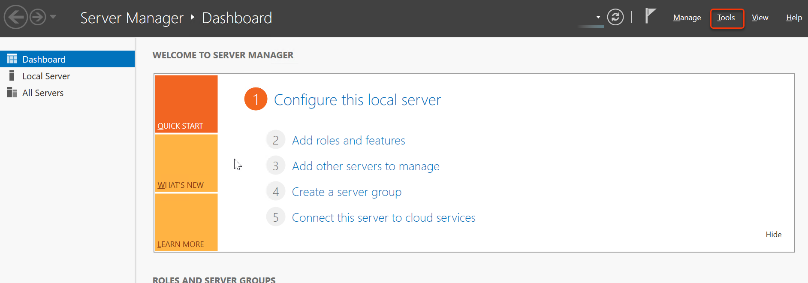
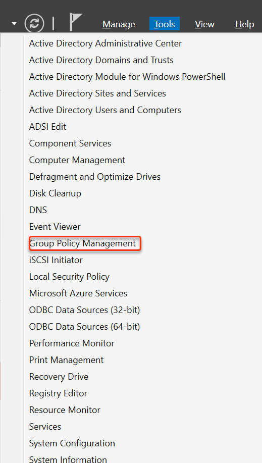
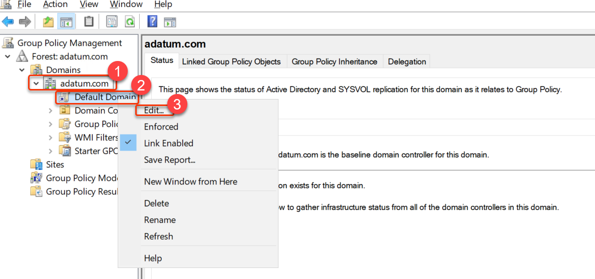
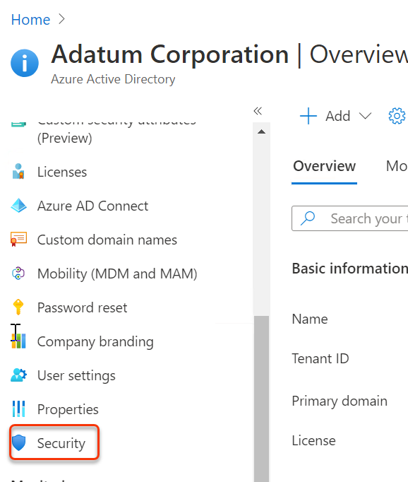
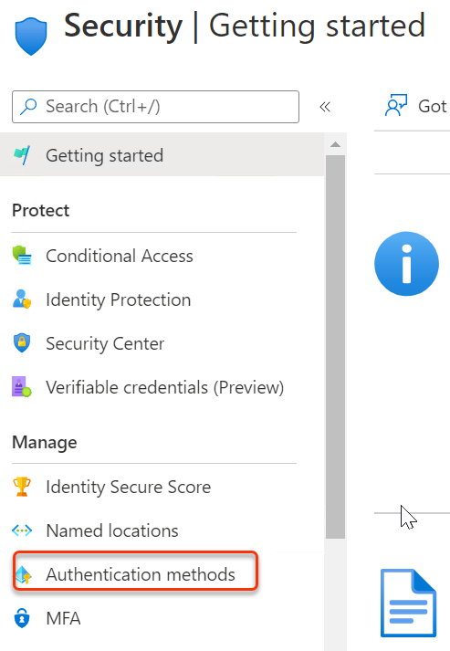
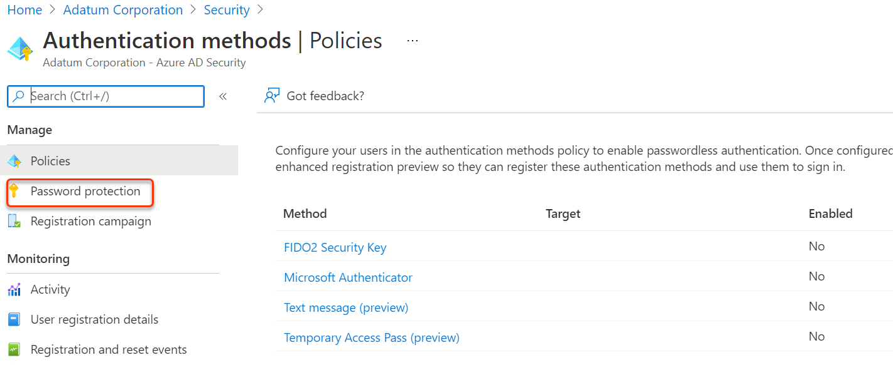
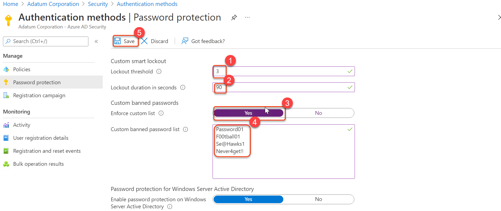
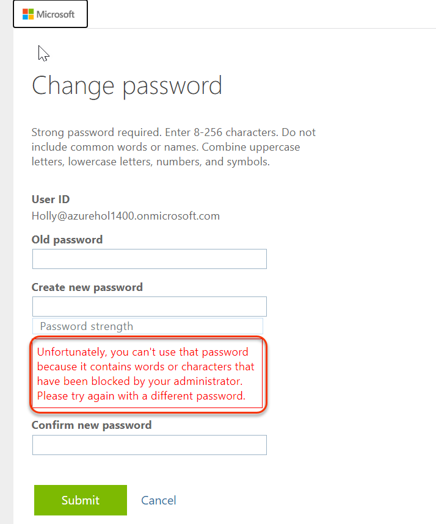
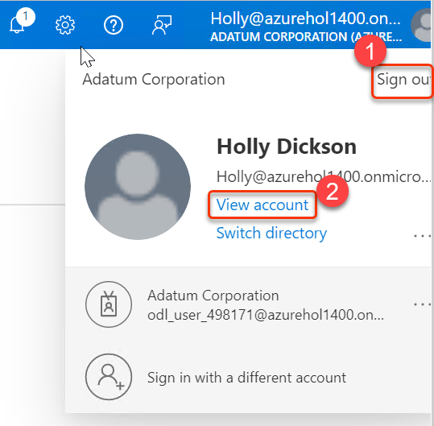
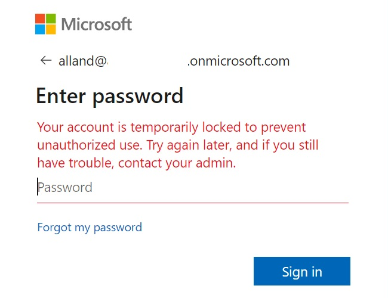

# Module 1 - Lab 2 - Exercise 2 - Deploy Azure AD Smart Lockout 

Adatum’s CTO has asked you to deploy Azure AD Smart Lockout, which assists in locking out bad actors who are trying to guess your users’ passwords or use brute-force methods to get admitted into your network. Smart Lockout can recognize sign-ins coming from valid users and treat them differently than sign-ins from attackers and other unknown sources. 

The CTO is anxious to implement Smart Lockout because it will lock out the attackers while letting Adatum’s users continue to access their accounts and be productive. The CTO has asked you to configure Smart Lockout so that users can’t use the same password more than once, and they can’t use passwords that you deem too simplistic or common. 

1. On the Domain Controller (**LON-DC1**), select the **Server Manager** icon on the taskbar if it’s already open; otherwise, open it now.

2. In **Server Manager**, select **Tools** in the upper-right menu bar, and in the drop-down menu, select **Group Policy Management.**

	
	

3. Maximize the **Group Policy Management** window, if necessary.

4. You want to edit the group policy that includes your organization's account lockout policy. If necessary, in the root console tree, expand **Forest:Adatum.com**, then expand **domains**, and then expand **Adatum.com**.   

	

5. Under **Adatum.com**, right-click on **Default Domain Policy** and then select **Edit** in the menu.

	

6. Maximize the **Group Policy Management Editor** window.

7. In the **Default Domain Policy** tree in the right pane, browse to **Computer Configuration** > **Policies** > **Windows Settings** > **Security Settings** > **Account Policies.**

8. In the **Account Policies** folder, select **Account Lockout Policy**.

9. As you can see in the right pane, none of the smart lockout parameters have been defined. You are going to use the **Azure AD admin center** to assign these values.    

10. Open a new browser tab and go to `https://portal.azure.com`.  Sign-in as Holly Dickson if you are not already signed in on another browswer tab. Search for **Azure Active Directory** and click **Azure Active Directory**. 

11. In the **Adatum Corporation | Overview** page, in the middle navigation pane under the **Manage** section, scroll down and select **Security**.

	

12. In the **Security | Getting started** window, in the middle pane under the **Manage** section, select **Authentication Methods**.

	

13. In the **Authentication methods | Policies** page, in the middle pane under the **Manage** section, select **Password protection.**

	

14. In the **Authentication methods | Password protection** window, in the detail pane on the right, enter the following information:

	- In the **Custom smart lockout** section:

		- **Lockout threshold:** this field indicates how many failed sign-ins are allowed on an account before its first lockout. The default is 10. For testing purposes, Adatum has requested that you set this to `3`.

		- **Lockout duration in seconds:** This is the length in seconds of each lockout. The default is 60 seconds (one minute). Adatum has requested that you change this to `90` seconds.

	- In the **Custom banned passwords** section:

		- **Enforce custom list**: select **Yes**

		- **Custom banned password list:** Enter the following values (press Enter after entering each value so that each value is on a separate line):

			- `Password01`

			- `F00tball01`

			- `Se@Hawks1`

			- `Never4get!!`

15. Select **Save** on the menu bar at the top of the page.

	

16. You should now test the banned password functionality. Select Holly Dicksons's user icon in the upper right corner of the screen and click **View account**, and in the menu that appears select **Change password**.

17. A new tab will open displaying the **change password** window. Enter `Pa55w.rd` in the **Old password** field, enter `Never4get!!` in the **Create new password** and **Confirm new password** fields, and then select **submit**. Note the error message that you receive.

	

18. In your browser, close the **Change password** tab. 

19. You should now test the lockout threshold functionality. In the **My Dashboard - Azure Active Directory admin center** tab, select Holly Dicksons's user icon in the upper right corner of the screen, and in the menu that appears select **Sign out**.

	

20. Once you are signed out as Holly, the **Pick an account** window will appear. Select **Use another account**. 

21. In the **Sign in** window, enter **AllanD@M365xZZZZZZ.onmicrosoft.com** (where ZZZZZZ is the tenant suffix ID assigned to you by your lab hosting provider), and then select **Next**. 

22. On the **Enter password** window, enter any mix of letters and then select **Sign in**. Note the invalid password error message. Repeat this step 2 more times. Since you set the **Lockout threshold** to **3**, note the error message that you receive after the third attempt. Allan's account has been temporarily locked to prevent unauthorized access.  

**Note:** You will be prohibited from logging in as Allan until after the **90 second lockout duration** that you set earlier. 

23. After 90 seconds, try logging in again to verify that you can log in. 

# End of lab.
 
