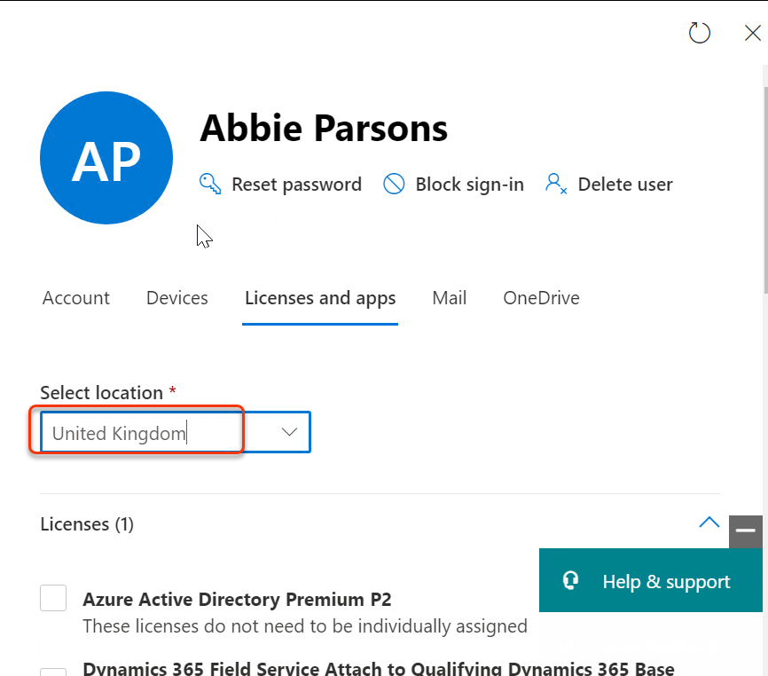
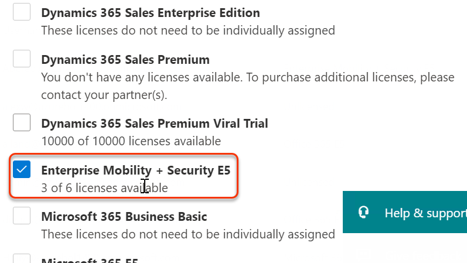

# Module 2 - Lab 1 - Exercise 1 - Setting up your organization for identity synchronization 

You are Holly Dickson the security administrator for Adatum Corporation, and you have Microsoft 365 deployed in a virtualized lab environment. In this lab, you will implement identity synchronization between your Microsoft 365 tenant accounts and your local active directory accounts.

### Task 1 - Configure your UPN suffix

1.  On LON-DC1, log on as **azureuser** and password assigned from your lab hoster.
1.  Using Windows PowerShell as administrator, update the UPN suffix for the domain and on the UPN on every user in AD DS with “@zzzzzzz.onmicrosoft.com” (where zzzzzzz is your unique UPN name) for the domain name. To do this, run the following command (remember to change zzzzzzz to your unique UPN name example:azureholxxxx):

    	Set-ADForest -identity "adatum.com" -UPNSuffixes @{replace="zzzzzzz.onmicrosoft.com"}  
1.  Next type the follow command (remember to change zzzzzzz to your unique UPN name): 

		Get-ADUser –Filter * -Properties SamAccountName | ForEach-Object { Set-ADUser $_ -UserPrincipalName ($_.SamAccountName + "@zzzzzzz.onmicrosoft.com" )}
1.  At the Windows PowerShell prompt, type the following command, and then press Enter:

		Set-ExecutionPolicy Unrestricted  
1.  To confirm the execution policy change, Select **Yes to All**.

		
	  
	
### Task 2 - Enable Directory Synchronization

1.  Open your browser and go to `https://portal.office.com/`   
1.  Sign in as **holly@ZZZZZZ.onmicrosoft.com** (where ZZZZZZ is your tenant ID provided by your lab hosting provider) In the **Enter password** window, enter the password provided by your lab hosting provider.
1.  Click **Admin** to go to the Microsoft 365 admin center.

	
	
1.  If asked about **update your admin contact information **click the Cancel button to skip this request.  
	**Note:** If you see the Active Directory synchronization is being activated warning, you can ignore it at this time, but you will not be able to run directory synchronization later in this exercise. You must wait until directory synchronization is activated. However, you can complete the following steps, even if you do see the warning message.  
1.  In the left navigation, select **users** icon and select **Active users**, click on the ellipses at the top menu and choose **Directory Synchronization**.

       
       
      
1.  Click on the **Go to the Download center to get the Azure AD Connect tool**. scroll down and select Download and Run the download once prompted.

		
	
	
	
    
### Task 3 - Run Azure AD Connect

1.	On the Microsoft Azure Active Directory Connect setup wizard, proceed through the wizard. 
1.	Agree to the license terms and privacy notice.
1.	Click on **Use express settings**.

		
	  
1.	On the **Connect to Azure AD** screen enter your Office 365 admin username of **holly@ZZZZZZ.onmicrosoft.com** (where ZZZZZZ is your tenant ID provided by your lab hosting provider) and enter the password provided by your lab hosting provider and click Next.  

         
	  
1.	If there is a pop up sign in window **Connect to AD DS** screen enter your domain administrator **Admin@ZZZZZZ.onmicrosoft.com** and password that is provided in the **Environment Details** tab 

1.	select **Next**.   
1.	On the **Connect to AD DS** screen enter your domain administrator **ADATUM\azureuser** and password given in Environment details page and select **Next**.

		
	  
1.	Select **Continue without matching all UPN suffixes to verified domains** checkbox. Select **Next** on the Azure AD sign-in configuration screen.   
1.	On the **Ready to configure** screen make sure the check box for **Start the synchronization process when configuration completes** is marked and select **Install**.   
1.	Wait for the installation to complete (this may take several minutes).

1.	Select **Exit**.
 	 
	 

### Task 4 - Validate the results of directory synchronization and license a user. 

1.	To verify the new user you created open the Office 365 Admin Center in the browser by typing `https://portal.office.com` in the address bar.  
1.	Sign in as Holly Dickson with the following credentials:  User name: **hollyd@ZZZZZZ.onmicrosoft.com**, (where ZZZZZZ is your tenant ID provided by your lab hosting provider) and enter the password provided by your lab hosting provider.
1.	Navigate to the **Active Users**.  

		
	  
1.	You should now see many users that have become synced from the local Active Directory.  You may need to click the refresh button to update the data in the page.  Select Abbie Parsons.  Abbie is a user that was only in the AD DS domain prior to our synchronization. 
1.	Edit Abbie Parsons Product licenses as follows: 
	- Location = United Kingdom
	- Product License = Enterprise Mobility + Security E5

		
	  
	  
1.	Click **Save changes** to make the changes. Close the window.

 >Note: If it already exists, just review the following settings that is mentioned above

You have successfully synced local ADATUM users into Office 365 and licensed the synced user Abbie Parsons.

# End of lab  

 
