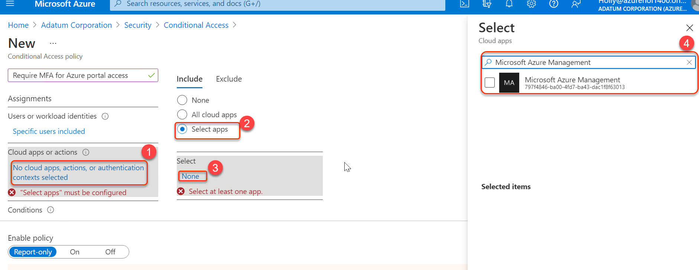
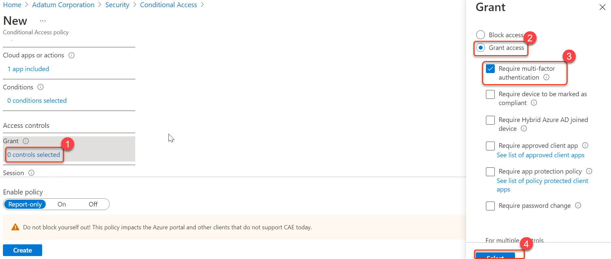
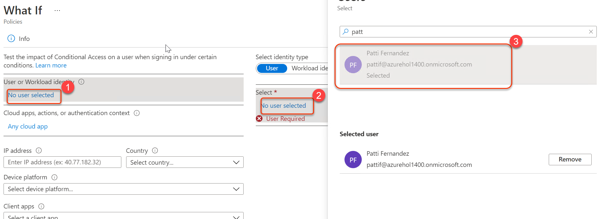
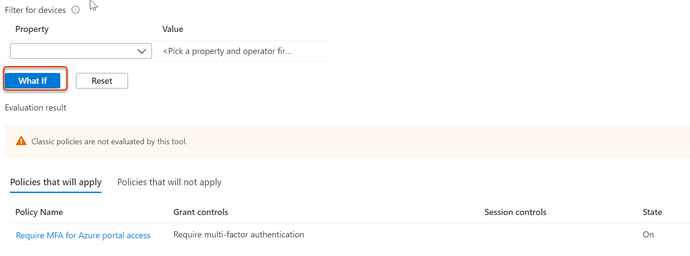

# Module 3 - Lab 1 - Exercise 1 -  MFA Authentication Pilot (Require MFA for specific apps with Azure Active Directory conditional access)

### Task 1: Create your conditional access policy 

This lab shows how to create the required conditional access policy to require MFA for certain users. The scenario uses:

- The Azure portal as placeholder for a cloud app that requires MFA. 
- Your sample user to test the conditional access policy.  

In your policy, set:

|Setting |Value|
|---     | --- |
|Users and groups | Patti Fernandez |
|Cloud apps | Microsoft Azure Management |
|Grant access | Require multi-factor authentication |

 
1.  Sign in to the Azure Portal `https://portal.azure.com` as Holly Dickson with password: `Pa55w.rd`.

2.  In the Azure portal, on the hub menu go to **Azure Active Directory** by using More Services to search if necessary.

3. On the left click **Security** and then select **Conditional Access**.

     
 
5.  On the **Conditional Access** page, in the toolbar on the top, click **New Policy**.

    **Note**: if this is greyed out, refresh the browser session.

6.  On the **New** page, in the **Name** textbox, type `Require MFA for Azure portal access`.

7.  In the **Assignment** section, click **0 users and groups selected**.

8.  On the **Users and groups** page, perform the following steps:

    a. Click **Select users and groups**, and then select **Users and groups**.
    

    b. On the **Select** page, select `Patti Fernandez`, and then click **Select**.
    
    
 
 
9.  Back on the New page click **Cloud apps or actions**.

10. On the **Cloud apps or actions** page, perform the following steps:

    a. Click **Select apps**.

    b. Click **Select**.

    c. On the **Select** page, select **Microsoft Azure Management**, and then click **Select**.

 
 
11.  In the **Access controls** section, click **Grant**.

12.  On the **Grant** page, perform the following steps:
     1. Select **Grant access**.
     2.  Select **Require multi-factor authentication**.
     3.  Click **Select**.

 
 
13.  In the **Enable policy** section, click **On**.

14.  Click **Create**.

    **Note:** If the policy fails check your work and **Create** again.
 
 
 
### Task 2: Evaluate a simulated sign-in

Now that you have configured your conditional access policy, you probably want to know whether it works as expected. As a first step, use the conditional access what if policy tool to simulate a sign-in of your test user. The simulation estimates the impact this sign-in has on your policies and generates a simulation report.  

We will initialize the what if policy evaluation tool for:

- **Patti Fernandez** as user 
- **Microsoft Azure Management** as cloud app

 Clicking **What If** creates a simulation report that shows:

- **Require MFA for Azure portal access** under **Policies that will apply** 
- **Require multi-factor authentication** as **Grant Controls**.

1.  On the Conditional access - Policies page, in the menu on the top, click **What If**.  
 
     

2.  Click **Users**, select `Patti Fernandez`, and then click **Select**.

    

3.  To select a cloud app, perform the following steps:

    a. On the **Cloud apps, actions, or authentication context** page, select **Any cloud app**.

    b. Click **Select apps**.

    c. On the **Select** page, select **Microsoft Azure Management**, and then click **Select**.
    
    

    d. On the cloud apps or actions page,  select 'X' on the top right corner to close the window..

4.  In the What If page select **What If**.

    

5.  Note the result, Require MFA for Azure portal access.

     

### Task 3: Test your conditional access policy

In the previous section, you have learned how to evaluate a simulated sign-in. In addition to a simulation, you should also test your conditional access policy to ensure that it works as expected. 

To test your policy, open an in-private browsing session and try to sign-in to the Azure portal **`https://portal.azure.com`** using your **Patti Fernandez** account. You should see a dialog that requires you to set your account up for additional security verification.

## Continue to exercise 2.
