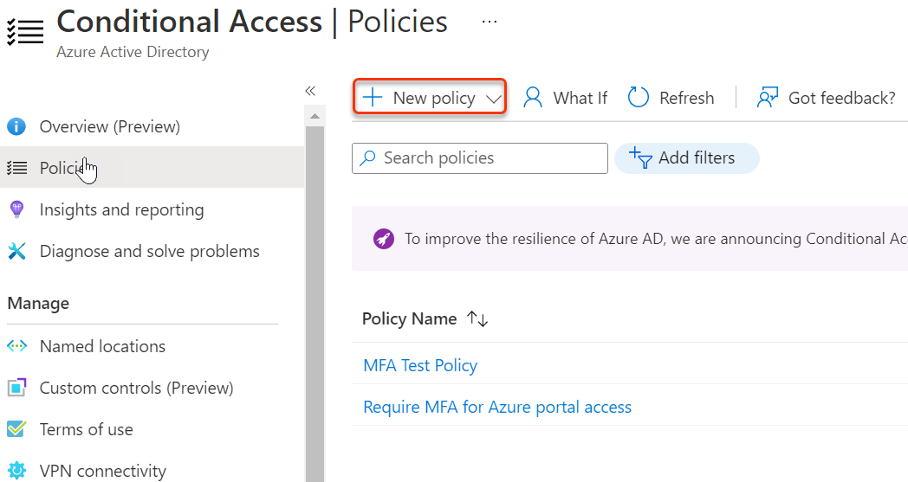
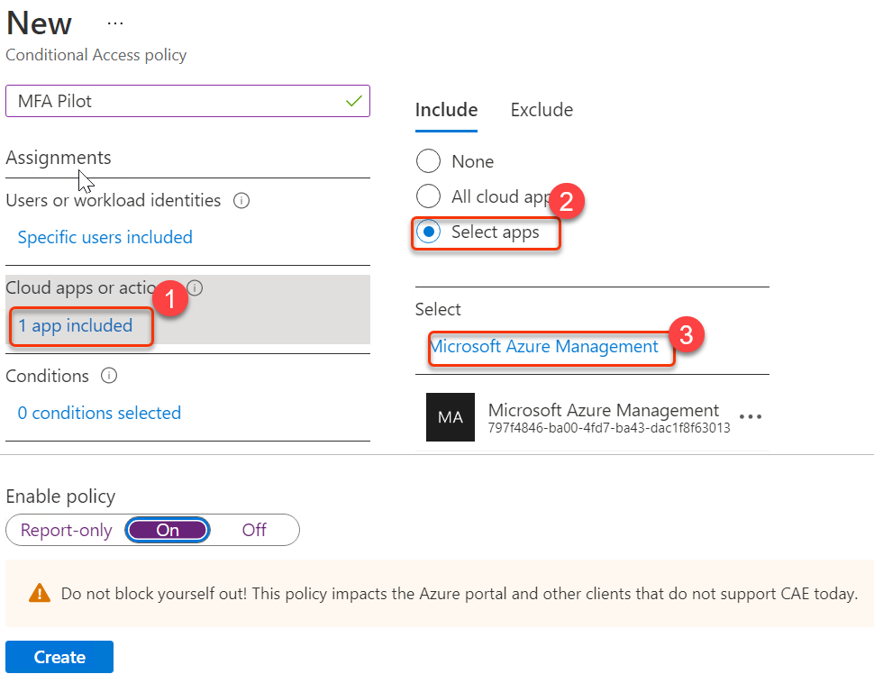
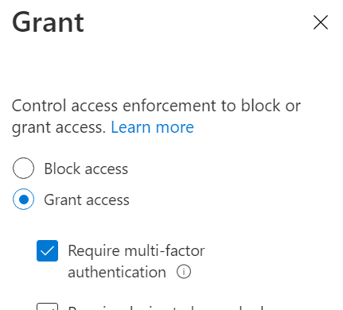

# Module 3 - Lab 1 - Exercise 2 -  MFA Conditional Access (Complete an Azure Multi-Factor Authentication pilot roll out)

In this exercise you will configure a conditional access policy enabling Azure Multi-Factor Authentication (Azure MFA) when logging in to the Azure portal. The policy is deployed to and tested on a specific group of pilot users. Deployment of Azure MFA using conditional access provides significant flexibility for organizations and administrators compared to the traditional enforced method.

- Enable Azure Multi-Factor Authentication
- Test Azure Multi-Factor Authentication

### Task 1: Enable Azure Multi-Factor Authentication

1.  Return to the the Azure portal that is logged in as your Global Admin Holly Dickson.

1.  On the Hub go to **Azure Active Directory**,

1.  Click **Groups** and click **+ New group**.

     

1.  Enter the following information then select **Create**:

      * Group type; `Security`
      * Group Name: `MFA Pilot`
      * Group description: `MFA Pilot Group`
      * Membership type: `Assigned`
      * Members: Select `Lynne Robbins`
  
  
      
  
2.  Browse to **Azure Active Directory**, click **Security** and select **Conditional access** on the **Policies** Blade.

3.  Select **+ New policy**

     

4.  Name your policy `MFA Pilot`
5.  Under **Users and groups**, click **0 users and groups selected**. Choose **Select Users and groups** radio button and check the box **Users and groups** Select.
    * Select your pilot group `MFA Pilot`
    * Click **Select**

     

6.  Click **Cloud apps or actions**, select the **Select apps** radio button.
    * Click **Select**. The cloud app for the Azure portal is `Microsoft Azure Management` select it.
    * Click **Select**

     

7.  Skip the **Conditions** section
8.  Click **Grant**, make sure the **Grant access** radio button is selected
    * Check the box for **Require multi-factor authentication**
    * Click **Select**

     

9.  Skip the **Session** section
10. Set the **Enable policy** toggle to **On**
11. Click **Create**

    **Note**: If the policy fails check your work and **Create** again. 

### Task 2: Test Azure Multi-Factor Authentication

To prove that your conditional access policy works, you test logging in to a resource that should not require MFA and then to the Azure portal that requires MFA.

2.  Open a new browser window in InPrivate or incognito mode and browse to **`https://portal.azure.com`**

       * Log in with the Lynne Robbins user (Lynne's password is likely the same as the MOD Administrator password provided by your lab hoster) and note that you should now be required to register for and use Azure Multi-Factor Authentication.
       * Close the browser window.

# End of lab
