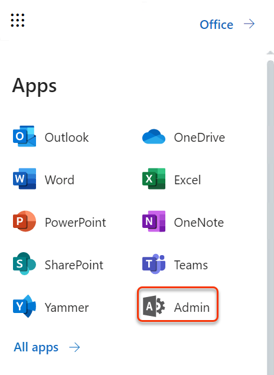
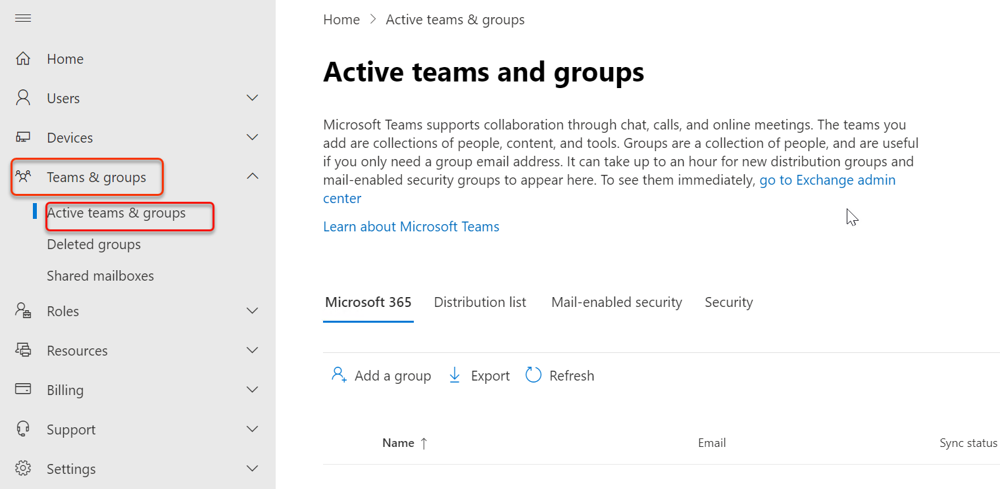
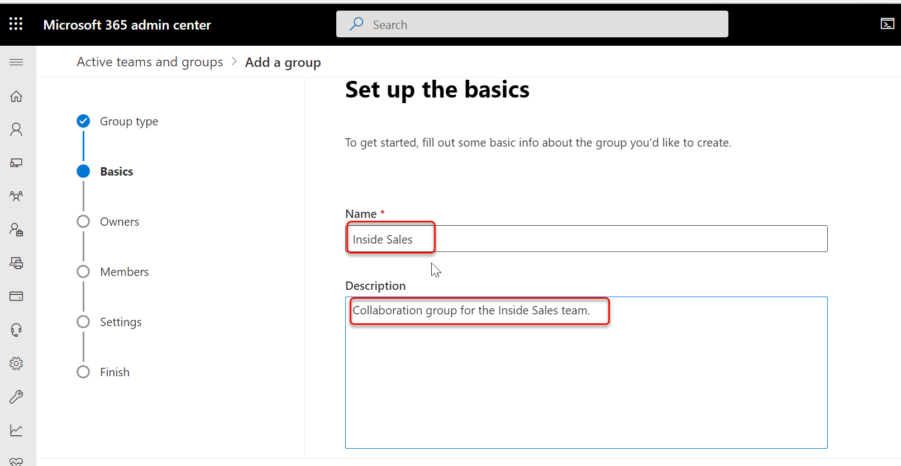
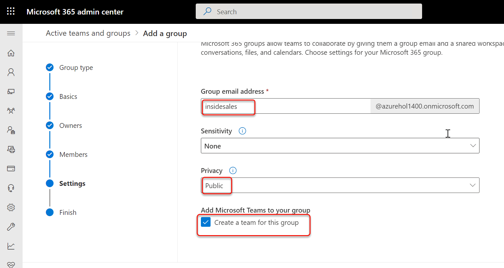
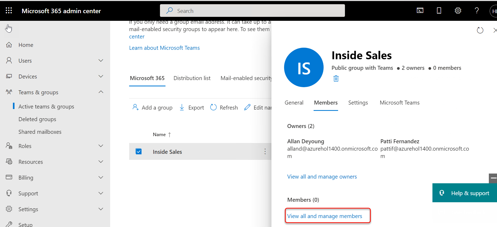
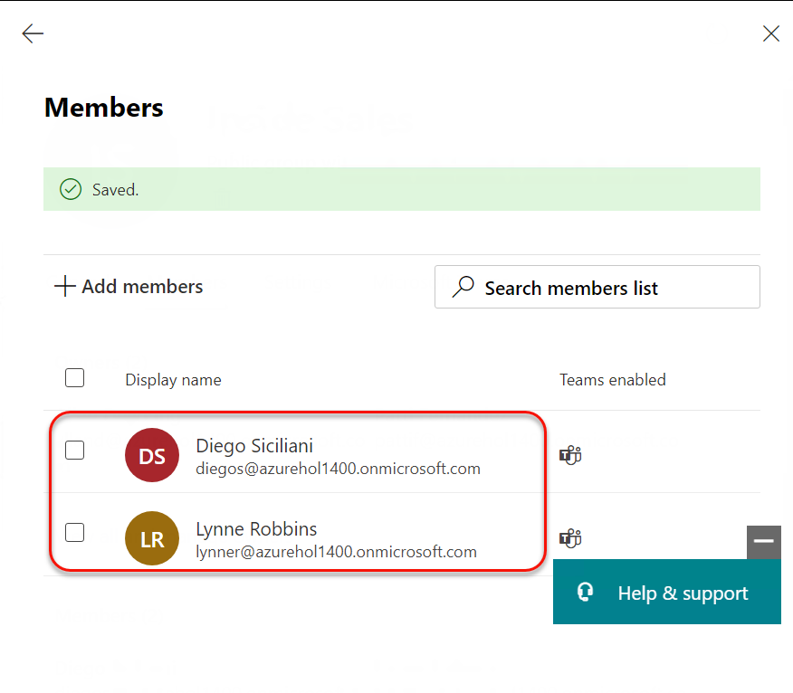
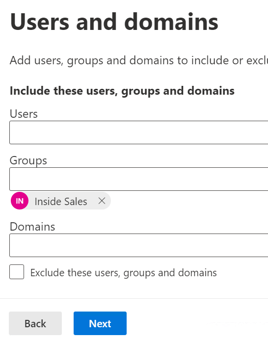
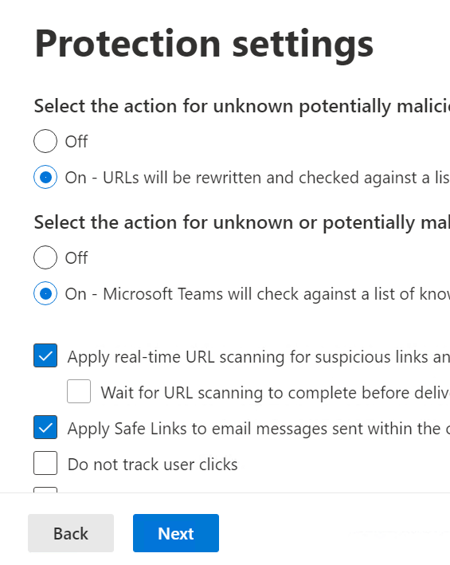
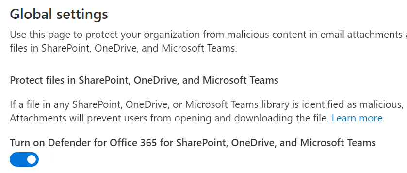
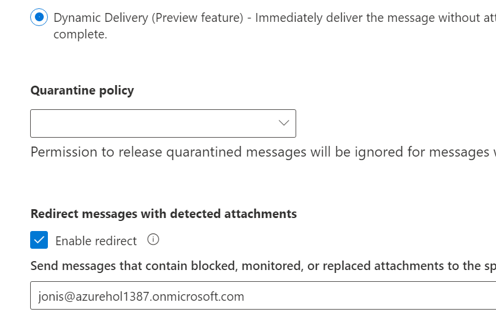

# Module 5 - Lab 1 - Exercise 1 - Implement ATP Policies  

You have a Global Admin account set up for Holly Dickson, and you&#39;re signed into Microsoft 365 as Holly. In this phase of your pilot project for Adatum, you want to edit an existing ATP Safe Links policy, and then create a Safe Attachments policy and turn on Advanced Threat Protection for SharePoint, OneDrive, and Microsoft Teams. You will also validate both policies to ensure they work properly.

### Task 0 - Create and Manage Groups

1. You need to login into your domain controller 1 VM as the **LON-DC1\Azureuser Admin** account.

1. In Internet Explorer browser, navigate to `https://portal.office.com/`. 

1. In the **Sign in** window, enter **Holly@xxxZZZZZZ.onmicrosoft.com** (where ZZZZZZ is your unique tenant ID provided by your lab hosting provider). Select **Next**.

1. Select **Password** from Environment details page and then select **Sign in**.

1. If a **Get your work done with Office 365** window appears, select the **X** to close it. 

1. In the **Office 365 home page**, select **Admin** to open the Microsoft 365 admin center (if **Admin** is covered by an **Office 365 apps** box, select **Got it!** to close the box).

	

1. If a survey window appears, select **Cancel**.

1. In the **Microsoft 365 admin center**, select **Teams & Groups** in the left navigation pane, and then under it, select **Active Teams & Groups**. 

	

1. In the **Active Teams & Groups** page, select **Add a group** that appears on the menu bar above the list of groups.  

1. In the **Choose a group type** window, select **Microsoft 365 (recommended)** and then select **Next**. 

1. In the **Set up the basics** window, enter `Inside Sales` in the **Name** field, and then enter `Collaboration group for the Inside Sales team.` in the **Description** field. Select **Next**.

	

1. In the **Assign Owners** window, you will assign Allan Deyoung and Patti Fernandez as owners of this group. 
	- Enter `Allan` in the **Owners** field. In the drop-down menu that appears, select **Allan Deyoung**. 
	- Enter `Patti` in the **Owners** field. In the drop-down menu that appears, select **Patti Fernandez**. 
	- Select **Next**.

1. Leave default settings and click 'Next' under Members.

1. In the **Edit settings** window, enter `insidesales` in the **Group email address** field. Under the **Privacy** section, verify the **Public** option is selected (select it if need be), and under the **Add Microsoft Teams to your group** section, verify the **Create a team for this group** checkbox is selected (select it if need be). Select **Next**. 

	

1. In the **Review and finish adding group** window, review the content that you entered. If everything is correct, select **Create group**; otherwise, select **Back** and fix anything that needs correction (or select **Edit** under the specific area that needs adjustment).

1. On the **New group created** window, note the comment at the top of the page that it may take 5 minutes for the new group to appear in the list of groups.  

	Select **Close**. This returns you to the **Groups** page.
   
1. If groups do not appear in the **Groups** list, wait a minute or so and then select the **Refresh** option on the menu bar (to the right of **Add a group**). You may need to wait an additional few minutes for both groups to appear.

1. You’re now ready to add members to the groups. In the list of **Groups**, select the **Inside Sales** group, which opens a window for the group. 

1. In the **Inside Sales** group window, select the **Members** tab.

1. Under the **Members** section, you can see the two owners (Allan and Patti), but you can also see that there are zero (0) members. Select **View all and manage members** to add members to the group. 

	

1. In the **Inside Sales** group window, select **+ Add members**. This displays the list of current users.

1. In the list of users, select **Diego Siciliani** and **Lynne Robbins**, and then scroll to the bottom and select **Add (2)**. 

	

1. Select **Back arrow**. 

1. On the **Inside Sales** window, Diego and Lynne should now appear as members of the group. Select the **X** in the upper right corner to close the window.

### Task 1 – Create a Safe Links Policy

In this task, you will add the URL **http://tailspintoys.com** to the company-wide list of blocked URLs, and you will create an ATP safe links recipient policy that applies to all users in your tenant.

1. You should  be logged into your Client 1 VM (**LON-CL1**) as the **LON-CL1\Admin** account, and you should be logged into Microsoft 365 as **Holly Dickson** as credential given in lab environment details page.

2. You should be in the Microsoft 365 Security and Compliance center. If not, in your browser, enter `https://protection.office.com`

3. In the **Security &amp; Compliance center**, in the left navigation pane, select **Threat Management** and then select **Policy**.

4. In the **Policy** window, scroll to the right (if necessary) and select the **Safe Links** tile.

5. In the **Safe Links** window, click **Global Settings**.

6. In the **Global settings for users included in active Safe Links policies** window, under the **Block the following URLs** section, you can enter any URLs that you want to have blocked. For this test lab, in the **Enter a valid URL** field, enter `http://tailspintoys.com` to add it to the policy.

7. Select **Save**.

8. Select the **+ Create** to add a new recipient policy.

9. On the **Name your policy** pane, enter a unique name to your lab session `Unique Name` in the **Name** field. Click **Next**.

10. On the **Users and domains** pane, enter `Inside Sales`in the **Group** field, select it from the list. Click **Next**.

    

11. On the **Protection settings** pane, select the following options and click **Next**:

    - Under **Select the action for unknown potentially malicious URLs in messages**: Select **On – URLs will be rewritten and checked against a list of known malicious links when user clicks on the link**.

    - Also **select On for unknown or potentially malicious URLs within Microsoft Teams**.

    - Select the check box next to **Apply real-time URL scanning for suspicious links and links that point to files**.

    - Select the check box next to **Apply safe links to email messages sent within the organization**.

    

12. On the **Notification** pane, leave the default notification text selected. Click **Next**.

13. On the **Review** pane, select **Submit** to create the policy.

14. Leave the Office 365 Security &amp; Compliance tab open for use in a later task.

### Task 2 – Validate the Safe Links Policy

In this task, you will test the Safe Links Policy that you just created that blocks links to the `http://tailspintoys.com` URL.

1. You should still be logged into your Client 1 VM (**LON-CL1**) as the **LON-CL1\Admin** account, and you should be logged into Microsoft 365 as **Holly Dickson**.

2. In your **Microsoft Edge** browser, select the **Microsoft Office Home** (or go to `https://office.com`) tab and then select **Outlook.**

3. If you receive a **We updated Outlook** message, select **Not Now**, or if you see a **Welcome** message, then close it.

4. In **Outlook on the web**, select **New Message** in the upper left part of the screen.

5. In the right pane, enter the following email information:

    - To: You will be sending an email to the MOD Administrator, so enter **odl** in the **To** field and then select the **MOD Administrator** email address from the drop-down list.

    - Add a subject: `Free stuff from Microsoft`

    - Add a message: `Please click on me for free toys from Microsoft`.

6. Select the text that you added in the body of the message.

7. At the bottom of the detail pane, below the body of the message, is a taskbar. On the taskbar, select the **Insert hyperlink** icon to display the Insert link window.

9. In the **Insert link** window, the text that you highlighted in the body of the message should be displayed in the **Display as** field. In the **Web address (URL)** field, enter the following URL: `http://tailspintoys.com/aboutus/freetoys`.

10. Select **OK**.

11. In the body of the email, the message should still be selected. Click anywhere in the body of the message to remove the highlighting. The color of the text should now be blue and it should be underlined, indicating that this message is hyperlinked to a URL.

12. Select **Send** in the menu bar that appears above the message (or the **Send** button at the bottom of the page).

13. You now want to open the MOD Administrator&#39;s Inbox in Outlook and validate whether the ATP policy you created in the prior task worked on the email that you just sent from Holly. To do this, you need to **Open new Inprivate window.**

14. Enter the following URL in the address bar: `https://outlook.office365.com`

15. Since you want to sign in as the MOD Administrator, in the **Sign-in** window, enter **admin@M365xZZZZZZ.onmicrosoft.com** (where ZZZZZZ is your tenant ID provided by your lab hosting provider).

16. Then select **Next**.

17. In the **Enter password** window, enter the password provided by your lab hosting provider and select **Sign in**.  If you are requested to provice self-service password information click **cancel**.

18. Close the **Let Microsoft Edge save and fill your password for this site next time?** banner by selecting **Never**.

19. On the **Stay signed in?** dialog box, select the **Don't show this again** check box and then select **Yes.**

20. Close the **Welcome** window that appears.

21. In the MOD Administrator&#39;s **Inbox**, open the email that was sent by Holly.

22. When you hover over the blue link that appears in the body of the email, you can see a long URL in the bottom of the browser window; this URL starts with `https://nam03.safelinks.protection.outlook.com`.

    When you select the hyperlink to open it, a new tab in **Edge** opens that displays the following warning message: **Opening this website might not be safe.** This message indicates that your ATP Safe Links policy is working correctly and access to the URL is blocked with ATP Safe Links.

23. Leave the Inprivate window open and leave Outlook open to the MOD Administrator&#39;s Inbox for later.

### Task 3 – Create a Safe Attachment policy and turn on ATP for SharePoint, OneDrive, and Microsoft Teams

In this task, you will, and you&#39;ll create an ATP Safe Attachments policy that will test email attachments for malware that are sent to recipients within the M365xZZZZZZ.on microsoft.com domain. You will configure the policy so that if an attachment is blocked, it will be removed from the email that is sent to the recipient, and a copy of the email will be redirected to Joni Sherman for additional review.

1. Switch back to your Client 1 VM (**LON-CL1**). You should still be logged into your Client 1 VM as the **LON-CL1\Admin** account, and you should be logged into Microsoft 365 as **Holly Dickson**.

2. In your **Edge** browser, select the **Office 365 Security &amp; Compliance** tab.

3. In the **Office 365 Security &amp; Compliance center**, in the left navigation pane under **Threat Management**, select **Policy**.

4. In the **Policy** window, select the **Safe Attachments** tile.

5. On the **Safe attachments** window, at the top of the page under **Global Settings** in the **Protect files in SharePoint, OneDrive, and Microsoft Teams** section, select the **Turn on Defender for Office 365 for SharePoint, OneDrive and Microsoft Teams** switch. Select **Save**.

   

6. Select the **+ Create** on the menu bar to add a new safe attachments policy.

7. In the new safe attachments policy window, enter `AttachmentPolicy1` in the **Name** field then select **Next**.

8. In the **Users and domains**, enter `Joni Sherman` in the **Users** field then select **Next**.

9. Under the **Safe attachments unknown malware response** section, select **Dynamic Delivery** (this option will still send the email but will hold the attachment until it has been scanned and marked acceptable).

10. Under the **Redirect messages with detected attachments** section, select **Enable redirect**.

11. In the **Send messages that contain blocked, monitored, or replaced attachments to the specified email address** field, enter **JoniS@M365xZZZZZZ.onmicrosoft.com** (where ZZZZZZ is your unique tenant ID provided by your lab hosting provider)

    

1. On the **Review** window, note the two messages displayed regarding the **Safe Attachents detection response:** and **Redirect attachments:** options that were selected. select **Submit**.

12. It may take a minute or so to update the organization settings. In the **Update complete** window, select **OK**.

**NOTE:** Unfortunately, we are unable to create a training lab in which you can validate the ATP Safe Attachments policy that you just created. To do so, you must send an email that contains a malicious attachment. There are some common test viruses that are available, such as the EICAR test virus; however, with well-known test viruses such as EICAR, the messages in which they are attached get quarantined before they can be processed by Office 365 ATP. Since ATP Safe Attachments functionality is meant to protect against unknown and zero-day viruses and malware, it is very difficult, and not recommended, to create such an attachment.

That said, after you have defined your ATP Safe Attachment policies in your real-world environment, one  way to see how the service is working is by viewing Advanced Threat Protection reports. For more information on using ATP reporting to validate your Safe Links and Safe Attachment policies, see [View reports for Office 365 Advanced Threat Protection](https://docs.microsoft.com/en-us/office365/securitycompliance/view-reports-for-atp).

# End of Lab
