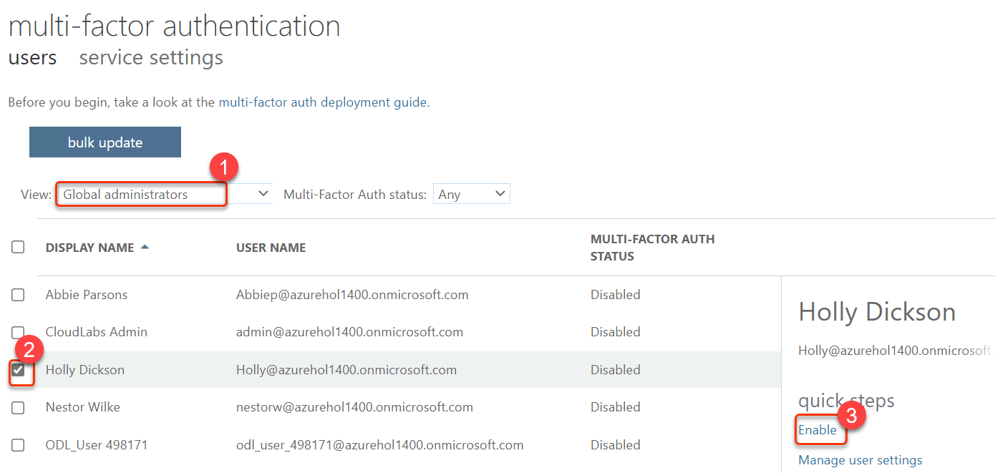
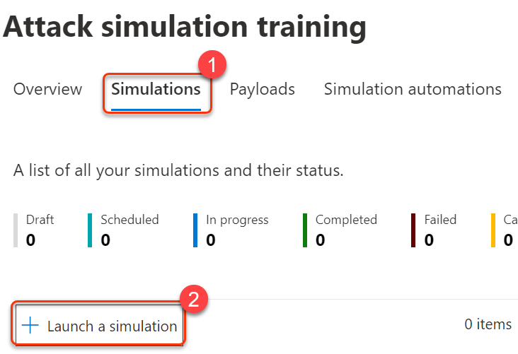
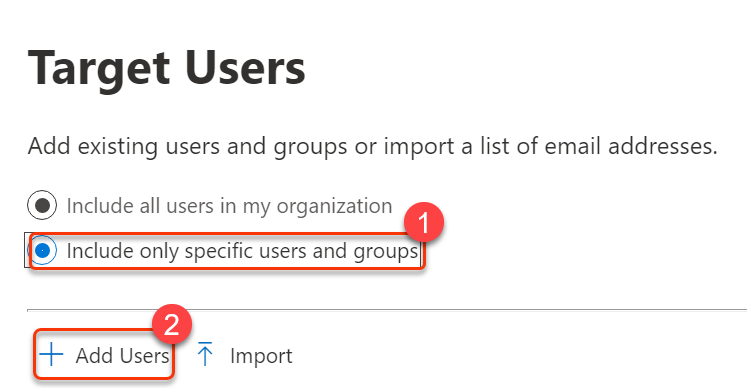

# Module 6 - Lab 1 - Exercise 1 - Conduct a Spear phishing attack

Holly Dickson is concerned that some users in her organization may require education about phishing attacks.  In this lab you will use the Microsoft 365 Attack simulator to determine your users' susceptibility to phishing attacks.

### Task 1: Enable Mulit-factor authentication for Holly Dickson

1.  On LON-CL1, Go to the Office 365 Security & Compliance center `https://protection.office.com` and login as **Holly Dickson** as credentials given in Lab Environment Details Page.

2.  Click **Threat management**, and then click **Attack simulator**.

	

3.  Notice the warning that you must enable multi-factor authentication (MFA).  You are about to do a simulated attack and the system wants to confirm your credentials. This is a requirement of the attack simulator. Let's enable MFA for Holly Dickson. Go to your browser tab with the Microsoft 365 admin center or open a new browser tab to `https://admin.microsoft.com`.

	**Note:** You may not get this warning if you enabled MFA for Holly in an earlier lab and are using the same tenant.  If this is the case you may skip ahead to the next task.

4.  On the left select **Users** and then select **Active users**.

5.  On the Active users screen click **Multi-factor authentication**.

	

7.  In the multi-factor authentication screen View **Global Administrators** then select **Holly Dickson** and select **Enable** under quick steps.

8.  In the About enabling multi-factor auth screen select **enable**. in the About enabling multi-factor auth screen select **enable multi-factor auth** button.

9.  In the Updates successful screen click **Close**.

	

10.  Close the browser session.  Open a new browser and open the Office 365 Security & Compliance portal and login again as Holly Dickson.  Now you should be asked for multi-factor credentials as part of the login process.

**Note:** it may take several minutes for this MFA setting to propagate your tenant.  If the **Launch Attack** button is not available in Attack Simulator then wait a few minutes and login again as Holly Dickson. If you are not able to satisfy the MFA requirements with your own mobile device you will not be able to complete this lab.

### Task 2: Configure and launch a Spear Phishing attack

1. Go to [Microsoft 365 security center - Attack simulation training](https://security.microsoft.com/attacksimulator) and login as **Holly Dickson** as credentials given in Lab Environment Details Page.
1. Click the **Simulations** tab. Select **+ Launch a Simulation**.

	
1. On the **Select Technique** screen. Ensure that **Credential Harvest** is selected. Click **Next**.

1. Name the simulation `Spear Simulation` and select **Next**.
1. On the **Select Payload** screen, select a desired payload from the list of provided payloads. Click **Next**.

1. In the **Target Users** screen, do the following:
	1. Ensure **Include only specific users and groups** is selected. 
	1. Click **Add Users**. 
	1. On the **Add Users** screen, type  **Patti Fernandez** in the search box and hit Enter. 
	1. Select the user from the search results list. 
	1. Click **Add 1 User** at the bottom. 
	1. Click  **Next**.

	
	
1. Leave the default settings on the **Assign training** screen. Click **Next**.
1. On the **Landing page** screen leave default and  click **Next**.
1. On the Select end user notification select **Microsoft default notification** and then select Delivery preferences to **Deliver during campaign** and click **Next**.
1. On the **Launch Details** page, ensure that **Launch this simulation as soon as I'm done** is selected. Click **Next**.
1. On the **Review Simulation** screen, click **Submit**.

### Task 3: Confirm target received phishing email attack

1.  Open a new browser window in InPrivate or incognito mode and browse to `https://office.com`.
 
1.  Log in as the user Patti Fernandez **PattiF@ZZZZZZ.onmicrosoft.com** where ZZZZZZ is your specific Office 365 tenant.  Patti's password is likely the same as the MOD administrator's password provided by your lab hosting providor.

1.  Click the Outlook icon to open Microsoft Outlook for Patti. You should see a spear phishing email that includes the details you just entered in the previous task.

	

### Task 4: Review the results

1. In your browser session where you are logged in as Holly Dickson go back to the [Attack simulation training](https://security.microsoft.com/attacksimulator). Click the **Simulations** tab.
2. In the simulation details area, notice the Actual and Predicted compromised rates.
3. Click on the **Spear Phishing** simulation and in the Simulation Impact area, click **View users**.  
    
	**Note**: Since you can run multiple spear phishing simulation campaigns simultaneously you could create different simulations for different users and groups.  These different simulations might have enticements that are more appropriate for different users.
	
4. In the list of users select **Export** to export a list of users who fell victim to the simulated spear-phishing attack.
