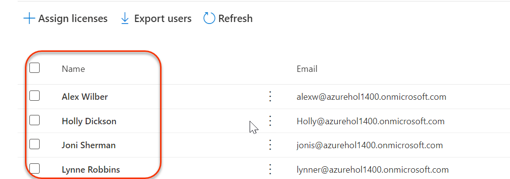

# Module 8 - Lab 1 - Exercise 1 - Enable device management

You are Holly Dickson the security administrator for Adatum Corporation, and you have Microsoft 365 deployed in a virtualized lab environment. In this lab, you will manage user devices using Intune.

In this exercise you will verify that Adatum has installed the Enterprise Mobility + Security E5 product. You will then verify that it has been assigned to your test user accounts, and you will assign a license to Holly Dickson.

### Task 1: Verify and assign Enterprise Mobility + Security licenses

In this task you will verify that Adatum has installed the Enterprise Mobility + Security E5 product and you will check how many licenses are available. You will then verify that a license has been assigned to your test user accounts, and you will assign a license to Holly Dickson.

1. Log into your Client 1 VM (LON-CL1) as the **Adatum\Azureuser Administrator** account. 

1. In **Microsoft Edge**, open **https://portal.office.com**, sign in as as Holly Dickson **(holly@M365xZZZZZZ.onmicrosoft.com)** with a password as provided in the Environment tab, and in the **Microsoft Office Home** page, select **Admin**.

   

1. In the **Microsoft 365 admin center**, select **Billing** in the left navigation pane, and then under it, select **Licenses**.

1. On the **Licenses** page, select **Enterprise Mobility + Security E5.**

   

1. In the **Enterprise Mobility + Security E5** page, under the list of users, verify that your pilot team members – **Alex Wilber**, **Joni Sherman**, **Lynne Robbins**, and the **MOD Administrator** – were each assigned a license.

   

    **Note:** These user accounts were created as part of your Office 365 tenant, and during that process, they were each assigned an Office 365 E5 license and an Enterprise Mobility + Security E5 license.

6. The one user who was not assigned an Enterprise Mobility + Security E5 license is your Global Administrator, Holly Dickson. When you created Holly&#39;s user account in an earlier lab, you may have been instructed at that time to only assign her an Office 365 E5 license. You will now assign her an Enterprise Mobility + Security E5 license.  If Holly already has an Enterprise Mobility + Security E5 license you can skip to the next task.

    To assign Holly a license, select **+Assign licenses**.

7. On the **Assign licenses to users** page, select the **Enter a name or email address** field, and in the list of users that appears, select **Holly Dickson**.

8. Select **Assign**.

9. Close the **You assigned a license to Holly Dickson** window.

10. Leave your Client 1 VM open for the remainder of this lab.

You have now verified the available Enterprise Mobility + Security E5 licenses in your tenant and assigned an EMS E5 license to Holly.

# Proceed to Exercise 2
