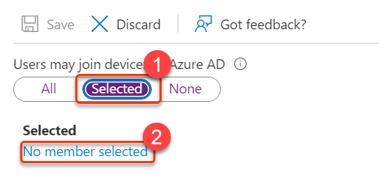

# Module 8 - Lab 1 - Exercise 2 - Configure Azure AD for Intune 

In this exercise you will activate the automatic client enrollment to Intune for Mobile Device Management (MDM). This will allow you to manage mobile device access and set policies for restricting access to devices unless certain actions are adopted, such as strong passwords and screen timeouts.

### Task 1: Integrate Azure AD with Intune

1. Open **Microsoft Edge**, open Azure by going to `https:/portal.azure.com/`. Login as Holly Dickson, Navigate to **Azure Active Directory**

1. On the **Adatum Corporation - Overview** window, in the left pane under **Manage** select **Mobility (MDM and MAM),** and then in the details pane on the right, select **Microsoft Intune**.

    **Note:** If you see a notification that automatic enrollment is available only for Azure AD Premium, press F5 to refresh the page in your web browser and then select **Microsoft Intune**.

1. On the **Configure** window, in the **MDM user scope** row, select **All**.

    **Note:** By setting this parameter to **All**, you are allowing all users who join their devices to Azure AD to automatically enroll them to Intune as well.

1. Select **Restore default MDM URLs** to ensure the correct URLs for client enrollment are configured.

1. If any changes made, then in the menu bar at the top of the **Configure** window, select **Save**.

1. Leave the Azure portal open for the next task.

You have now configured your tenant so that all users can enroll their clients to Intune as soon they log in to their Windows 10 Client with their Azure AD account credentials.

### Task 2: Configure Azure AD join

1. In the **Azure portal** , in the left navigation pane, select **Azure Active Directory.**

1. In the **Adatum Corporation – Overview** window, in the left section under **Manage**, select **Devices**.

1. In the **Devices – All devices** window, in the details pane on the right, verify that no devices are listed. This is because no device has yet to be joined to Azure Active Directory.

1. In the **Devices – All devices** window, in the left pane, select **Device settings**.

1. In the details pane that appears on the right, the property **Users may join devices to Azure AD** is currently set to **All**. This means that all Azure AD users can join their devices to Azure Active Directory. Click **Selected** instead.

1. Below this field, in the **Selected** section click **No member selected**.

   

1. In the **Members allowed to join devices** window, select **+Add**

1. In the **Add members** pane on the right, select **Alex Wilber** , select **Select** at the bottom of the screen, and then select **Ok**.

   

1. Back in the **Device settings** detail pane on the right, scroll down and verify that **Require Multi-Factor Authentication to register or join devices with Azure AD** is set to **No**. The **Maximum number of devices per user** property is currently set to **50.** Select **10** from the drop down box.

1. In the menu bar at the top of the detail pane, select **Save**.

   

1. Leave the Azure portal open for the next task.

You have changed the default settings for users to join their devices to your Azure AD tenant.

### Task 3: Create dynamic Azure AD device group

1. In the **Azure portal** , in the left navigation pane, select **Azure Active Directory.**

1. In the **Adatum Corporation – Overview** window, in the left section under **Manage,** select **Groups**.

1. In the **Groups – All groups** window, in the details pane on the right, select **+New group** on the menu bar.

1. In the **New Group** window, enter the following information:

    - Group type: **Security**
    - Group name: `Enrolled Devices`
    - Membership type: **Dynamic Device**
    - Owner: select the **No owners selected** link, then in the **Add Owners** window, select `Alex Wilber` and select **Select**.

   

1. Under **Dynamic device members**, click **Add dynamic query**.

1. On the **Dynamic membership rules** pane, configure the following fields for this expression:

    - **Property**: select the drop-down arrow and select **managementType**
    - **Operator**: select the drop-down arrow and select **Equals**  
    - **Value**: enter `MDM`

   

1. Select the **Rule syntax** field. It should display the following rule:

    **(device.managementType -eq  &quot;MDM&quot;)**

1. Select **Save** in the menu bar at the top of the window.

1. In the **New Group** window, select the **Create** button at the bottom of the window.

1. The **Enrolled Devices** group should now appear in the list of groups.

1. Leave the Azure portal open for the next task.

# Proceed to Exercise 3
