# Module 8 - Lab 1 - Exercise 3 - Creating compliance and conditional access policies 

### Scenario

Datum would like to ensure that enrolled Windows 10 devices meet a minimum configuration specification.  The following are required:

* Minimum OS version: 10.0.17763.615
* Windows Defender Antimalware required
* iOS and MacOS platforms blocked

If the device does not meet these requirement, the device should be marked as non-compliant.

#### Task 1: Create and apply compliance policy and enrollment restrictions

1.  In Microsoft Edge, type `https://endpoint.microsoft.com` in the  address bar, and then press **Enter**. Sign in as as **Odl_User_id@yourtenant.onmicrosoft.com** with the password as provided in the Environment tab.

1.  From the navigation pane click **Devices**, then click **Compliance Policies**.

    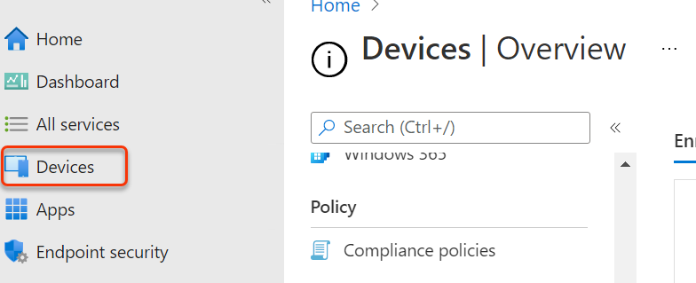

1.  On the **Compliance policies | Policies** blade, in the details pane click **Create Policy**.

    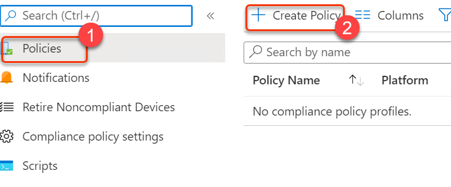

1.  On the **Create a policy** blade, provide the following values and click **Create**:

    -  Platform: **Windows 10 and later**
    

1.  On the Basics tab, provide the following values and click **Next**:

    -  Name: `Compliance1`

1.  On the **Compliance settings** tab, click **Device Health** and review the available settings.

1.  On the **Compliance settings** tab, expand **Device Properties**. In the **Minimum OS version** field, type `10.0.16299.15`.

    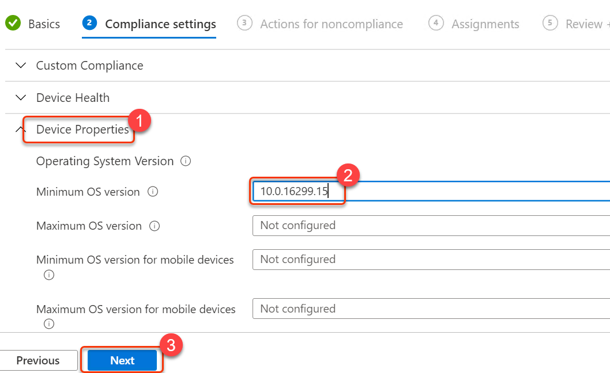

1.  On the **Compliance settings** tab, expand **System Security**. Scroll down and set the **Microsoft Defender Antimalware** setting to **Require**. Click **Next**.

    

1. On the **Actions for noncompliance** tab, note that the schedule to **Mark device noncompliant** is immediately. Review how you can configure the number of days after which the device is marked as noncompliant, and configuration additional actions. Click **Next**. 

1. On the **Assignments** tab, under **Included groups**, click **+ Add groups**. Click `Enrolled Devices`, choose **Select**, and then click **Next**.

    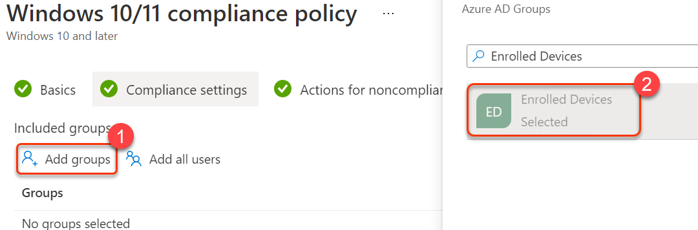

1. Click **Create**.

1. From the left menu click **Devices**, then click **Enroll devices**.

1. On the **Enrollment devices | Windows enrollment** blade, click **Enrollment restrictions**.

1. On the details pane, in the **Device Type Restrictions** section, on the **Default** line, click **All Users**.

    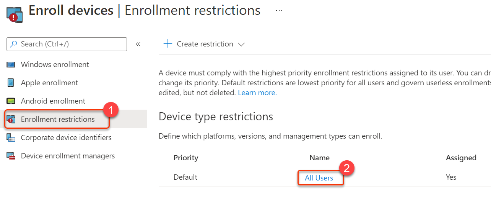
    
1. On the **All Users** blade, click **Properties**. In the **Platform settings** section, click **Edit**.

    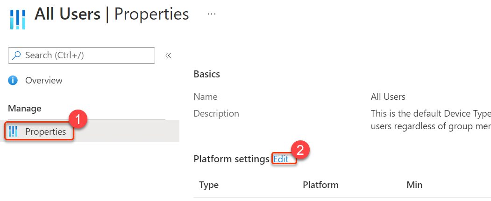

1. On the **Platforms settings** tab, in the **Platform** column, on the rows with **iOS/iPadOS** and **macOS**, click **Block**. Click **Review + save** and then click **Save**.

    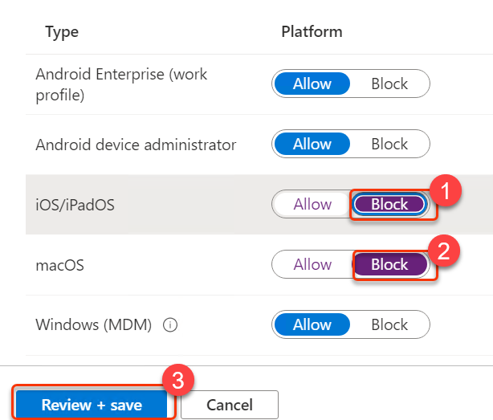

1. Scroll left to the **Enroll devices | Enrollment restrictions** blade. In the **Device Limit Restrictions** section, click **All Users** and then click **Properties**.

    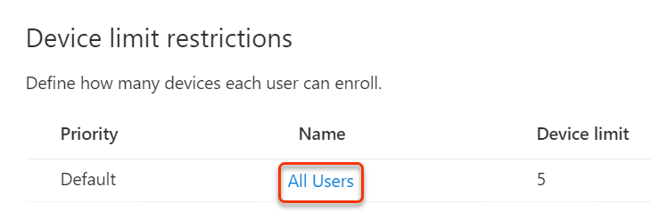
    
    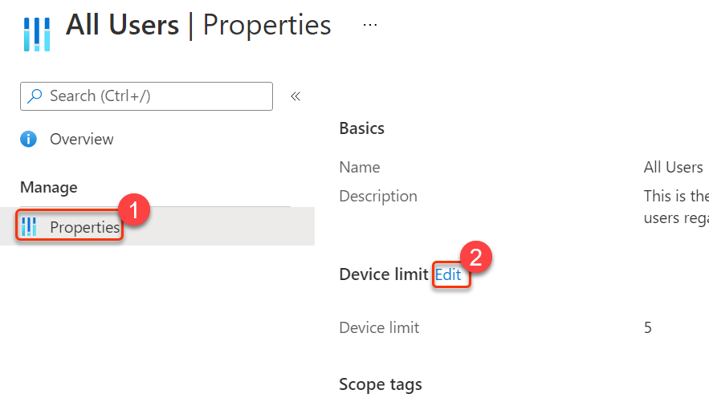

1. In the **Device limit** section, click **Edit**, then change the value to **3**.

    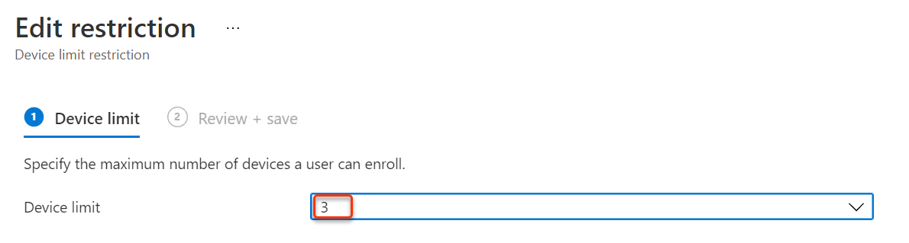

1. Click **Review + Save**, and then click **Save**.

## Task 2: Creating a conditional access policy

### Scenario 

When devices are non-compliant, they should not be able to access their e-mail. You've been asked to configure a conditional access policy that enforces this rule, and verify it functions as expected.

1.  In the **Microsoft Endpoint Manager admin center** click **Devices**, then click **Conditional Access**.

1.  In the **Conditional Access | Policies** pane, click **+ New policy** and select **Create New Policy**.

    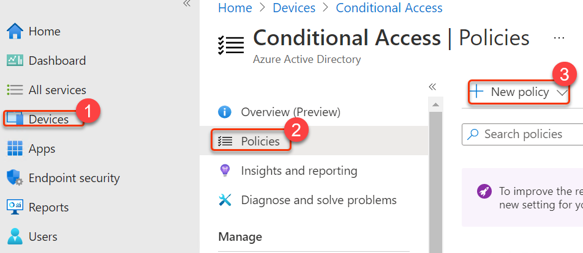

1.  On the **New** blade, in the **Name** text box, type `Conditional1` and then click  on **0 users or workload identities selected** and then **Users and groups**.

1.  On the **Users and groups** blade, click the **All users** radio button.

    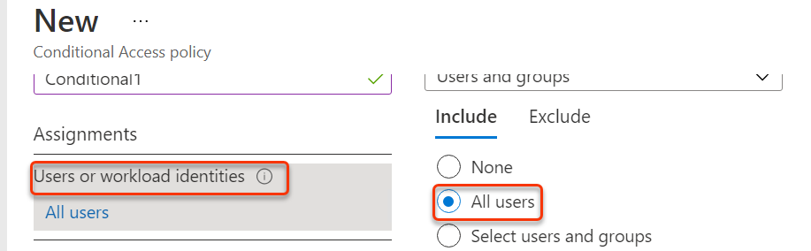

1.  On the **New** blade, click **Cloud apps or actions**, click the **Select apps** radio button, click **Select**, click **Office 365 Exchange Online**, and then click **Select**.

    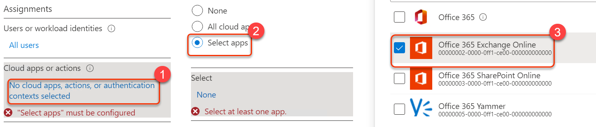

1.  On the **New** blade, click **Conditions** > **0 conditions selected**. Under **Device platforms** label, click **Not configured**. Under **Device platforms** pop-up window, click **Yes** below configure, click the **Select device platforms** radio button, click the **Windows** check box, and then click **Done**.

    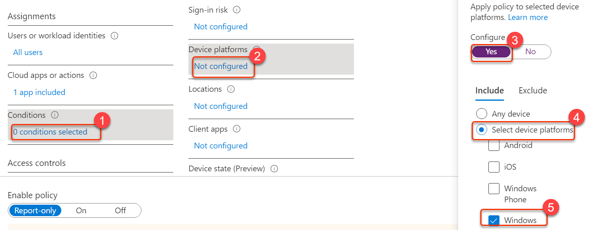

1.  On the **New** blade under **Access controls**, click **Grant**, click the **Require device to be marked as compliant** check box, and then click **Select**.

    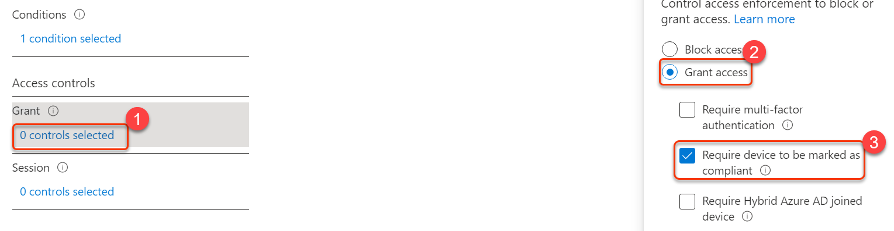

1.  On the **New** blade, click **On** for the **Enable policy** option and then click **Create**.

    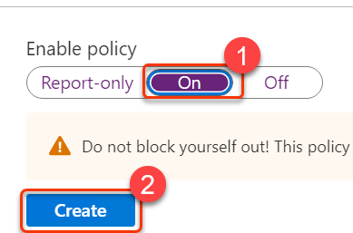

#### Task 3: Verify that the conditional access policy is working

1.  Open a new Microsoft Edge tab, then and open `https://portal.office.com` with the **Odl_User_id@yourtenant.onmicrosoft.com** with the password as provided in the Environment tab.

1.  Click the **Outlook** icon. 

1.  Verify that you receive the message **"You can't get there from here"** or similar warning message.

1.  Click **More details**. You should see more information about why you are blocked. **Note:** This is because LON-CL1 is not joined to Azure AD and not managed by Intune, so not marked as compliant.

1.  **Close** the browser window.

1. Open EndPoint Manager. In Microsoft Edge, type `https://endpoint.microsoft.com` in the  address bar, and then press **Enter**. Sign in as as **Odl_user_id@yourtenant.onmicrosoft.com** with password as provided in the Environment tab.

1.  Click **Devices** and then click **Conditional access**. Click the ellipses next to policy "Conditional1" and click **Delete**.  Click **Yes** to confirm deletion.  Note: If you don't delete this policy it will interfere with later labs.

    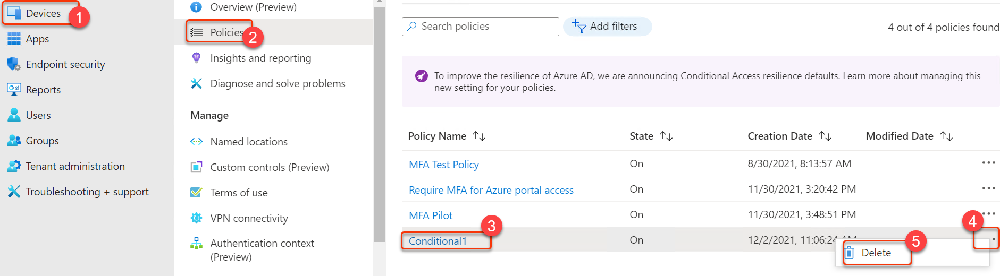

**End of lab**
