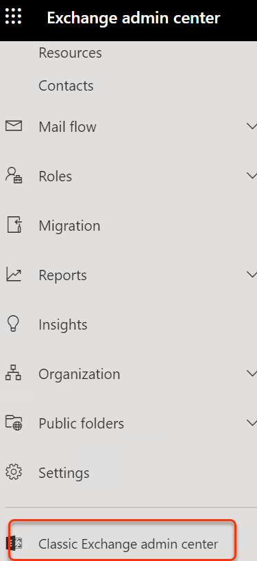
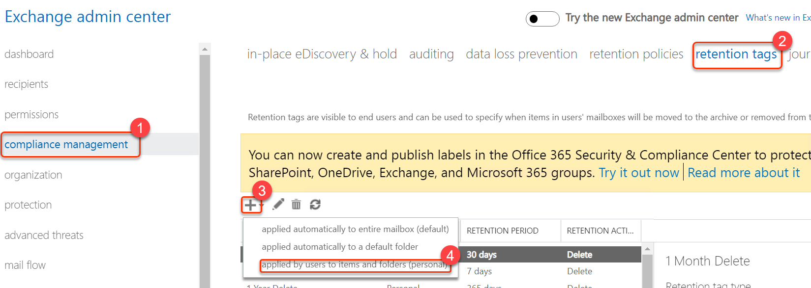
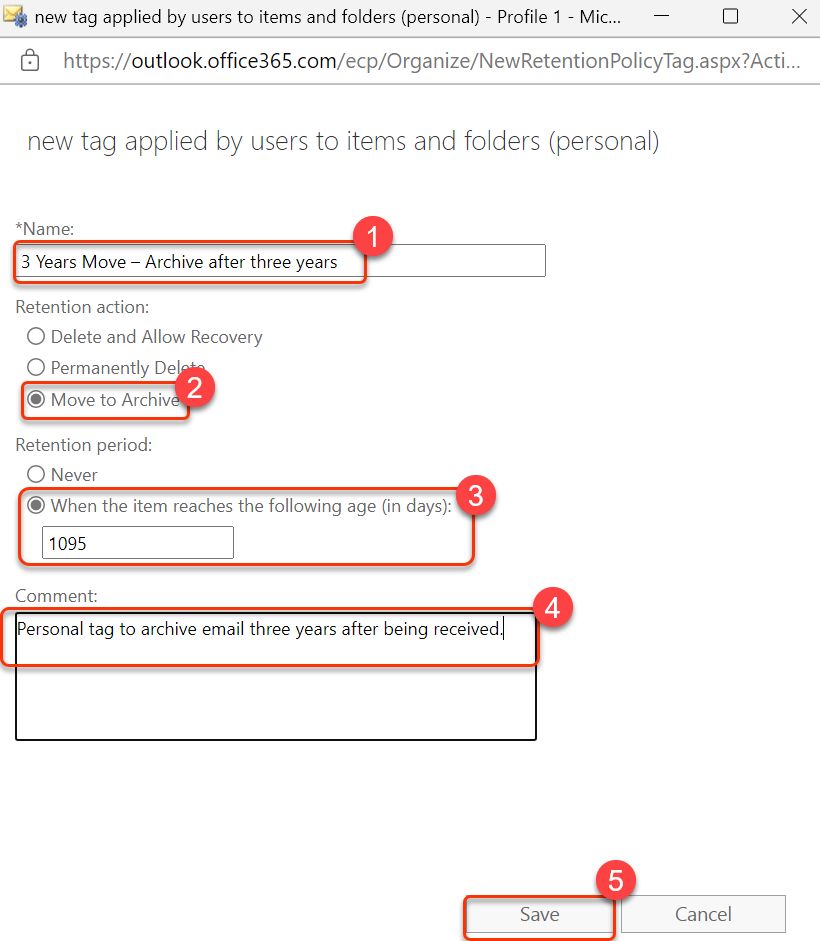
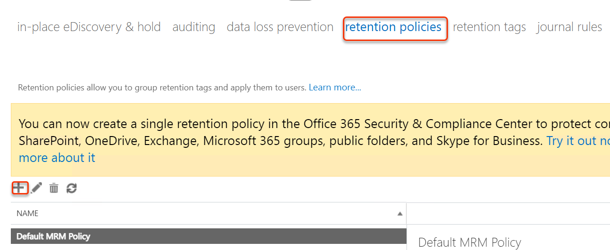
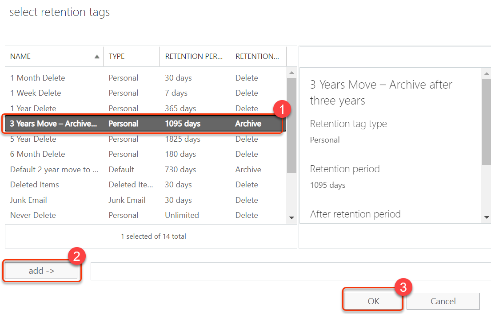
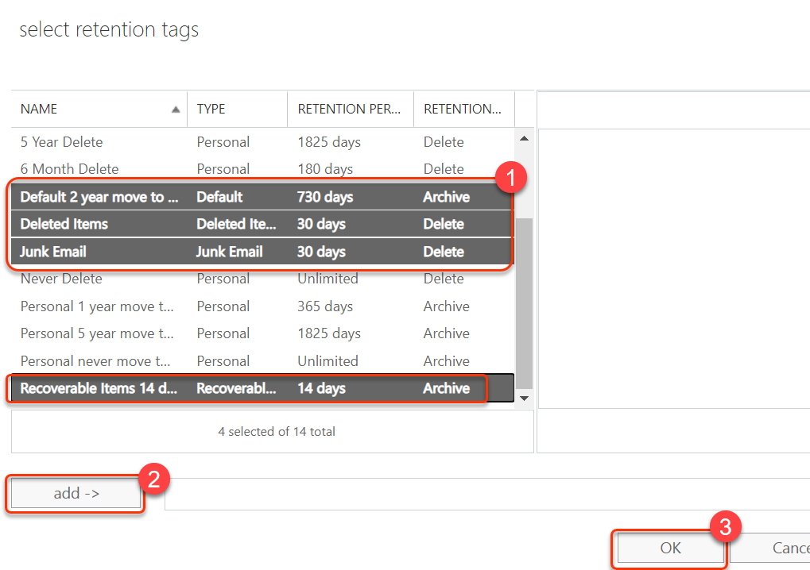
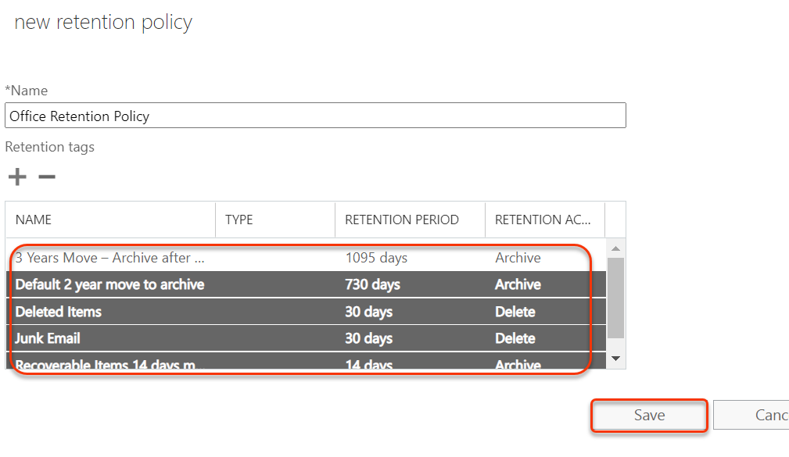
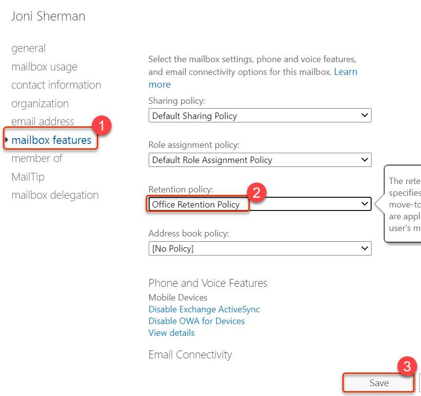
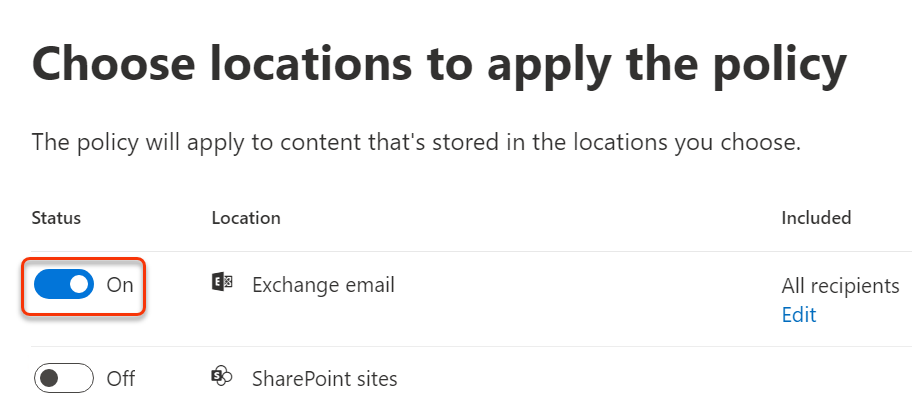

# Module 9 - Lab 1 - Exercise 2 - Configure retention tags and policies  

In this exercise, you will configure retention tags and policies, and you will implement archiving with MRM retention tags. 

### Task 1 – Create an MRM retention tag and policy in the Exchange Admin Center

As part of your pilot project for Adatum, you will configure MRM retention by creating an MRM retention tag and adding it to a new MRM retention policy. You will also assign several default tags to the policy as well. You will then assign this retention policy to Joni Sherman and Alex Wilber's mailboxes.

1. On LON-CL1 virtual machine. In **Microsoft Edge** as Holly Dickson and credentials given in Environment Details Page, navigate to the [**Microsoft 365 admin center**](https://admin.microsoft.com/).

2. In the **Microsoft 365 admin center**, in the left navigation pane, select **… Show all**.

3. In the left navigation pane, under **Admin centers** select **Exchange**. This will open the Exchange admin center.

4. In the **Exchange admin center**, in the left navigation pane, select **New Exchange admin center** then select **Classic Exchange admin center** and then select **Compliance management**.

	
	

5. In the **Compliance management** window, select the **retention tags** tab that appears at the top of the page.

6. You want to create a retention tag, so select the **plus (+)** **sign** in the toolbar that appears across the list of existing retention tags. In the drop-down menu that appears, select **applied by users to items and folders (personal)**.

	

7. In **new tag applied by users to items and folders (personal)** window, under **Name**, type `3 Years Move – Archive after three years`.

8. Under **Retention Action**, select the **Move to Archive** option.

9. Under **Retention period**, select the **When the item reaches the following age (in days)** option, and type `1095` in the retention period field.

10. Under **Comment**, enter `Personal tag to archive email three years after being received`.

11. Select **Save**.  Select **OK** once successful.

	

12. On the menu bar on the top of the page, select the **retention policies** tab.

13. You want to create a retention policy, so select the **plus (+)** **sign** in the toolbar that appears across the list of existing retention policies.

	

14. In **new retention policy** window, under **Name**, type `Office Retention Policy`.

15. Below **Retention tags**, select the **(+)** sign.

16. In the **select retention tags** window, select the tag that you just created, whose name starts with **3 Years Move...** (the column width will truncate the displayed name).

17. Select **add -&gt;** and then select **OK**.

	

18. In addition to the personal retention tag that you just added to the retention policy, you also want to add the following default tags as well:

	- Default 2 year move to archive

	- Deleted Items

	- Junk Email

	- Recoverable Items 14 days move to archive

	

To add these tags, repeat steps 15-17. Hold down the **Ctrl** key as you select each tag in the list; this will enable you to select all four default tags at one time before selecting **add-&gt;**.  Once complete select **OK**.

19. On the **new retention policy** window, select **Save**.  Select **OK**.

	

20. In the **Exchange Admin Center**, in the left navigation pane, select **recipients**.

21. You are now going to apply this retention policy to the mailboxes for your two test users, Joni and Alex. In the list of recipient mailboxes, select **Joni Sherman** and then select the **pencil (edit) icon** in the toolbar to edit the properties of Joni’s mailbox.

	

22. In the **Joni Sherman** properties window, select **mailbox features**.

23. On the **Warning** dialog box, select **OK**.

24. Select the drop-down arrow in the **Retention policy** field and select **Office Retention Policy**.

25. Select **Save** and then select **OK**.

	

26. Repeat the same steps for **Alex Wilber**.

27. Leave your web browser open and proceed to the next task.

You have now created a new retention policy with several retention tags, including a custom personal retention tag. Then you have assigned the retention tags via a retention policy to Alex and Joni’s mailboxes.

### Task 2 – Create a Retention Policy in the Security and Compliance Center

As part of your pilot project for Adatum, you will create a retention policy in the Security & Compliance Center to preserve the content of all Exchange Online mailboxes from deletion for 7 years after the last modification. 

1. In **Microsoft Edge**, go to the [**Microsoft 365 compliance**](https://compliance.microsoft.com/).  Make sure that you are logged in as **Holly Dickson**.

2. In the left navigation pane, click **Information Governance** (you might need to click **... Show all** first) and then select the **Retention policies** tab.

3. In the **Retention policies** tab, click **+ New retention policy** to start the wizard that’s used to create a new retention policy.

	

4. On the **Name your retention policy** page, type `Exchange Preservation` in the **Name** field and select **Next**.

5. on the **Choose the type of retention policy to create** select **static** field and select **Next**.

	

1. In the **Choose locations** page,  deselect all sliders except for **Exchange email.**. Click **Next**.

5. On the **Decide if you want to retain content, delete it, or both** page, leave the **Retain items for a specific period** option selected, and **7 years**. Do not change these fields. However, in the **Retain the content based on** field, it currently indicates **when it was created**. Select the drop-down arrow for this field and select **when items were last modified**.

	

6. Click **Next**.

10. On the **Review your settings** page, review all the settings. If any need to be corrected, select the **Edit** option and make the appropriate correction. Select **Submit** to finish the wizard.

11. Do not close your Client 1 VM or Microsoft Edge. Leave your web browser open as well as all tabs for the next lab.

You have now created a new retention policy in the Security & Compliance Center that retains all Exchange emails from all mailboxes for 7 years after last modification.

 # End of Lab
 
