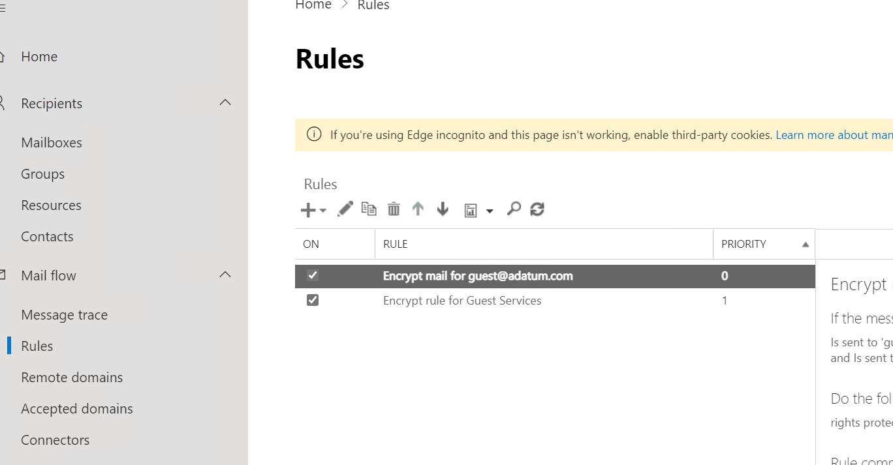
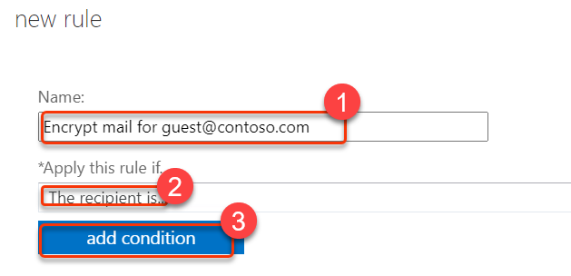
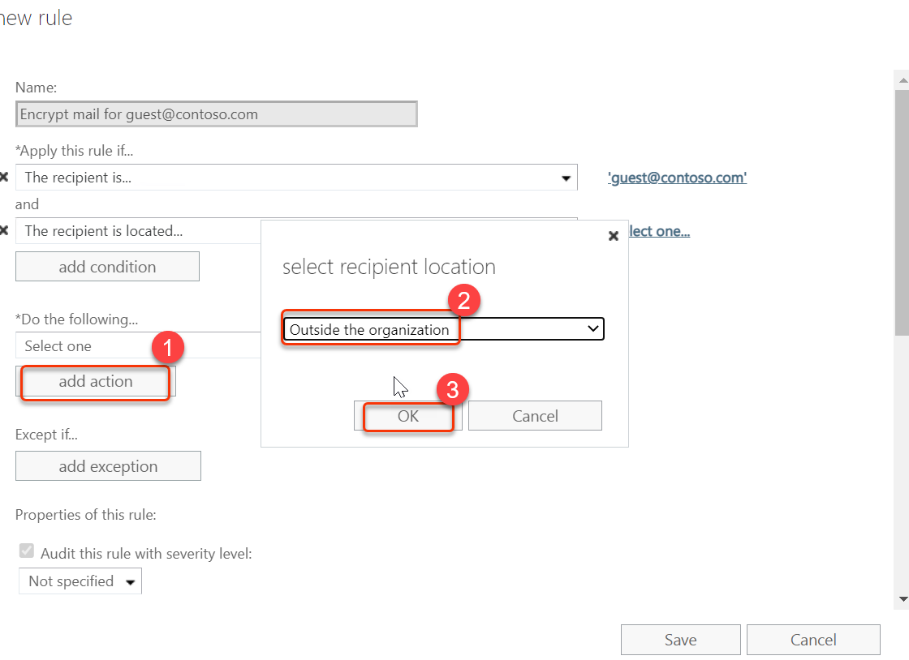

# Module 10 - Lab 1 - Exercise 1 - Configure Office 365 Message Encryption

In this lab, you will take on the persona of Holly Dickson, Adatum’s Security Administrator. You have been tasked with piloting the use of Office 365 message encryption in Adatum’s Microsoft 365 deployment.

In this exercise you will set up Azure Rights Management for your tenant. You will also learn how to create a mail flow encryption rule using the Exchange Admin Center.

### Task 1 – Enable Azure Rights Management for Exchange Online

In this task you will activate Rights Management protection from the Microsoft 365 admin center. 
 
1. Switch to the Client VM (**LON-CL1**). You should still be logged into LON-CL1 as **LON-CL1\Admin**, and you should still be logged into Microsoft 365 as **Holly Dickson**. 

2. Open the Microsoft 365 admin center `https://admin.microsoft.com` if it's not already open on your browser.

3. Select **Settings** and then select **Org settings**.

4. On the Services tab select **Microsoft Azure Information Protection**.

5. In the Microsoft Azure Information Protection pane select **Manage Microsoft Azure Information Protection settings**.

6. You may be asked to sign-in again.  If so login as Holly Dickson.

7. If rights management is not already activated select **activate**. You have now validated activation of rights management in your tenant.
  

### Task 2 – Create a Mail Flow Encryption Rule using the Exchange admin center

In this task, you will create an encryption rule for messages inside your Exchange Online environment by using the Exchange admin center. In the next task, you will do the same thing but using PowerShell instead. 

1. On the **LON-CL1** VM, you should still be logged into the Microsoft 365 admin center as Holly Dickson. If you closed your Edge browser or the Microsoft 365 admin center tab, then in Microsoft Edge navigate to `https://portal.office.com` and sign in as **Holly@M365xZZZZZZ.onmicrosoft.com** (where ZZZZZZ is your unique tenant ID provided by your lab hosting provider) and `Pa55w.rd`. 

2. In the **Office 365 home page**, select **Admin**.

3. In the **Microsoft 365 admin center** left navigation pane, select **Show all**, which expands the list of options in the navigation pane. 

4. Scroll down in the navigation pane and under **Admin centers**, select **Exchange**. This will open the Exchange admin center.

5. In the **Exchange admin center**, in the left navigation pane select **mail flow.**

6. At the top of the **mail flow** page, the **rules** tab displays by default. In the **rules** tab, select the plus sign (**+**) to create a new rule. This displays a drop down menu of actions. Select **Create a new rule.**

 

7. In the **new rule** window, in the **Name** box, enter `Encrypt mail for guest@contoso.com` as the name of this rule.

8. Select the drop-down arrow in the **Apply this rule if… ** condition box. In the drop-down menu, select **the recipient is**. 

9. For this condition, you must either select an existing name from the contact list or type a new email address in the **check names** box. In this case, enter `guest@contoso.com` in the **Check names** box and then select **OK**.

10. You need to add more conditions, so select **More options**.

11. Select **add condition**.

 

12. Note how a second condition box appears below **The recipient is…** condition box. In this second condition box, select the drop-down arrow and select **The recipient**. Then in the drop-down menu select **is external/internal.**

13. In the **select recipient location** dialog box, select the drop-down arrow. In the drop-down menu, select **Outside the organization** and then select **OK**.

 

14. You now need to define an action to perform when this rule is applied. In the **Do the following…** box, select the drop-down arrow. In the drop-down menu, select **Modify the message security….** In the menu that appears, select **Apply Office 365 Message Encryption and rights protection.**

15. In the **select RMS template** dialog box, select the drop-down arrow, select **Encrypt**, and then select **OK.**

16. Select **Save.** Once the rule is saved, it should appear in the list of rules in the Exchange admin center.

4. Leave your browser session open for the next exercise.
