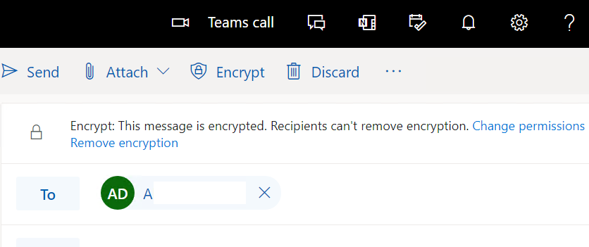
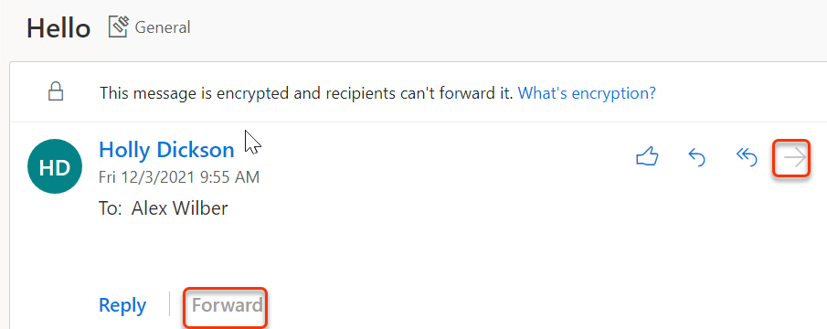
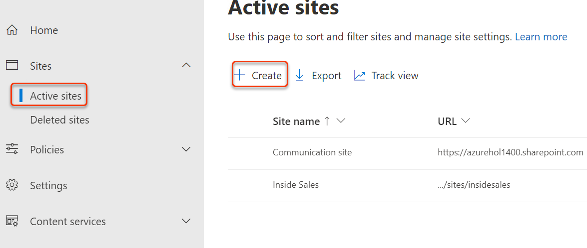
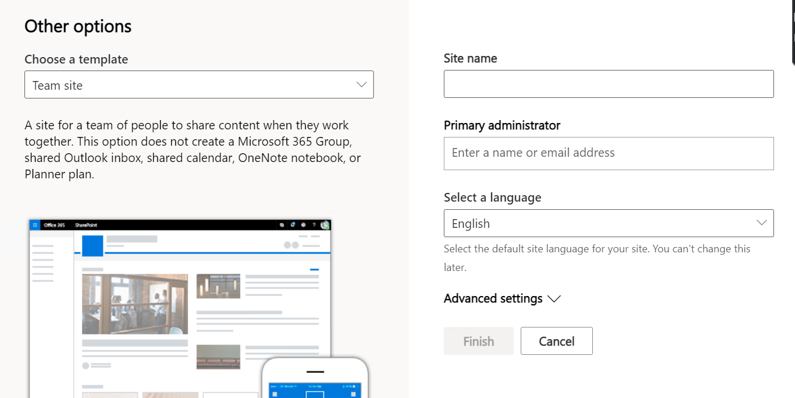
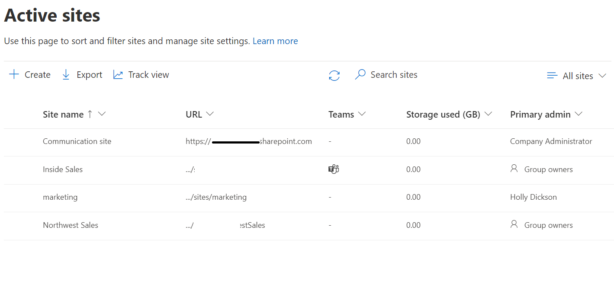
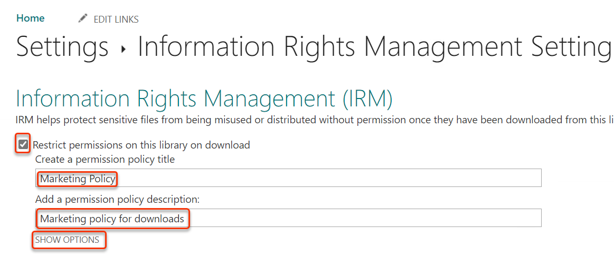
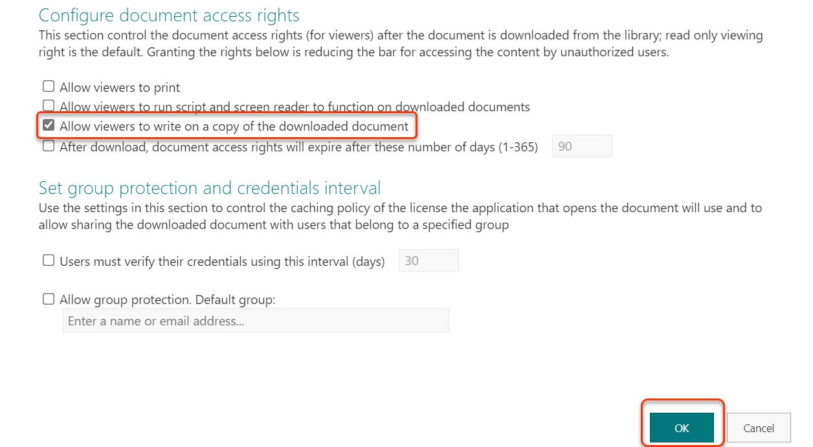
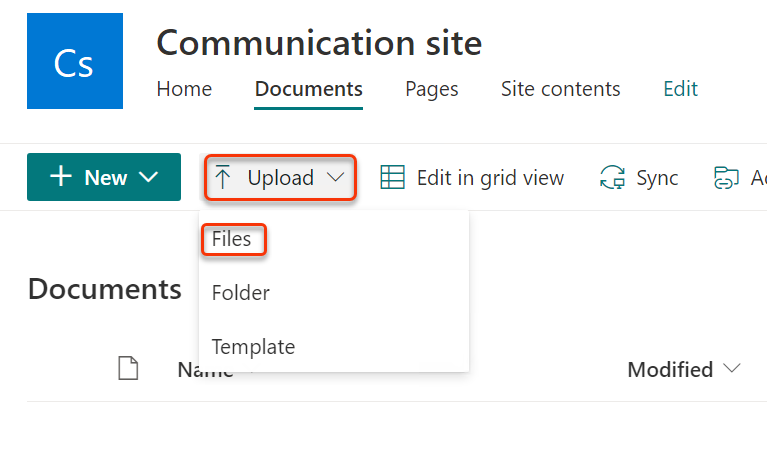
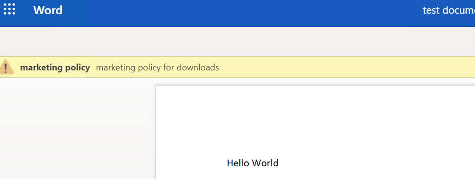

# Module 10 - Lab 1 - Exercise 2 - Validate Information Rights Management 

In this exercise, you will learn how to validate Information Rights Management for both Exchange Online and SharePoint Online.
 
### Task 1 - Validate Information Rights Management for Exchange Online

In the prior exercise, you set up Information Rights Management in Exchange Online for Adatum. In this exercise, you will validate that configuration by sending a protected email from Holly Dickson to Alex Wilber. You will then log into Alex’s mailbox on the Client VM (**LON-CL1**), open the email, and verify that it’s protected.  

1. On the Client VM (**LON-CL1**), you should still be logged into the Microsoft 365 admin center as Holly Dickson. In your **Microsoft Edge** browser, you should still have the **Office 365 home** page open on a tab. Select the **Office 365 home page** tab, and then select **Outlook.** **Note**: If you are prompted to select a time zone, then choose one and select **Save**. 

4. At the top of the left navigation pane, select **New message** to create a new email.

5. You want to send the email to **Alex Wilber**. Type `Alex` in the **To** field, which displays a dialog box that displays all users whose Display Name starts with Alex (of which there is just one). Select **Alex Wilber**.

6. Enter a **Subject**, and then type some text in the message body. 

7. In the menu bar above the message pane, select **Encrypt**.

	

8. The message will now have a lock icon and list it as encrypted. To the right of the lock icon select **Change permissions**.

9. In the Change permissions window click the drop-down and select **Do not forward**.  Select **OK**.

10. Select the **Send arrow** to send the email. 

11. **Open new Inprivate window and loggin with given credentials**
 
12. On the taskbar, select the **Microsoft Edge** icon. In your **Edge** browser navigate to `https://portal.office.com`. In the **Pick an Account** window, if **Alex Wilber** is listed then select his username; otherwise, select **Use another account** and log in as **AlexW@M365xZZZZZZ.onmicrosoft.com** (where ZZZZZZ is your unique tenant ID provided by your lab hosting provider) his password is probably the same as the MOD admin password for your tenant as set by your lab provider. 

13. In the **Office 365 home page**, select **Outlook**. 

14. Verify that Alex received an email from Holly that is IRM protected. IRM protected emails display a lock icon to the right of the message. Select the message to display it in the right pane.

15. In the message pane for this email, a message that says **This messsage is encrypted and recipients can't forward it** should appear.

16. In the message pane for this email, note how the **Forward** arrow is disabled.

	

17. Select the **ellipsis icon (More actions)** to the right of the disabled Forward arrow. In the menu that appears, note how both the **Forward** and **Print** options are disabled. 

18. In your **Edge** browser, close the **Outlook** tab. 

19. You want to remain logged into the Office 365 home page as **Alex Wilber** on **LON-CL1** for the next task, so leave the **Office 365 home page** tab open and proceed to the next task.

 
### Task 2 - Validate Information Rights Management for SharePoint Online

In first lab of this course, you enabled Information Rights Management for Adatum in SharePoint Online.

You will begin by having Holly create a new SharePoint site collection, configuring it for Information Rights Management, sharing it with Alex Wilber, and then having Alex validate IRM for the site. 

1. Switch to the **LON-CL1** VM where you should still be logged into the Microsoft 365 admin center as Holly Dickson.  If not go to `https://portal.office.com` and select **Admin**.

2. The **SharePoint admin center** tab should still be open in your browser from Lab 1 when you enabled IRM for SharePoint Online; if so, select this tab now. However, if you closed this tab, then In the **Microsoft 365 admin center**, scroll down through left-hand navigation pane and under **Admin centers**, select **SharePoint**. This will open the SharePoint admin center.

3. In the **SharePoint admin center**, in the left navigation pane, select **Sites**, then **Active sites**.

4. On the **Active sites** page, select **+ Create**.

	

5. Scroll down to **Other options** then in the **Choose a template** drop down box choose **More Templates**

	

6. On the **Create site collection** window, enter the following attributes:

	- Choose Template: `Team site`  
	 
	- site name: `marketing`
	
	- Web Site Address: leave the default values in the two drop-down fields. 
	
	- Administrator: Enter **Holly@M365xZZZZZZ.onmicrosoft.com** (where ZZZZZZ is your unique tenant ID provided by your lab hosting provider) and then select the **Check Names** icon to the right of the field; once the username is validated, it will be replaced with **Holly Dickson.**

	- Language: select your language

	- Select a template: leave the default value of **Team site (classic experience)** as the selected value

	- Time zone: select the appropriate time zone in which the team site is located 
	 
	 
	 
	
	
7. Select **OK**.

8. Wait for the new SharePoint site to be created, which may take up to 15 minutes. The new Marketing site collection will appear in the **Active sites** collection list, but the “Processing” circle will continue to spin to the right of the site collection while it continues being created. 

9. Once the Marketing site collection is created, **New** will appear to the right of the site collection.

10. In your web browser, open a new tab and connect to: `https://M365xZZZZZZ.sharepoint.com/sites/marketing` (where ZZZZZZ is your tenant ID provided by your lab hosting provider)

	

11. On the **Marketing** site, in the left navigation pane, select **Documents**. 

12. In the **We’ve got a new look** window, if it appears, select **NOT NOW**.

13. In the **Documents** page for the **Marketing** site, at the top right, select the **gear** (**Settings)** icon and then select **Library settings**.

	

14. On the **Documents&gt;Settings** page, under **Permissions and Management**, select **Information Rights Management**.

	

15. On the **Information Rights Management Settings** page, select the **Restrict permissions on this library on download** checkbox. 

16. In the **Create a permission policy title** box, type `Marketing Policy`. 

17. In the **Add a permission policy description** box, type `Marketing policy for downloads`. 

18. Select **SHOW OPTIONS**.

	

19. Under **Configure document access rights**, select the **Allow viewers to write on a copy of the downloaded document** checkbox and select **OK**.

	

20. In the top-right corner of the page, select **Share**.

21. In the **Share ‘Marketing’** window, in the **Invite people** box, enter `Alex Wilber`. Select **Alex Wilber** that appears in a drop-down menu, and then select **Share**.

22. Now that Holly has created this new SharePoint site and used IRM to restrict permissions on the site, she has asked Alex Wilber to test this site to validate whether IRM is working for SharePoint Online. Alex will perform this test on the Client VM (**LON-CL1**) VM. 

	Switch to the **LON-CL1** VM, where you should still be logged into the Microsoft 365 admin center as Alex from the prior task.  

23. In the **Microsoft Edge** browser on LON-CL1, open a new tab and enter the following URL in the address bar to navigate directly to the Marketing site: `https://M365xZZZZZZ.sharepoint.com/sites/marketing` (where ZZZZZZ is your unique tenant ID provided by your lab hosting provider)

24. In the **Pick an Account** window, select **Alex Wilber** if his account is listed; otherwise, select **Use another account** and log in as **AlexW@M365xZZZZZZ.onmicrosoft.com** (where ZZZZZZ is your unique tenant ID provided by your lab hosting provider) the password is likely the same as your MOD admin assigned by your lab hosting provider.

25. On the **taskbar of your VM**, select the **Search** icon and type `WordPad` in the Search field. Select **WordPad** that’s displayed.

26. In the WordPad window, enter some text for a new test document. 

27. Select **File** and **Save**. In the **Save As** window, under **This PC**, select **Desktop.** Type `TestDocument` in the **File name** field, and in the **Save as type** field, select **Office Open XML Document (*.docx)**. 

28. Close WordPad.

29. Select **Documents** on the left pane in SharePoint.  

30. On the **Documents** page, in the menu bar, select **Upload**, and then in the drop-down menu select **Files**.

	

31. In the **File Explorer** window, select **Desktop** under the **Quick access** section, select **TestDocument.docx**, and then select **Open**. This will upload the file to the **Documents** page in the **Marketing** site collection.

32. In the list of Documents, right-click on **TestDocument.docx**, select **Open**, and then select **Open in browser**. 

33. Verify that the **Marketing Policy** displays in a warning message at the top of the page. 

34. Try to enter some text in the document. Verify that Alex cannot edit the document in Word Online because it’s protected in this site collection. A Read-only information line will display at the top of the page indicating the document is read-only.

35. Leave your browser open for the next lab. 

# End of Lab
