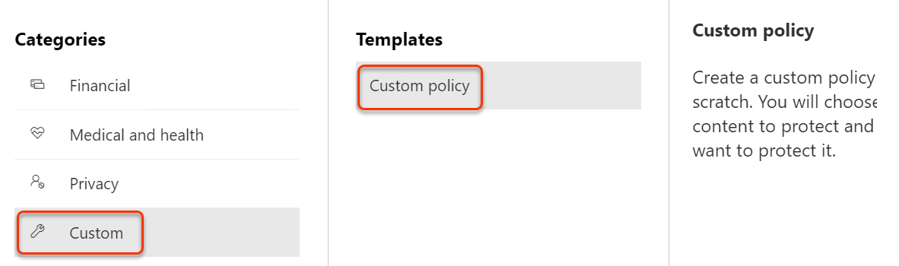
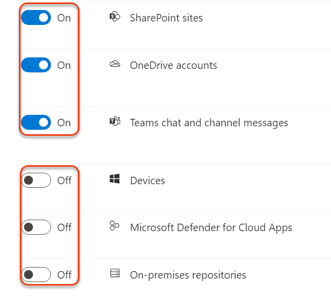
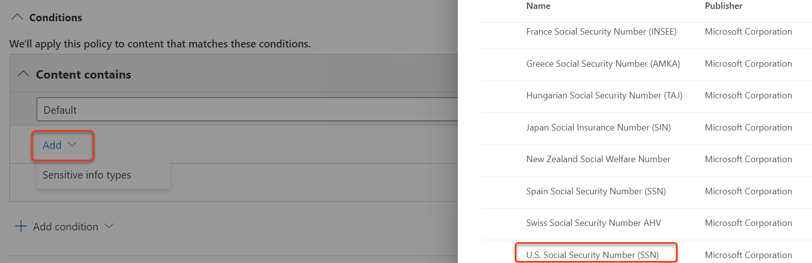
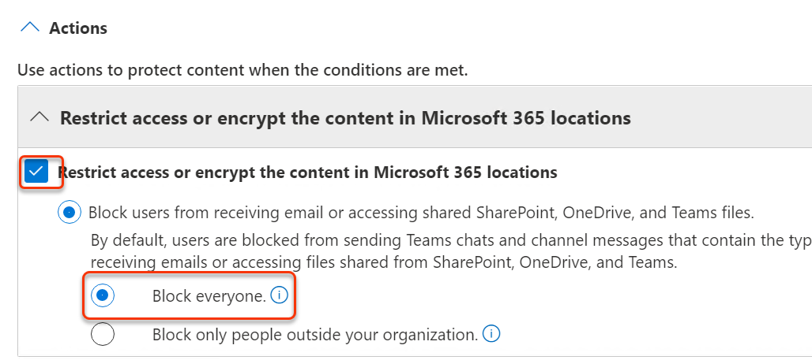
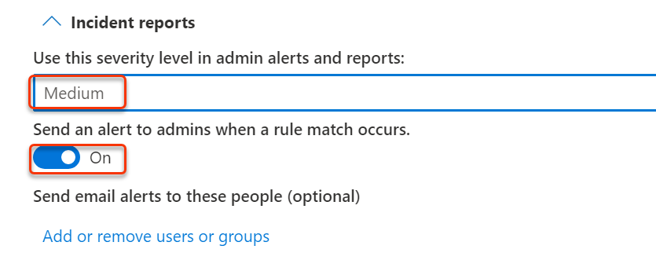
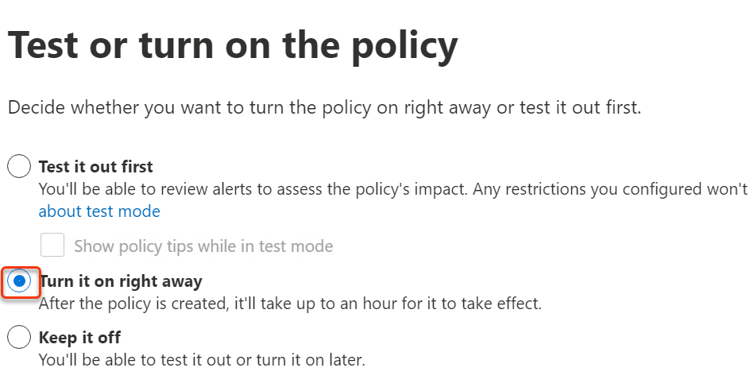

# Module 11 - Lab 1 - Exercise 1 - Manage DLP Policies  

In your role as Holly Dickson, Adatum’s Security Administrator, you have Microsoft 365 deployed in a virtualized lab environment. As you proceed with your Microsoft 365 pilot project, your next steps are to implement Data Loss Prevention (DLP) policies at Adatum. You will begin by creating a custom DLP policy, and then you will test DLP policies related to email message archiving and emails with sensitive data. 

### Task 1 – Create a DLP policy with custom settings

In this exercise you will create a Data Loss Prevention policy in the Security & Compliance Center to protect sensitive data from being shared by users. The DLP Policy that you create will inform your users if they want to share content that contains U.S. Social Security addresses. 

1. In **Microsoft Edge**, the Office 365 Security & Compliance Center tab should still be open. If so, select it and proceed to the next step. If you closed it, then in a new tab, navigate to `https://protection.office.com`, and you should be logged into Microsoft 365 as **Holly Dickson** and credentials is given in Environments Details Page. 

1. In the **Security &amp; Compliance Center**, in the left navigation pane, select **Data loss prevention** and then select **Policy**.

1. In the **Policy** window, select **+Create policy** to start the wizard for creating a new data loss prevention policy.

1. On the **Start with a template or create a custom policy** page, you want to select **Custom** in the left pane and **Custom policy** in the middle pane; however, by default, both these options should already be selected (if not, then select them now), so simply select **Next**.

  

1. In the **Name your policy** page, type `Social Security DLP Policy` in the **Name** field and `Protect social security numbers from being shared` in the **Description** field. Select **Next**.

1. On the **Choose locations** page, select **On** for**Exchange email, SharePoint, OneDrive, Teams chats and channel messages** and **Off** for **Devices, Microsoft Defender for Cloud Apps, On-premises repositories** and then select **Next**.

  

1. on **Define policy settings** select **Next**.

1. On the  **Customize advanced DLP rules** and click **+Create rule**.

1. On the **Create rule** page, in the **Name** field type **Social Security Number**.

1. Under **Conditions** click **+Add condition** then **Content Contains**.

1. Leave the value of **Default** and select **Add v**, choose **Sensitive info types**

1. In the search field type `social` and press enter, and wait until the search results are displayed.

1. In the list of search results, select the **U.S. Social Security Number (SSN)** check box, and then select **Add**.

  

1. Click **Add Condition** and select **Content is shared from Microsoft 365**,

1. In the field below this, verify that **only with people inside my organization** is displayed.

1. Scroll down to **Actions** section,

1. Click **+ Add and Action*,

1. Select **Restrict access or encrypt the content in Microsoft 365 locations**

1. Check the box **Restrict access or encrypt the content in Microsoft 365 locations** and select **Block everyone**.

  

1. Scroll down to **Incident reports**.

1. Select **Medium** in the field **Use this severity level in admin alerts and reports**.

1. Move the slider bar for **Send and alert to admins when a rule match occurs** to **On**.

  

1. Select **Save**.

1. Click **Next**.

1. On the **Test or turn on policy** page select **Turn it on right away** and select **Next**.

  

1. Click **Submit**

You have now created a DLP policy that scans for US Social Security numbers in emails and documents that are sent or shared in your organization.

# Proceed to Exercise 2 
