# Module 14 - Lab 1 - Exercise 1 - Investigate Your Microsoft 365 Data

In your role as Holly Dickson, Adatum’s Security Administrator, you have Microsoft 365 deployed in a virtualized lab environment. As you proceed with your Microsoft 365 pilot project, you now want to test how Adatum can investigate its Microsoft 365 data. You have decided to focus on performing a content search for deleted emails, which is a common request at Adatum, and then you want to analyze eDiscovery functionality by creating an eDiscovery case. You will conclude this portion of the pilot project by creating a GDPR data subject request.

### Task 1 – Perform a content search for deleted emails

In this exercise, you will add Joni Sherman and Holly Dickson as members of the eDiscovery Manger role, and then you will log into the Client VM as Joni and perform a content search that looks for emails with the keywords related to social security numbers. 

1. In your **Microsoft Edge** browser, if you have the **Security and Compliance Center** open in a tab, then select it; otherwise, open a new tab and enter the following URL in the address bar: `https://protection.office.com`, sign in as as **Holly Dickson (holly@AzureHOLxZZZZZZ.onmicrosoft.com)** with a **password** as provided in the Environment tab.

1. In the **Office 365 Security and Compliance Center**, in the left navigation pane, select **Permissions.**

  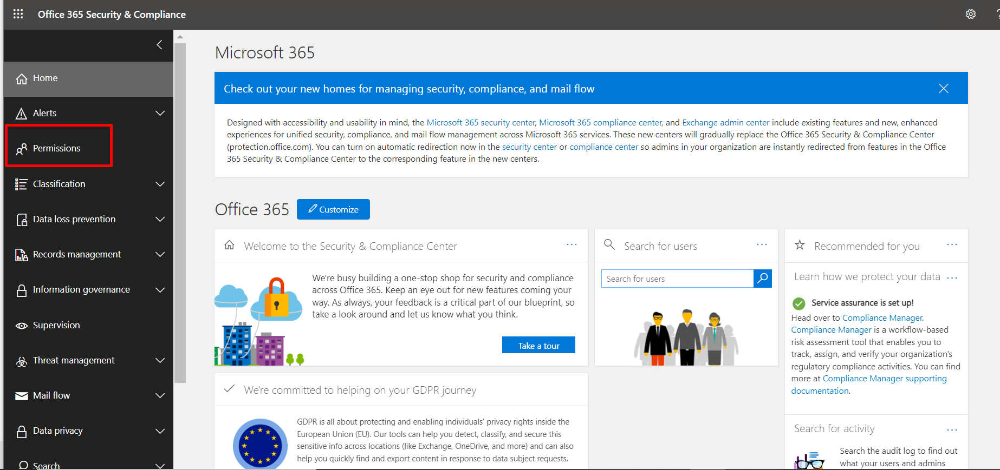

1. In the **Home &gt; Permissions** page, select the **eDiscovery Manager** check box.

  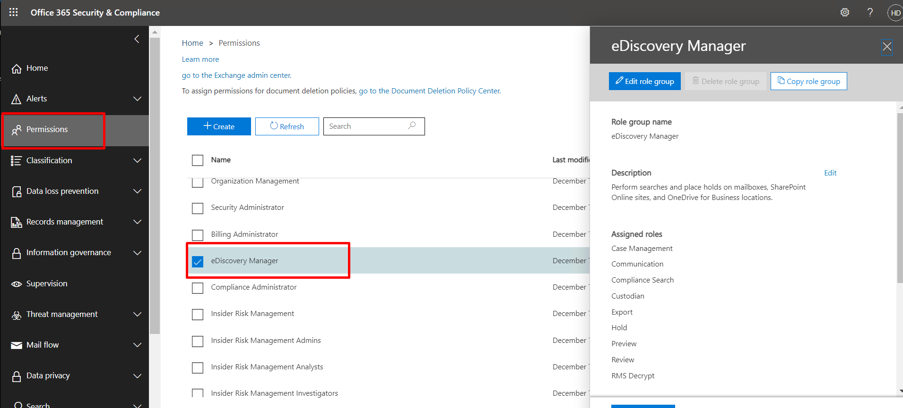

1. In the **eDiscovery Manager** role group window, scroll down to the **eDiscovery Manager** section and select **Edit**.

  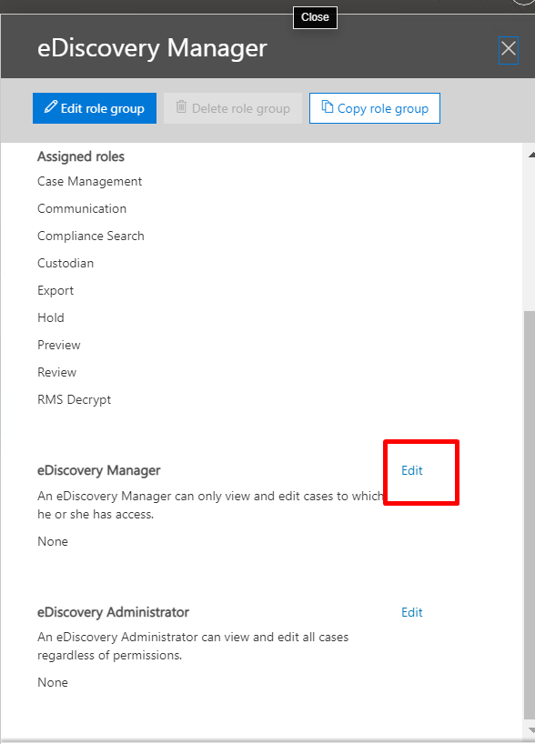

1. The **Editing Choose eDiscovery Manager** wizard opens. The list should be empty. Select **Choose eDiscovery Manager**.

  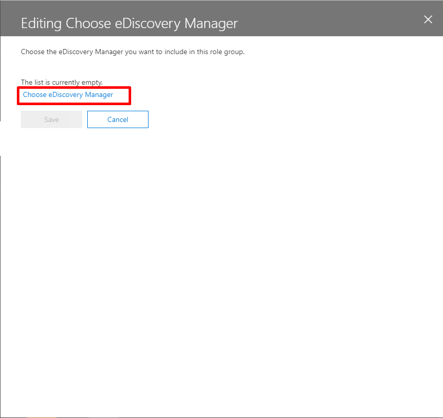

1. In the **Choose eDiscovery Manager window**, select **(+) Add**.

  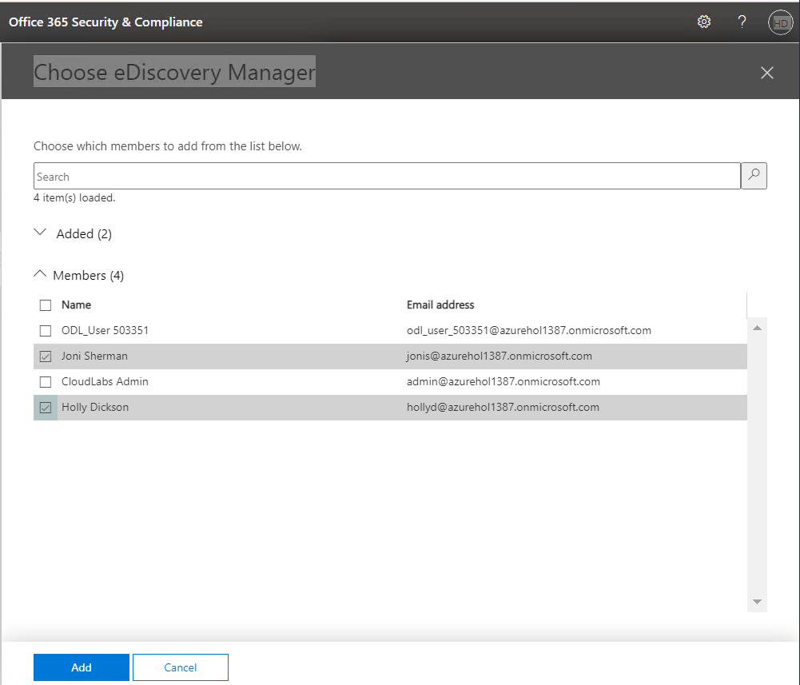

1. In the list of users that’s displayed, select `Joni Sherman` and `Holly Dickson`, and then select **Add**. 

  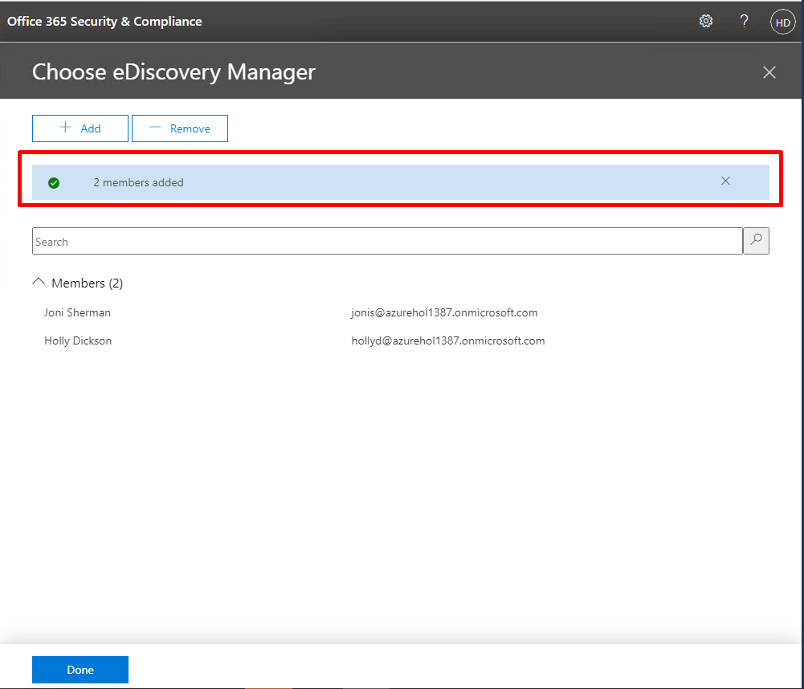 

   **Note:** You are adding Joni to the eDiscovery Manager role group for later use in this exercise, and you are assigning Holly to the role group for use in the next exercise.

1. You should see a banner with the message **2 members added**. Select **Done** and then **Save**.

  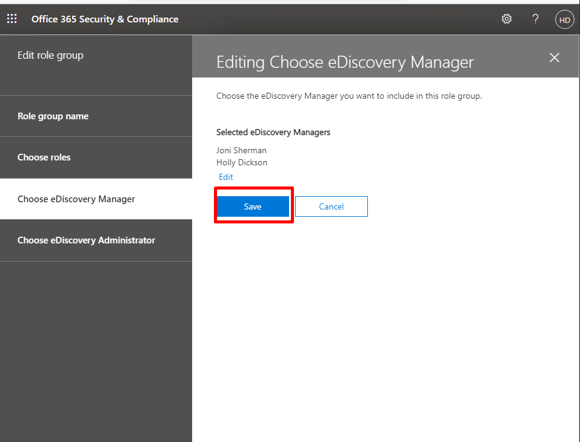 

1. open the new private window on Client 1 VM **(LON-CL1)admin**.and log into Microsoft 365 as **Joni Sherman**. In the **Sign in** window, enter **JoniS@AzureHOLxZZZZZZ.onmicrosoft.com** (where ZZZZZZ is your unique tenant ID provided by your lab hosting provider). Select **Next**. In the **Enter password** window, enter Joni's password (hint: it is probably the same as the MOD password assigned by your lab hoster).

1. If you have a tab open in your **Edge** browser for the **Office 365 Security and Compliance Center**, then select it now. Otherwise, select a new tab and enter the following URL in the address bar: `https://protection.office.com`.

1. In the **Security and Compliance Center**, in the left navigation pane, select **Search**, and then under it select **Content search**.

  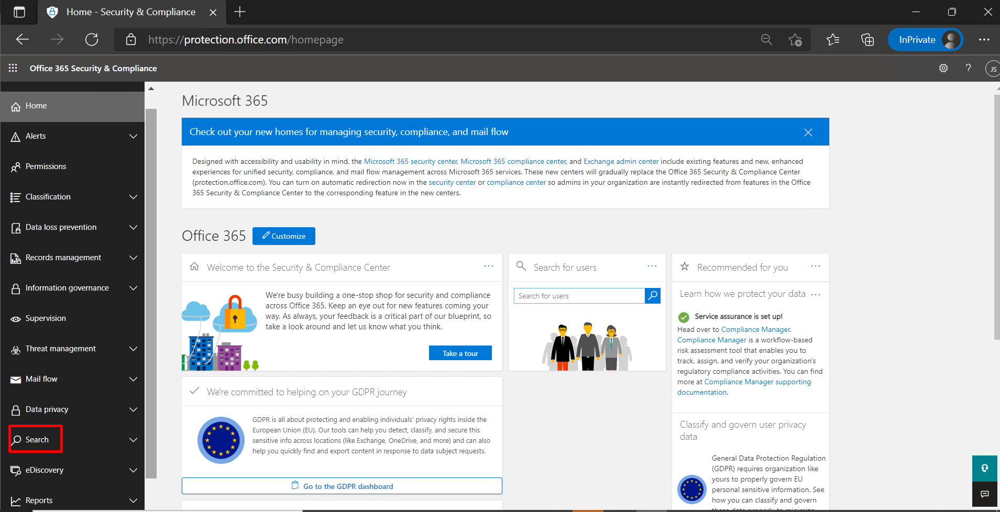

  

   **Note**: If you cannot see **Search** in the navigation pane yet, you need to reload the browser tab with the **Security and Compliance Center.**

1. On the **Content search** window, in the **Searches** tab, select **(+) Guided search** on the top menu. This will initiate the **New search** wizard.

  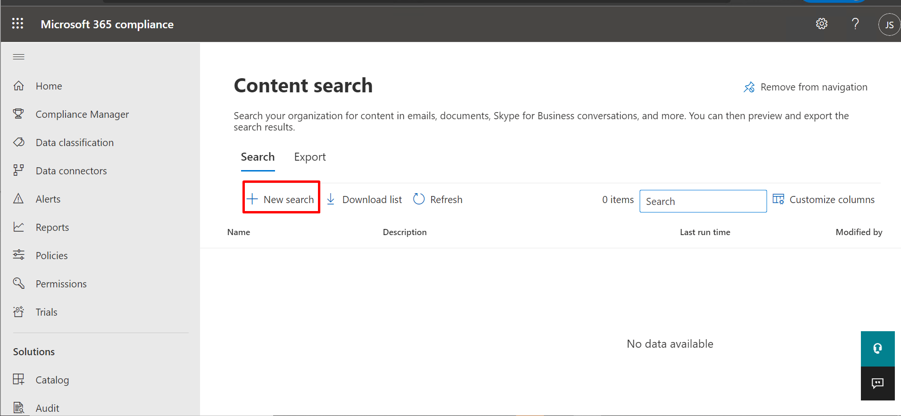

1. On the Name your search page, enter `Content Search Test` into the **Name** field and then select **Next**.

  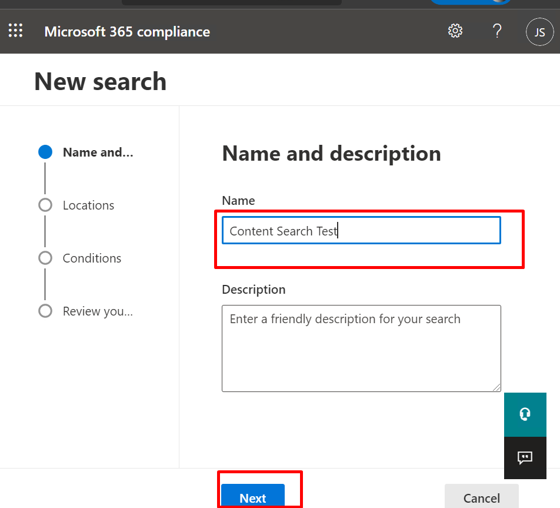

1. On the Locations page, select **All locations** and then select **Next**.

  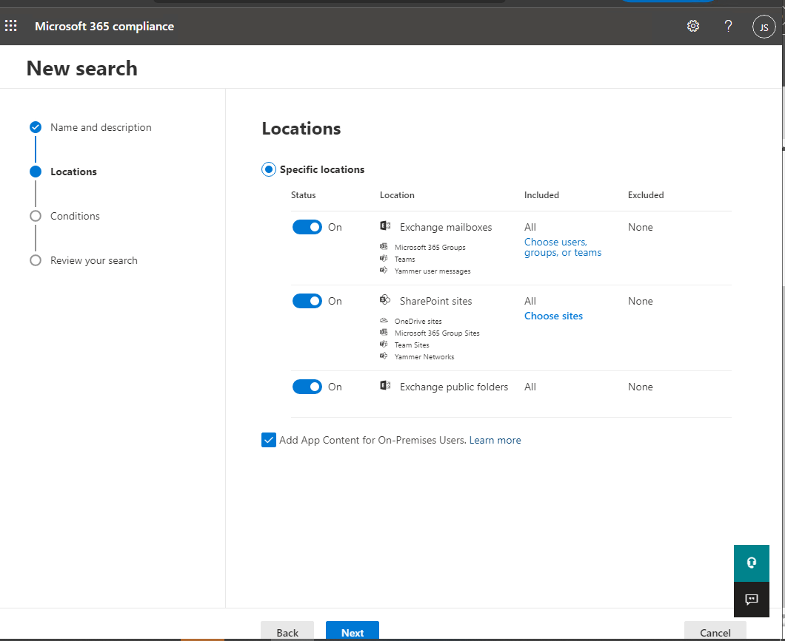

1. On the **Condition card** page, enter `SSN` press enter and type `social` into the **Keywords** box.  Pressing enter between keywords will separate the words as independent terms in the list. Once the two terms are added select **Next**.

  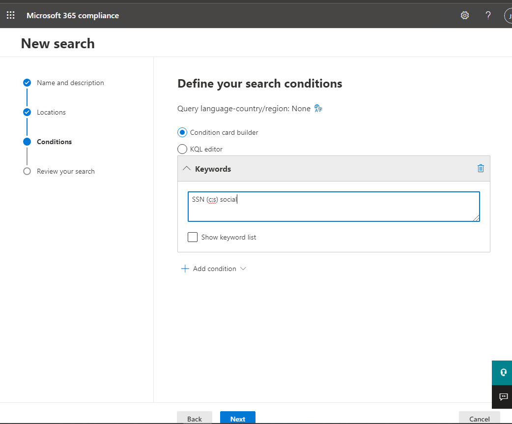

1. On the Review your search page select Done

  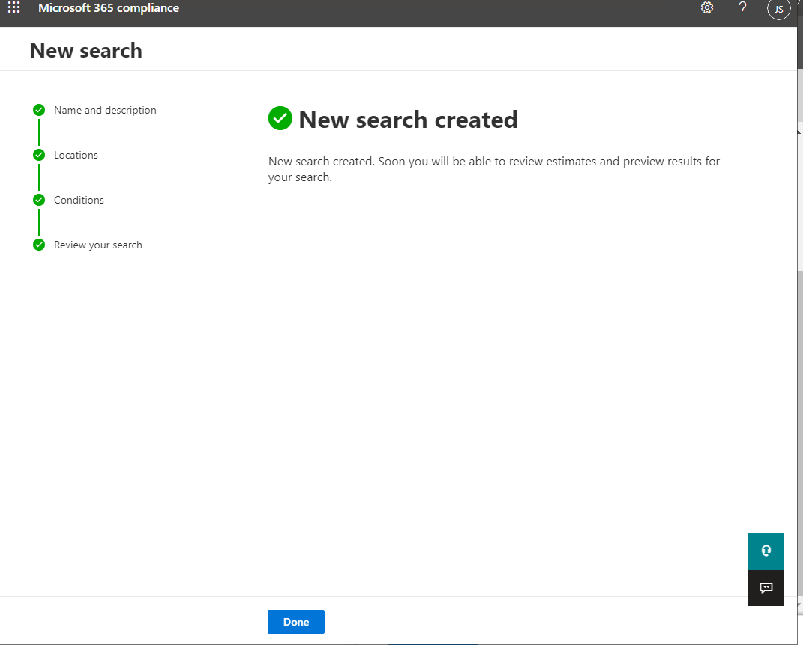 

1. Back on the **Searches** tab, the Search query will run. The Status field in the bottom-left corner of the screen will indicate when the query is complete. It may take many minutes for the query to run and the data to be displayed in the right pane. When the content search finishes, you will see all mailbox items that you have created for the sensitive information test of your custom DLP policy. 
 
  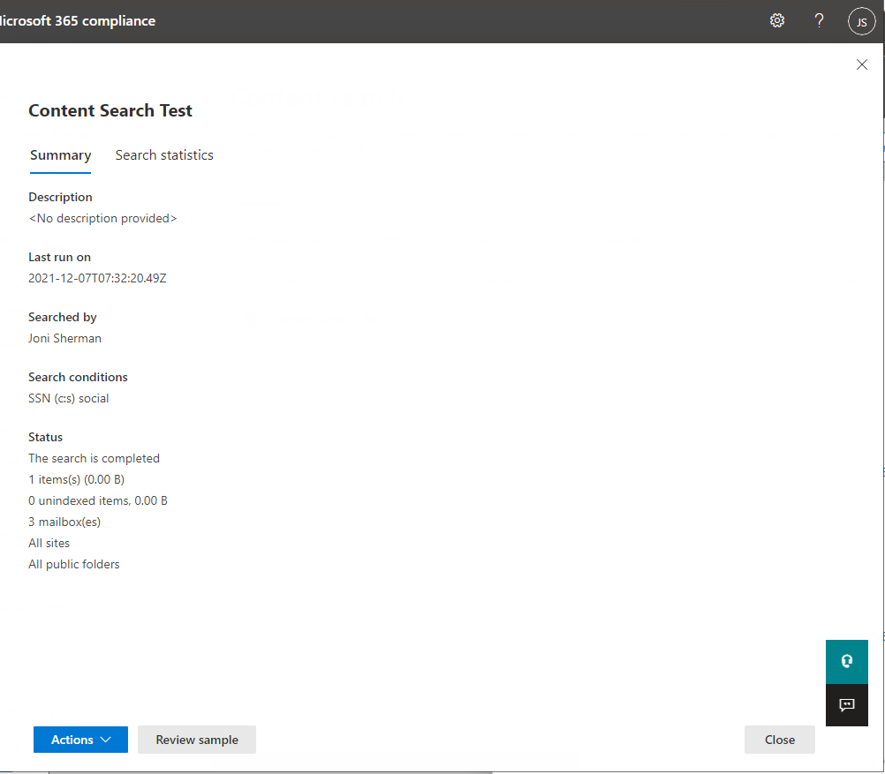 

If you didn't send emails during the DLP lab earlier in the course then no data will appear in this search.  If this happened, while the search is running, you could switch back to **LON-CL1** and send emails with the keyword terms mentioned in this lab to other users in your tenant.  You may have to run this search again to view data if you do that.

You can let the search run while you proceed with the remainder of this exercise. 

1. Leave the Client 2 VM open as well as all browser tabs and continue with the next task.

You have successfully assigned an eDiscovery role to Joni and performed a content search for a specific key word across all locations of your tenant.

 
### Task 2 – Create an eDiscovery case

In this task, you will create an eDiscovery case with a configured hold and content search for any violations regarding social security numbers. You will continue using Joni Sherman’s user account. Having been assigned the eDiscovery Managers role in the prior task, Joni has the permissions necessary to create an eDiscovery case.

1. You should still be logged into your Client 1 VM (**LON-CL1**) as the **LON-CL1\Admin** account and signed into Microsoft 365 as Joni Sherman. However, if you have been signed out of Microsoft 365, then on the Microsoft 365 sign-in page, sign into Joni’s **JoniS@M365xZZZZZZ.onmicrosoft.com** account using her password assigned by your lab hoster.

1. The **Security and Compliance Center** should still be open in a tab in Microsoft Edge. If so, select that tab now. If not, then enter the following URL in the address bar: `https://protection.office.com`. 

1. In the **Security and Compliance Center**, in the left navigation pane, select **eDiscovery**, and then under it, select **eDiscovery**.

   

1. On the **eDiscovery** window, select **(+) Create a case** on the top menu.

  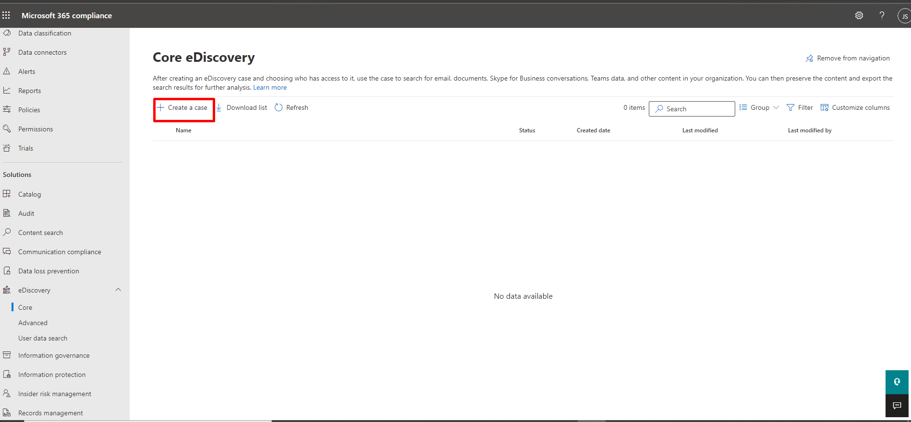 

1. In the **New case** window, enter `Social Security Violation` into the **Case name** field and select **Save**.

  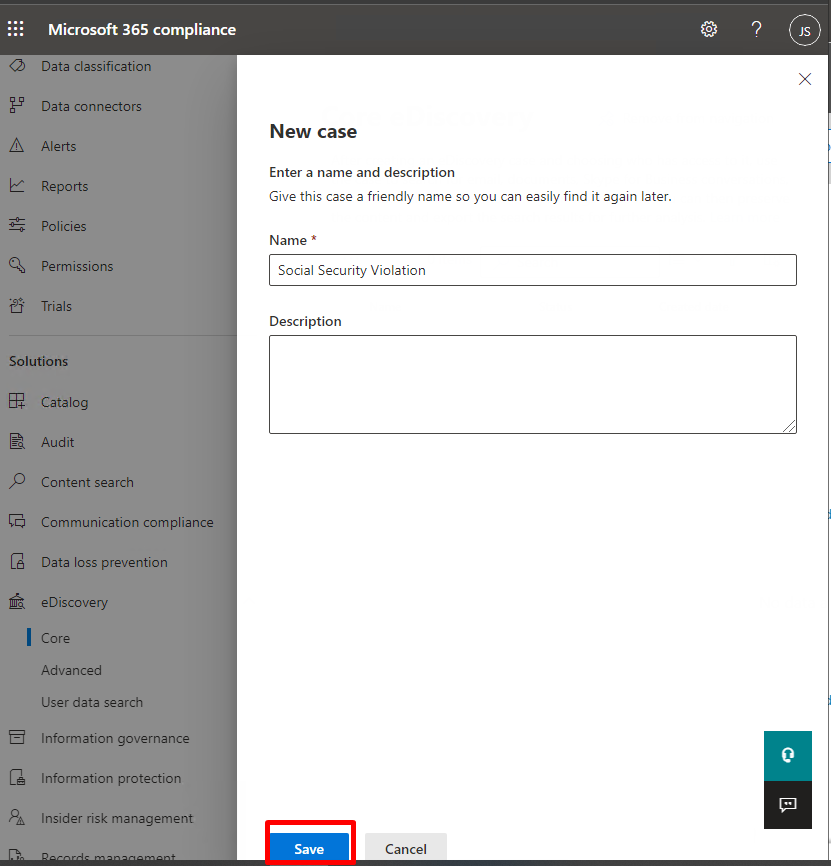 

1. Back on the **eDiscovery** page, select **Open** that appears to the left of the **Social Security Violation** case.

1. On the **Social Security Violation** window, select the **Holds** tab from the top menu.

   

1. Select **(+) Create** to create a new hold. This initiates the **Create a new hold** wizard.

  

1. On the **Name your hold** page, enter `Social Security Violation - Content` into the **Name** field and then select **Next**.

  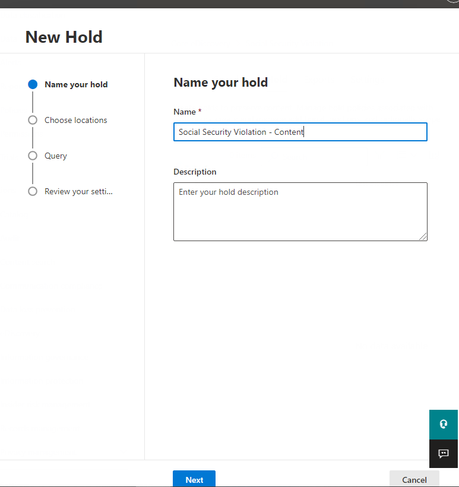

1. On the **Choose locations** page, For the location **Exchange email**, select the **Choose users, groups or teams** field.

  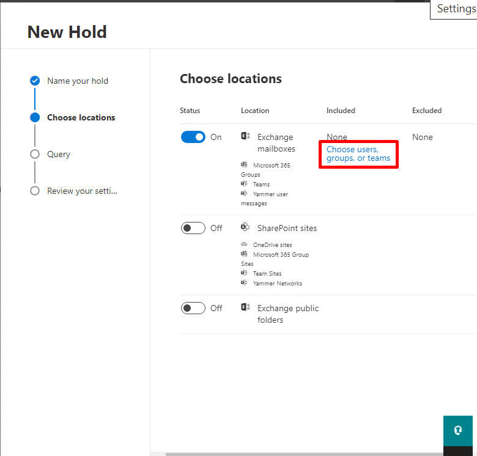

1. On the **Exchange email** page, select **Choose users, groups, or teams**.

1. Enter **Holly** into the search field, select the Search icon on the right side of the field. 

1. Scroll down on the page, and under **Users, groups, or teams**, select **Holly Dickson** from the search results.

  .png)

1. Select **Choose** and then select **Done**.

1. On the **Choose locations** page, **1 user, group, or team** is displayed to the right of **Exchange email**. Select **Next**.

   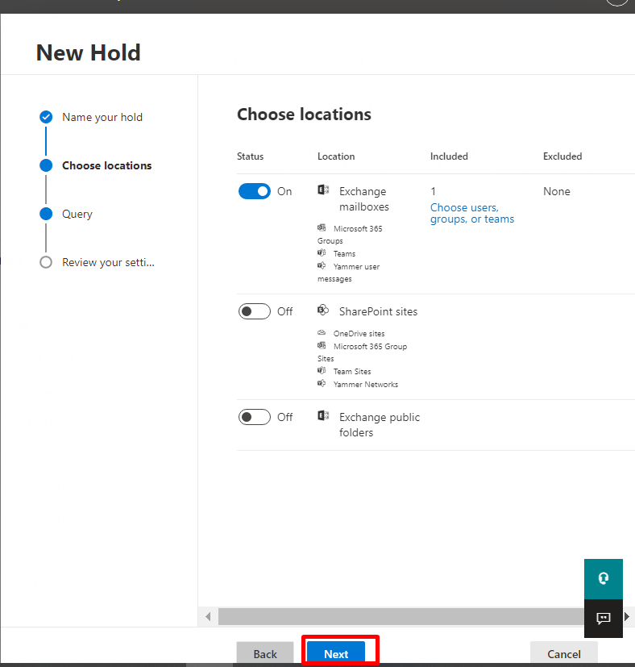

1. On the **Query conditions** page, enter `SSN` press enter and then type `social` into the **Keywords** box.  This will search for those two terms independently. Then select **Next**.

   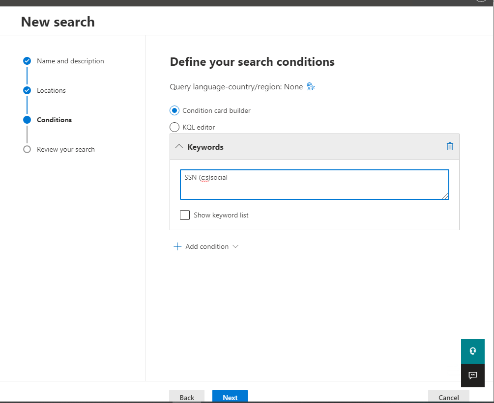

1. On the **Review your settings** page, review the values and select **Edit** next to any that need to be modified. When you are satisfied with the settings, then click  **submit and then Done**.

   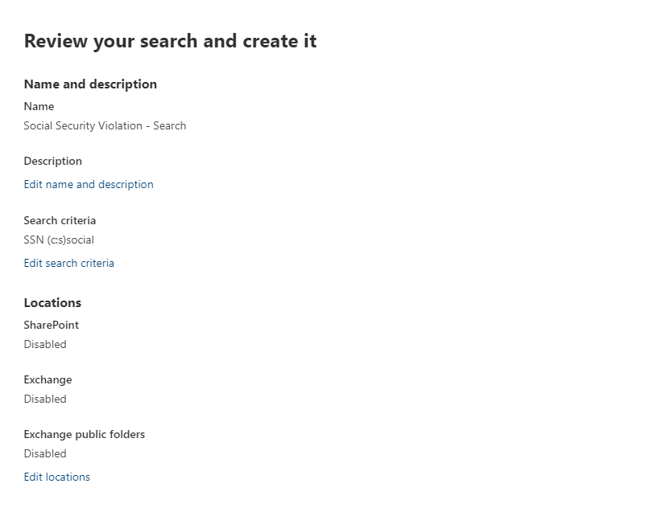

1. Back on the **eDiscovery Case overview**, on the **Social Security Violation &gt; Core ED &gt; Hold** page, select the **Searches** tab from the top menu.

   

1. Select **(+) New search.** and then in the drop-down select **(+) New search.**.

2. In the **New search** window, in the **Search query** enter `Social Security Violation - Search` into the **Name** field and then select **Next**.

   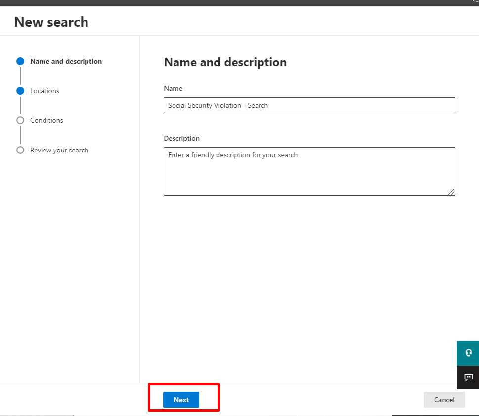

1. under **Locations**, select **Locations on hold**.

   

1. In the **New search** window, in the **Search query** pane on the left, enter `SSN` press enter and then type `social` in the **Keywords** field. 

1. This will initiate a search query that looks for the keywords **SSN**. Once the query is finished, wait for the preview results to be displayed.

1. Select **Save &amp; run**.

You have now created an eDiscovery case, added an In-Place Hold to preserve mailbox content, and created a search to discover data from the hold.

# Proceed to Exercise 2
