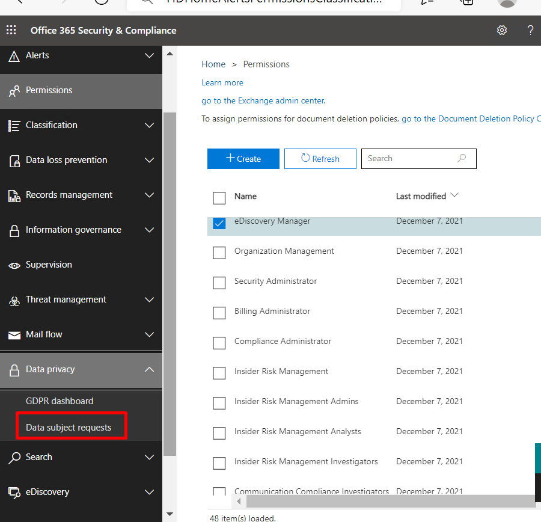
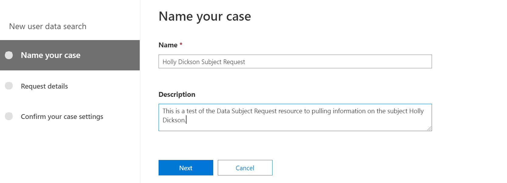
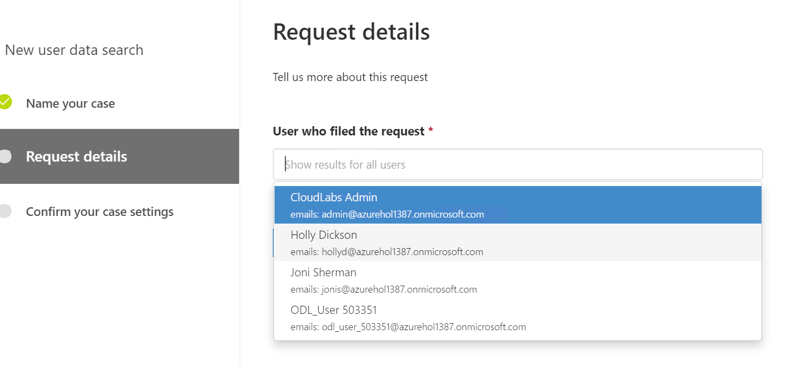
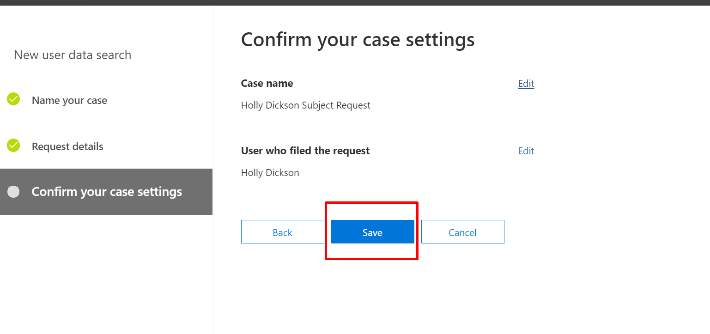
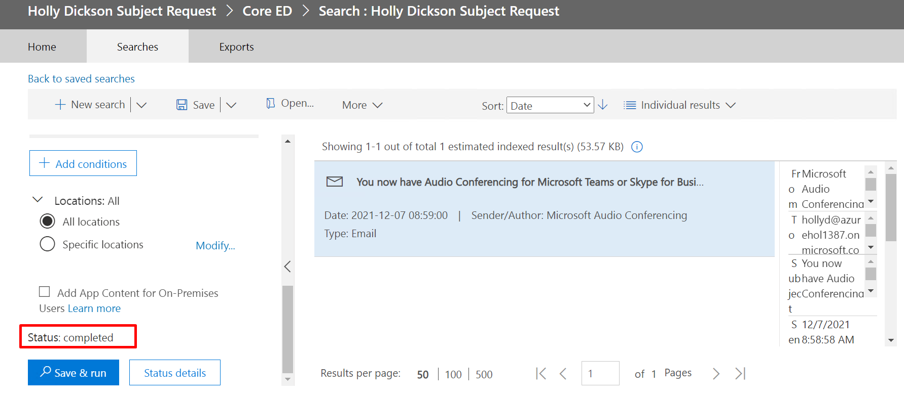
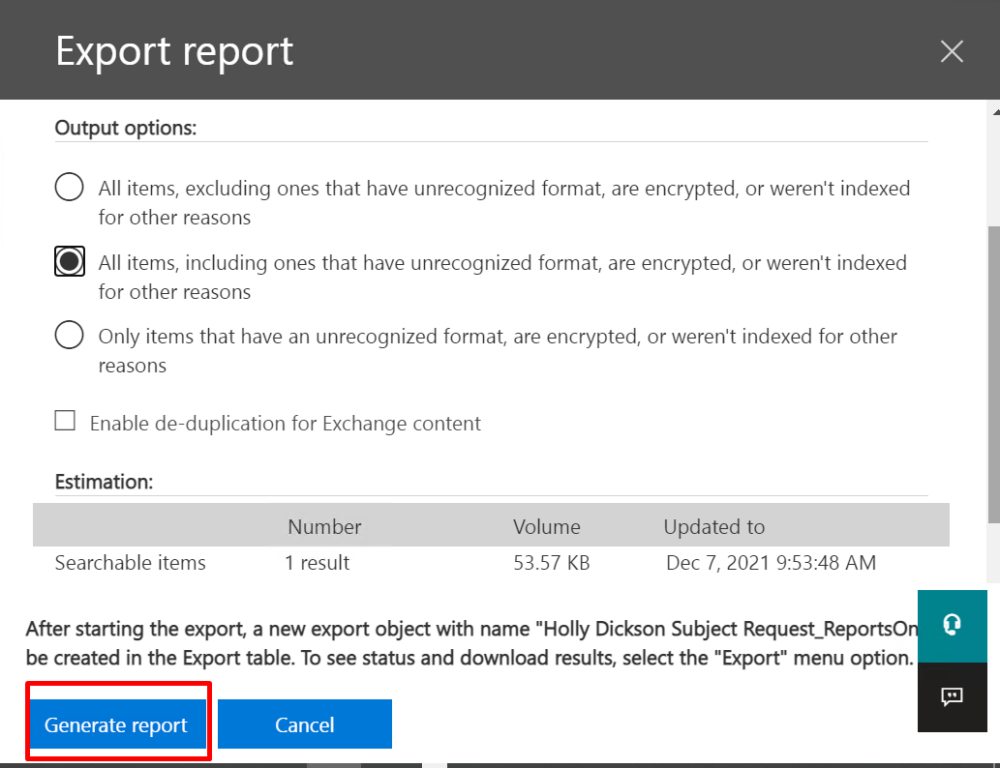
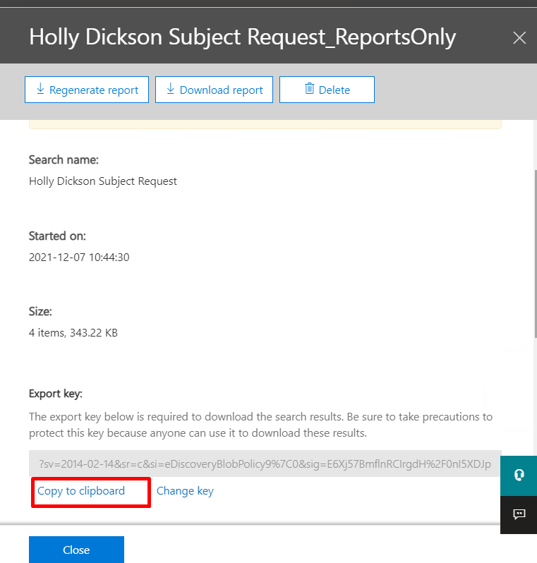
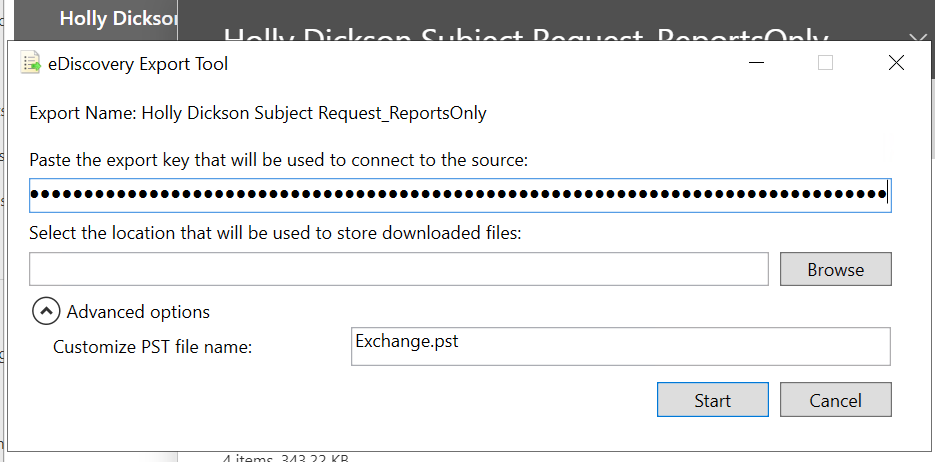
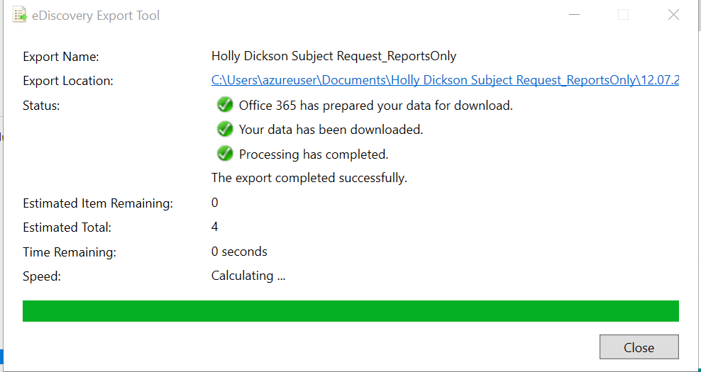

# Module 14 - Lab 1 - Exercise 2 - Conduct a Data Subject Request 

Data subject requests (DSRs) are used to search for and extract all known information on a person of interest. A DSR can come from the person in question or from an authorized source. In this exercise you will configure and export a DSR from the Microsoft 365 Security and Compliance center.

**NOTE:** You should only run a DSR if the request is made by a Data Privacy officer or a Human Resources manager. Due to data privacy legal concerns, you should NEVER run a DSR unless instructed to do so.

### Task 1 – Create a GDPR Data Subject Request

Holly Dickson is Adatum’s Security and Compliance Administrator. In her role as the company’s Microsoft 365 Global Administrator, she is responsible for implementing Adatum’s Microsoft 365 pilot project. Since Adatum has several European subsidiaries, properly managing GDPR data subject requests is a key task that must be tested so that the company can successfully implement this feature. In this task, Holly will create a DSR for herself on behalf of a request made by the Human Resource department.

1. You should still be logged into your Client 1 VM (**LON-CL1**) as the **LON-CL1\Admin** account, and you should be logged into Microsoft 365 as **Holly Dickson** (**holly@M365xZZZZZZ.onmicrosoft.com)** with a password of **Pa55w.rd**. 

2. In your **Microsoft Edge** browser, if you have the **Security and Compliance Center** open in a tab, then select it; otherwise, open a new tab and enter the following URL in the address bar: `https://protection.office.com` .

3. In the **Security and Compliance center**, in the left navigation pane select **Data privacy**, and then under it select **Data subject requests**. 

 

‎**Note:** To perform this task, Holly needs to be assigned to the eDiscovery Manager role group so that she has the necessary permissions. You added Holly to this role group in the prior exercise at the same time that you added Joni Sherman to the role group. The reason we did this is explained below following the search query. 

4. In the **Data subject requests** window, select **+Create a case**. This initiates the New DSR case wizard.

5. In the **Name your case** page, enter the following information and then select **Next**:

	- Name: `Holly Dickson Subject Request`

	- Description: `This is a test of the Data Subject Request resource to pulling information on the subject Holly Dickson`.
	
	

6. In the **Request details** page, select the **Data subject (the person who filed this request)** field, which displays a list of users. Select **Holly Dickson** and then select **Next**.

7. In the **Confirm your case settings** page, review your settings. If necessary, select **Edit** next to either setting to change it. Once you’re satisfied with the settings, select **Save**.

8. In the **Successfully created new DSR case** window, select **Show me search results**.

9. A new **Search query** window will appear and begin the query. In the bottom left corner of the screen, the status of the query is displayed. Wait for the status to show **Completed** this may take several minutes.

**Note:** The reason why you were instructed to add Holly to the eDiscovery Manager role group in the prior exercise rather than at the start of this one is that it takes several minutes for permissions to successfully propagate. If you had assigned Holly to this role group just prior to this query, you would have received error messages involving parameter fields because her permissions would not have completed propagating. By adding Holly to this role group in the prior exercise, enough time should have elapsed between then and now for the propagation to complete. If you still receive any error messages, click **OK** to resume the query. If this occurs, the query will not display any data.   
	
‎**Note:** Depending on how much data is accrued, a query can take some time to complete. For Adatum’s pilot project, they have not accrued much in terms of data, so Holly Dickson’s query should only take a few minutes or so to complete.

10. At any point, scroll down under **Search query** in the left pane to review the default query parameters. You can modify any of the parameters and save the query for future use.

11. Select **Save** to save this DSR query for **Holly Dickson**.

12. Select the **Home** tab. For Holly Dickson’s case, select **Close case** to the right of the Active status, and then select **Yes** on the **Warning** message.

 

13. Select the **Searches** tab again and open the saved search in the right pane by selecting **Holly Dickson Subject Request**. 
 

14. In the **Holly Dickson Subject Request** window, scroll to the bottom of the window to view search statistics of the results as well as the search query syntax. 

15. Leave this **Holly Dickson Subject Request** window open as you will resume testing in the next task from this point.

You have created a data subject request and you have searched for the personal information of Holly. At the end of your test, you have closed the DSR case again. 

### Task 2 – Export the DSR Search Query Results

When someone files a DSR, you typically need to export the results. In this task, Holly will export the DSR report for the previous case for further processing.

1. The **Holly Dickson Subject Request** window should still be open after having finished the previous task. In this window, select  **Export report** at the top of the page.

1. In the **Export report** window, select the option that states: **All items, including ones that have unrecognized format, are encrypted, or weren’t indexed for other reasons**.

1. Scroll down through the **Export report** window to see the estimated items that will be exported. 

1. Select **Generate report**.

 

1. If a **Client Error** dialog box appears it may be a result of the search still running, select **OK** and wait for the search to complete to generate the report again. 

1. Select the **Exports** tab from the top menu and open the **Holly Dickson Subject Request_ReportsOnly** export request.

1. In the right pane select **Download report** and when the download bar appears at the lower end of your browser, select **Open**.

1. An **Application Install – Security Warning** window will appear that wants to install the **Microsoft 365 Office 365 eDiscovery Export Tool**. Select the **Install** button.

1. When the **eDiscovery Export Tool** is installed, you need to copy the unique export key to the first text field. Go back to the **Holly Dickson Subject Request_ReportsOnly** export request in your browser window and below **Export key**, select **Copy to clipboard**.

 

1. Switch back to the **eDiscovery Export Tool** and paste the export key (press Ctrl+V) into the first text field.
 

1. Select the **Browse** button and in the **Browse For Folder** window, navigate to **Documents**. Select **OK**.

1. Start the export process by selecting **Start**.

1. As soon as the **eDiscovery Export Tool** shows three green checkmarks with a **The export completed successfully.** message below, the export is done, and you can view the results by opening the blue link next to **Export Location**.

1. You can now see a **results.csv** file that contains a report about all DSR case items found.

 

1. Close the **eDiscovery Export Tool** with the **Close** button, and then close the **eDiscovery** browser tab.

 

1. Leave **Holly** signed in at the **Security &amp; Compliance Center**.

You have successfully exported a DSR case report to your local computer. Because the report contains only a report and not the message or document content, you could not process this report to fulfill the DSRs legal requirements.

The reason we chose to perform the Data Subject Request on Holly Dickson is  because she was involved in almost every lab in this course and thus would have significant data to appear in the final report at this time.

# End of Lab  
