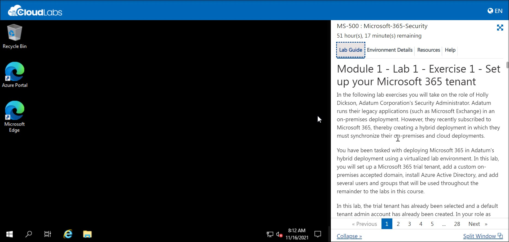

## Disclaimer

This exam will retire on June 30, 2023, at 11:59 PM Central Standard Time, and you may find some UI/instructions of the lab outdated and may not match with product UI.

### **Getting Started**

1. Once the environment is provisioned, a virtual machine and lab guide will get loaded into your browser. Use this virtual machine throughout the workshop to perform the lab.
   
   
   
1. Select the **Environment Details** tab. This contains your user credentials for the lab.

    **Username:** <inject key="AzureAdUserEmail" />

    **Password:** <inject key="AzureAdUserPassword" />

    

1. The **[DeploymentId]/[DID]** can be found under the environment details tab.

    

1. The **Lab Guide** tab contains the instructions for the lab. You will be using it throughout the workshop to perform the lab. Click on Next from the bottom right and follow the instructions to perform the lab.

    
    

