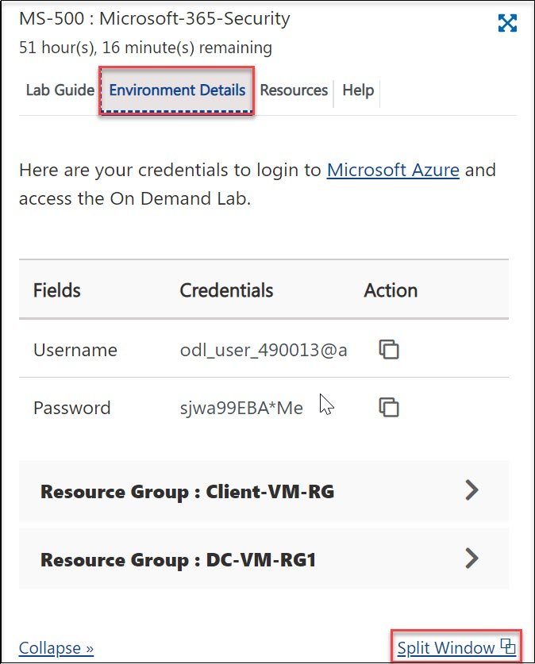
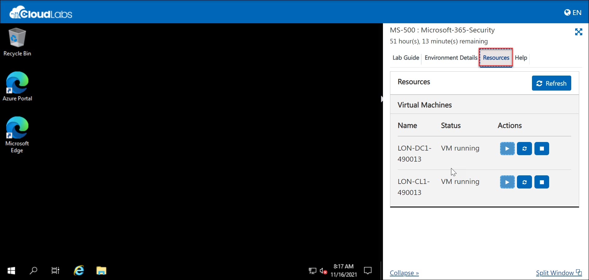

## **Getting Started**

1. Once the environment is provisioned, a virtual machine and lab guide will get loaded into your browser. Use this virtual machine throughout the workshop to perform the lab.
   
   
   
1. To get the lab environment details, you can select the Environment Details tab. Additionally, the credentials will also be sent to your email address provided during registration. You can also open the Lab Guide on a separate full window by selecting the **Split Window** button on the bottom right corner.

   

1. Also, you can start, stop and restart the virtual machines from Resources tab.

   
